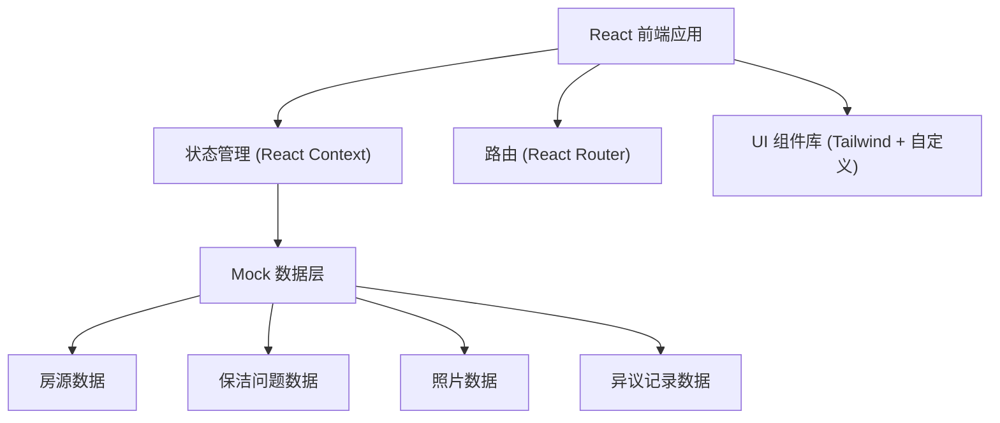
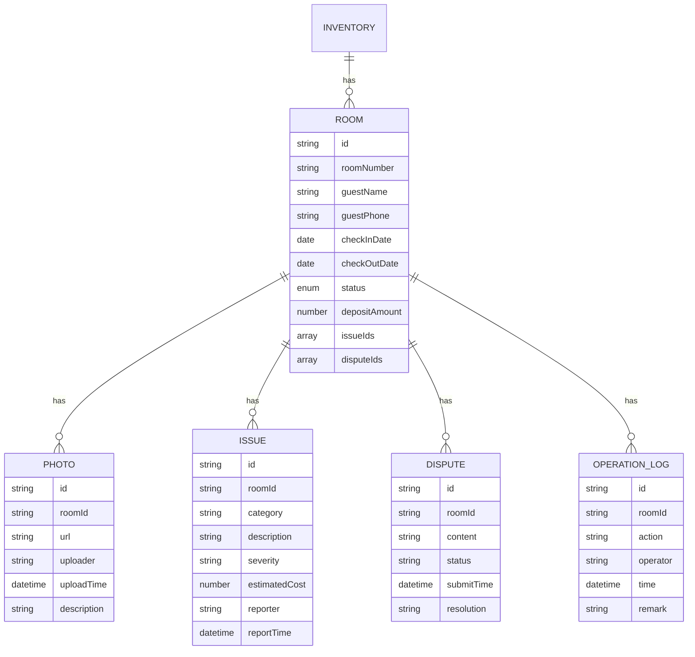

## 1. 架构设计



## 2. 技术选型

- **前端框架**: React@18 + TypeScript
- **构建工具**: Vite@5
- **样式方案**: TailwindCSS@3 + PostCSS
- **路由管理**: React Router Dom@6
- **图标库**: Lucide React
- **状态管理**: React Context API (轻量级，适合后台系统)
- **日期处理**: date-fns
- **后端**: 无，使用前端 Mock 数据

## 3. 目录结构

```
src/
├── components/          # 可复用组件
│   ├── layout/         # 布局组件 (Header, Sidebar)
│   ├── table/          # 表格组件
│   ├── status/         # 状态标签组件
│   ├── modal/          # 弹窗组件
│   └── timeline/       # 时间线组件
├── pages/              # 页面组件
│   ├── InventoryList/  # 房源列表页
│   └── InventoryDetail/ # 房源详情页
├── context/            # 状态管理
│   └── InventoryContext.tsx
├── types/              # TypeScript 类型定义
│   └── inventory.ts
├── data/               # Mock 数据
│   └── mockData.ts
├── hooks/              # 自定义 Hooks
│   └── useInventory.ts
├── utils/              # 工具函数
│   └── formatters.ts
├── App.tsx
├── main.tsx
└── index.css
```

## 4. 路由定义

| 路由 | 页面 | 功能 |
|------|------|------|
| / | 房源列表页 | 显示状态统计和房源表格 |
| /inventory/:id | 房源详情页 | 显示房源详情、照片、问题、异议 |

## 5. 数据模型

### 5.1 数据模型定义



### 5.2 TypeScript 类型定义

```typescript
type RoomStatus = 'CHECKED_OUT_TODAY' | 'PENDING_CLEANING' | 'PENDING_REINSPECTION' | 'DEPOSIT_PENDING' | 'COMPLETED';

interface Room {
  id: string;
  roomNumber: string;
  building: string;
  guestName: string;
  guestPhone: string;
  checkInDate: string;
  checkOutDate: string;
  status: RoomStatus;
  depositAmount: number;
  photos: Photo[];
  issues: Issue[];
  disputes: Dispute[];
  operationLogs: OperationLog[];
}

interface Photo {
  id: string;
  url: string;
  thumbnail: string;
  uploader: string;
  uploadTime: string;
  description: string;
}

interface Issue {
  id: string;
  category: string;
  description: string;
  severity: 'LOW' | 'MEDIUM' | 'HIGH' | 'CRITICAL';
  estimatedCost: number;
  reporter: string;
  reportTime: string;
}

interface Dispute {
  id: string;
  content: string;
  status: 'PENDING' | 'IN_PROGRESS' | 'RESOLVED' | 'REJECTED';
  submitTime: string;
  resolution: string;
  resolver?: string;
  resolveTime?: string;
}

interface OperationLog {
  id: string;
  action: string;
  operator: string;
  time: string;
  remark: string;
}
```

## 6. 核心组件设计

### 6.1 状态标签组件 StatusBadge
- Props: status: RoomStatus
- 根据不同状态显示不同颜色和文案

### 6.2 房源表格组件 RoomTable
- Props: rooms: Room[], onViewDetail: (id) => void
- 功能: 分页、状态筛选、行操作

### 6.3 照片墙组件 PhotoGrid
- Props: photos: Photo[]
- 功能: 缩略图展示、点击放大、描述显示

### 6.4 问题列表组件 IssueList
- Props: issues: Issue[]
- 功能: 严重度标识、费用展示、时间排序

### 6.5 时间线组件 Timeline
- Props: logs: OperationLog[]
- 功能: 按时间倒序展示操作记录

## 7. Mock 数据设计

包含以下测试场景:
1. **烟味投诉**: A101 房，烟味处理、墙面轻微熏黄
2. **床品污损**: B203 房，床垫大面积污渍、床单破损
3. **物品遗失**: C305 房，遥控器丢失、毛巾少2条
4. **照片证据不足**: D402 房，扣款申诉中，照片角度不全无法判定
