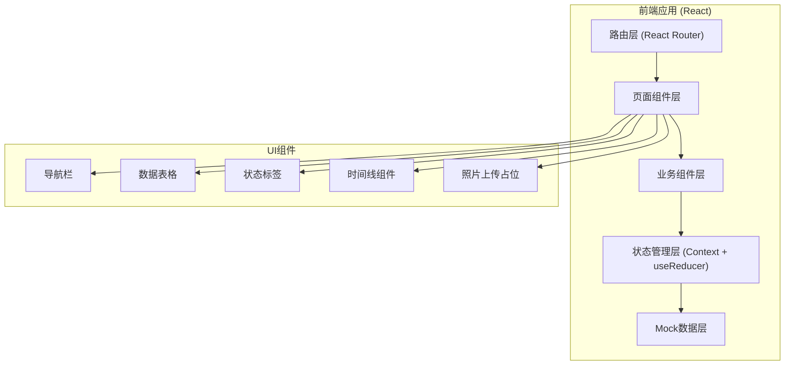
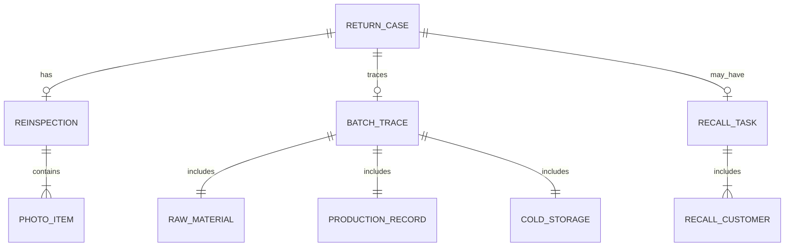

## 1. 架构设计



## 2. 技术描述

- **前端框架**: React@18 + TypeScript
- **构建工具**: Vite@5
- **样式方案**: TailwindCSS@3 + CSS变量
- **路由管理**: React Router DOM@6
- **图标库**: Lucide React
- **状态管理**: React Context + useReducer（轻量级，无后端）
- **数据方案**: 前端 Mock 数据，无需后端服务
- **开发辅助**: ESLint + Prettier

## 3. 路由定义

| 路由 | 页面 | 说明 |
|------|------|------|
| / | 退货案件列表 | 首页，展示所有退货案件概览 |
| /return/new | 退货登记 | 新建退货记录 |
| /return/:id | 案件详情 | 单条案件全流程视图，包含时间线 |
| /return/:id/trace | 批次反查 | 溯源信息面板 |
| /return/:id/reinspect | 复检处理 | 复检照片、结论录入、多角色补充 |
| /recalls | 召回管理 | 召回任务列表和客户清单 |

## 4. 数据模型定义

### 4.1 核心类型定义

```typescript
// 退货案件
interface ReturnCase {
  id: string;
  caseNo: string;
  customerName: string;
  productName: string;
  batchNo: string;
  returnQuantity: number;
  unit: string;
  returnReason: 'odor' | 'spec' | 'other';
  reasonDetail: string;
  customerPhotos: string[];
  status: 'registered' | 'tracing' | 'reinspecting' | 'processing' | 'recalling' | 'closed';
  conclusion?: 'false_alarm' | 'quality_issue' | 'price_adjustment';
  conclusionRemark?: string;
  registeredAt: string;
  registeredBy: string;
  closedAt?: string;
  closedBy?: string;
}

// 批次溯源信息
interface BatchTrace {
  batchNo: string;
  rawMaterial: {
    rawBatchNo: string;
    supplier: string;
    supplyDate: string;
    inspectionReport: string;
    weight: number;
  };
  production: {
    workshop: string;
    teamNo: string;
    teamLeader: string;
    productionDate: string;
    processRecords: string[];
    equipment: string[];
  };
  coldStorage: {
    warehouseNo: string;
    locationCode: string;
    inTime: string;
    outRecords: OutRecord[];
    remainingStock: number;
  };
}

// 复检记录
interface Reinspection {
  caseId: string;
  inspector: string;
  inspectTime: string;
  photos: PhotoItem[];
  conclusion: 'false_alarm' | 'quality_issue' | 'price_adjustment';
  remark: string;
  productionSupplement?: {
    teamLeader: string;
    supplementTime: string;
    content: string;
  };
  stockConfirmation?: {
    warehouseKeeper: string;
    confirmTime: string;
    remainingStock: number;
    remark: string;
  };
}

// 召回任务
interface RecallTask {
  id: string;
  caseId: string;
  caseNo: string;
  productName: string;
  batchNo: string;
  status: 'pending' | 'notifying' | 'completed';
  createdAt: string;
  customers: RecallCustomer[];
}

// 召回客户
interface RecallCustomer {
  id: string;
  customerName: string;
  contact: string;
  phone: string;
  shippedQuantity: number;
  shippedDate: string;
  notifyStatus: 'pending' | 'notified' | 'confirmed' | 'returned';
  notifyTime?: string;
  returnedQuantity?: number;
}

// 照片项
interface PhotoItem {
  id: string;
  url: string;
  description: string;
  uploadedAt: string;
}
```

### 4.2 数据关系图



## 5. 目录结构

```
src/
├── components/          # 公共组件
│   ├── Layout/         # 布局组件
│   ├── Table/          # 数据表格
│   ├── StatusTag/      # 状态标签
│   ├── Timeline/       # 时间线
│   └── PhotoUpload/    # 照片上传占位
├── pages/              # 页面组件
│   ├── CaseList/       # 案件列表
│   ├── ReturnForm/     # 退货登记
│   ├── CaseDetail/     # 案件详情
│   ├── BatchTrace/     # 批次反查
│   ├── Reinspection/   # 复检处理
│   └── RecallManage/   # 召回管理
├── data/               # Mock数据
│   ├── cases.ts
│   ├── trace.ts
│   └── recalls.ts
├── types/              # TypeScript类型
│   └── index.ts
├── context/            # 状态管理
│   └── AppContext.tsx
├── hooks/              # 自定义Hooks
├── utils/              # 工具函数
├── App.tsx
├── main.tsx
└── index.css
```

## 6. 样例数据规划

预置3条典型样例数据：

1. **案例1：误报（客户误解）**
   - 退货原因：客户反映"有异味"
   - 复检结论：误报，实为产品正常风味
   - 流程：登记→复检→记录说明→关闭

2. **案例2：确认质量问题，需要召回**
   - 退货原因：规格不对，肥瘦比例超标
   - 复检结论：确认质量问题
   - 流程：登记→复检→发起召回→客户通知→召回完成→关闭

3. **案例3：规格差异，只需补差价**
   - 退货原因：单重不足
   - 复检结论：规格偏差在允许范围内，补差价处理
   - 流程：登记→复检→计算差价→确认→关闭
