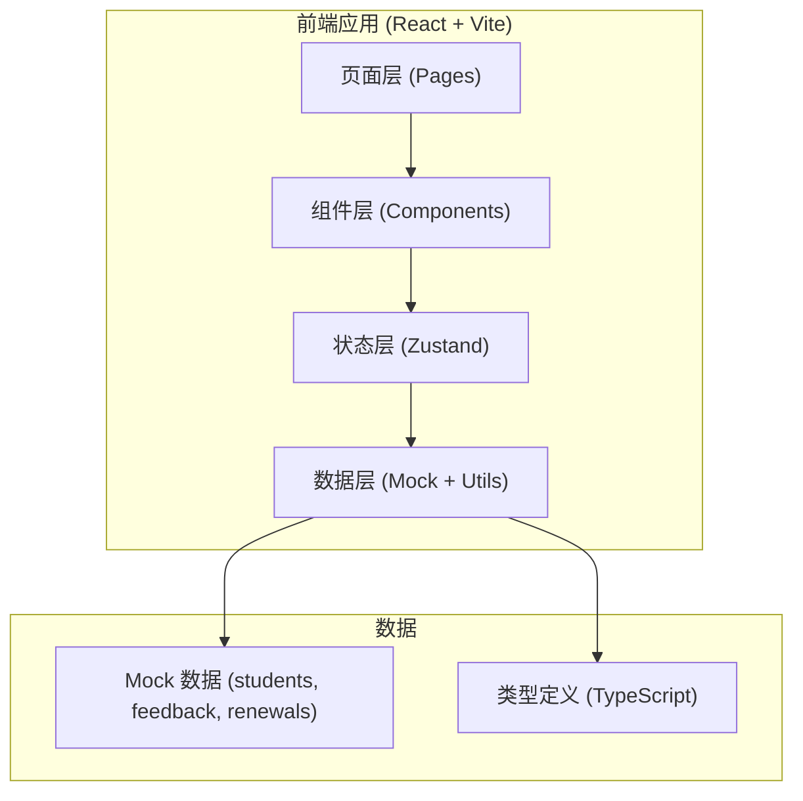
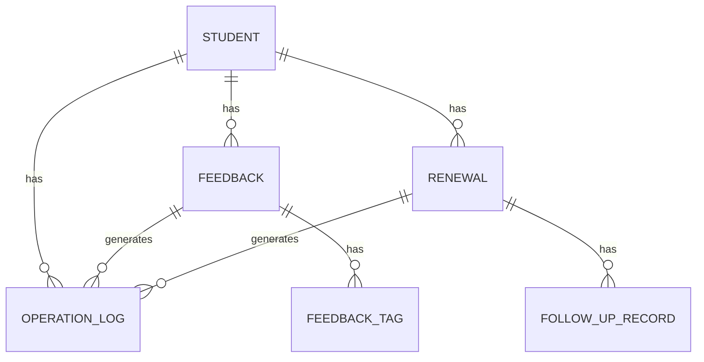

## 1. 架构设计



采用纯前端架构，数据全部 mock，通过 Zustand 进行状态管理，模拟真实后台的数据联动效果。

## 2. 技术选型

- **前端框架**：React@18 + TypeScript
- **构建工具**：Vite@5
- **样式方案**：TailwindCSS@3
- **状态管理**：Zustand
- **路由**：React Router DOM@6
- **图标库**：lucide-react
- **日期处理**：date-fns
- **初始化工具**：vite-init

## 3. 路由定义

| 路由路径 | 页面 | 说明 |
|----------|------|------|
| / | 总览仪表盘 | 待办、风险、最近变更、关键指标 |
| /feedback | 课堂反馈列表 | 所有课堂反馈的列表与筛选 |
| /feedback/:id | 课堂反馈详情 | 单条反馈详情与处理记录 |
| /renewal | 续费跟进列表 | 续费名单、批量操作 |
| /renewal/:id | 续费跟进详情 | 跟进详情、关联课堂反馈 |
| /student/:id | 学员档案 | 学员完整信息与数据追溯 |

## 4. 数据模型

### 4.1 实体关系



### 4.2 核心数据类型

```typescript
// 学员
interface Student {
  id: string;
  name: string;
  avatar: string;
  className: string;
  level: string;
  costumeSize: string;
  examLevel: string;
  remainingClasses: number;
  totalClasses: number;
  joinDate: string;
  phone: string;
  parentName: string;
}

// 课堂反馈
interface ClassFeedback {
  id: string;
  studentId: string;
  date: string;
  className: string;
  teacher: string;
  content: string;
  performance: 'excellent' | 'good' | 'average' | 'poor';
  tags: string[];
  status: 'pending' | 'processing' | 'resolved';
  createdAt: string;
  updatedAt: string;
  handledBy?: string;
  handleNote?: string;
}

// 续费跟进
interface RenewalFollowUp {
  id: string;
  studentId: string;
  expirationDate: string;
  remainingDays: number;
  packageType: string;
  packagePrice: number;
  status: 'pending' | 'contacted' | 'negotiating' | 'signed' | 'lost';
  followUpRecords: FollowUpRecord[];
  riskLevel: 'low' | 'medium' | 'high';
  keyInsights: string[];
  createdAt: string;
  updatedAt: string;
}

// 跟进记录
interface FollowUpRecord {
  id: string;
  date: string;
  operator: string;
  method: 'phone' | 'wechat' | 'in_person' | 'other';
  content: string;
  nextFollowUpDate?: string;
}

// 操作日志（留痕）
interface OperationLog {
  id: string;
  type: 'feedback' | 'renewal' | 'student' | 'system';
  targetId: string;
  action: string;
  operator: string;
  timestamp: string;
  details: string;
}
```

### 4.3 状态标签体系

| 模块 | 状态 | 颜色 | 含义 |
|------|------|------|------|
| 课堂反馈 | pending | 琥珀橙 | 待处理 |
| 课堂反馈 | processing | 天空蓝 | 处理中 |
| 课堂反馈 | resolved | 森绿 | 已解决 |
| 续费跟进 | pending | 琥珀橙 | 待跟进 |
| 续费跟进 | contacted | 天空蓝 | 已联系 |
| 续费跟进 | negotiating | 紫 | 洽谈中 |
| 续费跟进 | signed | 森绿 | 已续费 |
| 续费跟进 | lost | 酒红 | 已流失 |
| 风险等级 | low | 森绿 | 低风险 |
| 风险等级 | medium | 琥珀橙 | 中风险 |
| 风险等级 | high | 酒红 | 高风险 |

## 5. 项目目录结构

```
src/
├── components/         # 通用组件
│   ├── Layout/        # 布局组件
│   ├── StatusBadge/   # 状态标签
│   ├── DataCard/      # 数据卡片
│   ├── Timeline/      # 时间线
│   └── Table/         # 表格组件
├── pages/             # 页面
│   ├── Dashboard/     # 总览仪表盘
│   ├── Feedback/      # 课堂反馈
│   ├── Renewal/       # 续费跟进
│   └── Student/       # 学员档案
├── store/             # Zustand 状态管理
│   ├── useFeedbackStore.ts
│   ├── useRenewalStore.ts
│   ├── useStudentStore.ts
│   └── useOperationLogStore.ts
├── data/              # Mock 数据
│   ├── students.ts
│   ├── feedback.ts
│   ├── renewals.ts
│   └── operationLogs.ts
├── types/             # TypeScript 类型
│   └── index.ts
├── utils/             # 工具函数
│   ├── date.ts
│   └── status.ts
├── App.tsx
├── main.tsx
└── index.css
```

## 6. 关键交互设计

### 6.1 数据联动机制

- 课堂反馈提交后，自动更新学员档案的反馈历史
- 续费跟进处理时，自动关联展示该学员的关键反馈标签
- 所有状态变更均生成操作日志，支持全程追溯
- 批量操作时，统一更新状态并生成批量操作记录

### 6.2 留痕机制

每个操作（新增、修改状态、添加备注等）都会：
1. 更新目标实体的 updatedAt
2. 生成一条 OperationLog 记录
3. 在详情页的时间线中展示
4. 支持从总览的"最近变更"直接跳转
