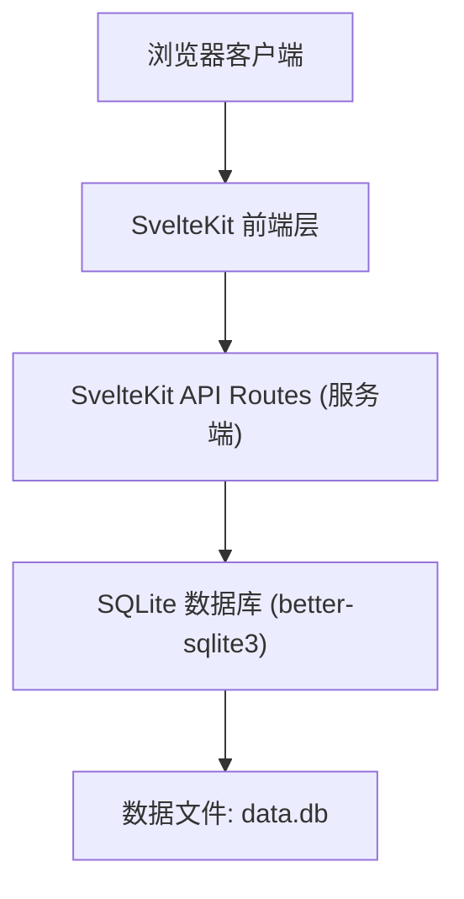
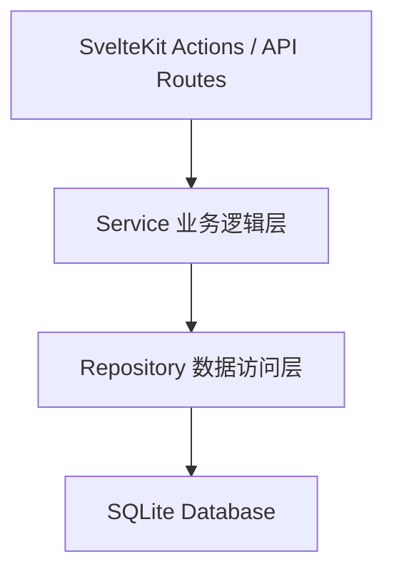
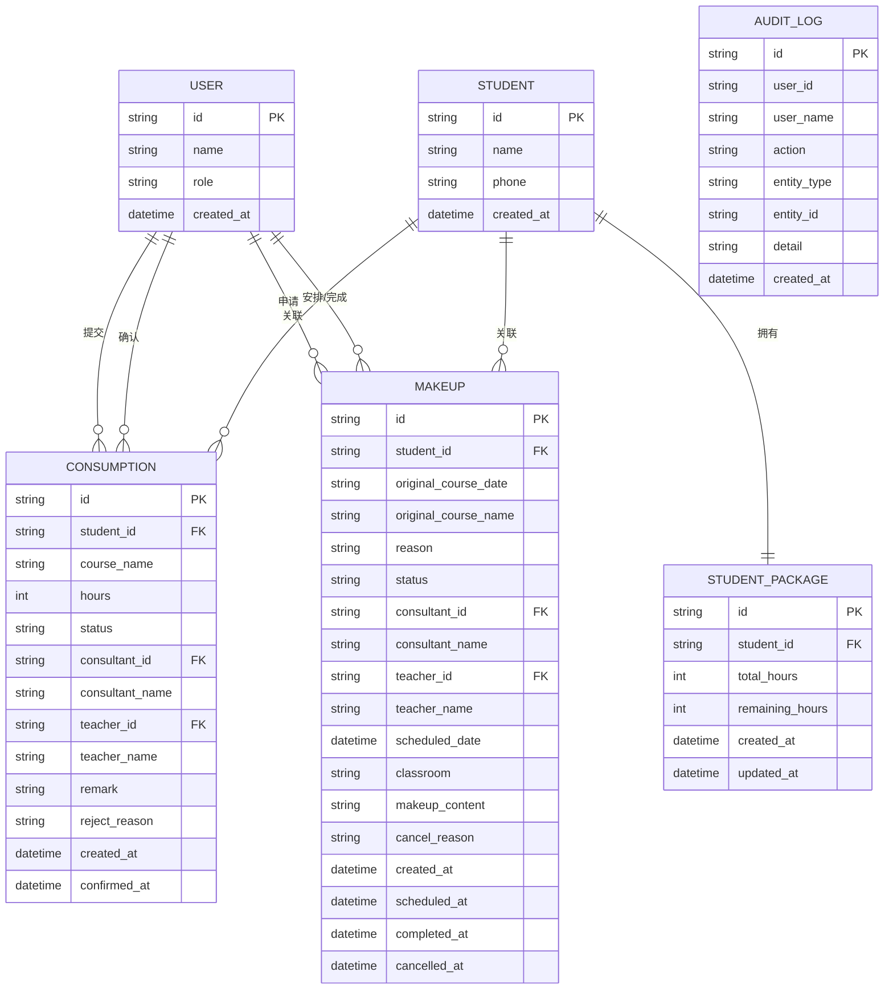

## 1. 架构设计



## 2. 技术选型说明

- **前端框架**: SvelteKit (最新稳定版)
  - 基于文件系统的路由，SSR/SSG 支持
  - 轻量级运行时，性能优秀
  - 内置 form actions 和 data loading 机制
- **CSS 方案**: Tailwind CSS 3
  - 原子化 CSS，快速开发
  - 响应式设计支持
- **数据库**: SQLite (通过 better-sqlite3)
  - 零配置，单文件数据库
  - 适合中小规模应用
  - 数据持久化，不依赖外部服务
- **认证方案**: 简化的 Session 机制
  - 基于 Cookie 的会话管理
  - 无需密码，角色+姓名登录
- **图标**: lucide-svelte
  - 高质量线性图标库
  - 与 Svelte 集成良好

## 3. 路由定义

| 路由 | 页面/用途 | 权限角色 |
|------|-----------|----------|
| `/login` | 登录页面 | 公开 |
| `/` | 首页仪表盘（待办、风险、最近变更） | 所有已登录角色 |
| `/consumption` | 课包消耗列表 | 所有已登录角色 |
| `/consumption/new` | 新增课消记录 | 课程顾问、校区主管 |
| `/consumption/[id]` | 课消详情/确认 | 任课老师、校区主管 |
| `/makeup` | 补课安排列表 | 所有已登录角色 |
| `/makeup/new` | 新建补课申请 | 课程顾问、校区主管 |
| `/makeup/[id]` | 补课详情/安排/回看 | 所有已登录角色 |
| `/students` | 学生列表/课包查询 | 所有已登录角色 |
| `/students/[id]` | 学生详情（课包+补课历史） | 所有已登录角色 |

## 4. API 定义

### 4.1 认证相关

```typescript
// POST /api/auth/login
interface LoginRequest {
  role: 'consultant' | 'teacher' | 'admin';
  name: string;
}

interface LoginResponse {
  success: boolean;
  user: {
    id: string;
    role: string;
    name: string;
  };
}

// POST /api/auth/logout
interface LogoutResponse {
  success: boolean;
}
```

### 4.2 课包消耗相关

```typescript
// GET /api/consumption?status=&studentId=
interface ConsumptionListResponse {
  items: ConsumptionRecord[];
  total: number;
}

interface ConsumptionRecord {
  id: string;
  studentId: string;
  studentName: string;
  courseName: string;
  hours: number;
  status: 'pending' | 'confirmed' | 'rejected';
  consultantId: string;
  consultantName: string;
  teacherId?: string;
  teacherName?: string;
  remark?: string;
  createdAt: string;
  confirmedAt?: string;
}

// POST /api/consumption
interface CreateConsumptionRequest {
  studentId: string;
  courseName: string;
  hours: number;
  remark?: string;
}

// PATCH /api/consumption/[id]
interface UpdateConsumptionStatusRequest {
  status: 'confirmed' | 'rejected';
  teacherId: string;
  teacherName: string;
  rejectReason?: string;
}
```

### 4.3 补课安排相关

```typescript
// GET /api/makeup?status=&studentId=
interface MakeupListResponse {
  items: MakeupRecord[];
  total: number;
}

interface MakeupRecord {
  id: string;
  studentId: string;
  studentName: string;
  originalCourseDate: string;
  originalCourseName: string;
  status: 'pending' | 'scheduled' | 'completed' | 'cancelled';
  consultantId: string;
  consultantName: string;
  teacherId?: string;
  teacherName?: string;
  scheduledDate?: string;
  classroom?: string;
  makeupContent?: string;
  createdAt: string;
  scheduledAt?: string;
  completedAt?: string;
}

// POST /api/makeup
interface CreateMakeupRequest {
  studentId: string;
  originalCourseDate: string;
  originalCourseName: string;
  reason?: string;
}

// PATCH /api/makeup/[id]/schedule
interface ScheduleMakeupRequest {
  teacherId: string;
  teacherName: string;
  scheduledDate: string;
  classroom: string;
}

// PATCH /api/makeup/[id]/complete
interface CompleteMakeupRequest {
  makeupContent: string;
}

// PATCH /api/makeup/[id]/cancel
interface CancelMakeupRequest {
  reason: string;
}
```

### 4.4 学生相关

```typescript
// GET /api/students
interface StudentListResponse {
  items: Student[];
}

interface Student {
  id: string;
  name: string;
  phone: string;
  packageHours: number;
  remainingHours: number;
  createdAt: string;
}

// GET /api/students/[id]
interface StudentDetailResponse {
  student: Student;
  consumptionHistory: ConsumptionRecord[];
  makeupHistory: MakeupRecord[];
}

// GET /api/dashboard
interface DashboardResponse {
  stats: {
    totalStudents: number;
    pendingConsumption: number;
    pendingMakeup: number;
    todayConsumption: number;
  };
  todos: TodoItem[];
  risks: RiskItem[];
  recentChanges: ChangeItem[];
}

interface TodoItem {
  id: string;
  type: 'consumption' | 'makeup';
  title: string;
  priority: 'high' | 'medium' | 'low';
  link: string;
}

interface RiskItem {
  id: string;
  type: 'low_hours' | 'overdue_makeup' | 'unusual_consumption';
  title: string;
  description: string;
  level: 'warning' | 'danger';
}

interface ChangeItem {
  id: string;
  type: string;
  title: string;
  operator: string;
  time: string;
}
```

## 5. 服务端架构



分层说明：
- **Actions/API Routes**: 处理 HTTP 请求，参数校验，响应格式化
- **Service 层**: 业务逻辑，状态流转校验，权限检查
- **Repository 层**: SQL 操作，数据持久化
- **Database**: SQLite 文件数据库

## 6. 数据模型

### 6.1 ER 图



### 6.2 DDL 语句

```sql
-- 用户表
CREATE TABLE IF NOT EXISTS users (
  id TEXT PRIMARY KEY,
  name TEXT NOT NULL,
  role TEXT NOT NULL CHECK (role IN ('consultant', 'teacher', 'admin')),
  created_at DATETIME DEFAULT CURRENT_TIMESTAMP
);

-- 学生表
CREATE TABLE IF NOT EXISTS students (
  id TEXT PRIMARY KEY,
  name TEXT NOT NULL,
  phone TEXT,
  created_at DATETIME DEFAULT CURRENT_TIMESTAMP
);

-- 学生课包表
CREATE TABLE IF NOT EXISTS student_packages (
  id TEXT PRIMARY KEY,
  student_id TEXT NOT NULL REFERENCES students(id),
  total_hours INTEGER NOT NULL DEFAULT 0,
  remaining_hours INTEGER NOT NULL DEFAULT 0,
  created_at DATETIME DEFAULT CURRENT_TIMESTAMP,
  updated_at DATETIME DEFAULT CURRENT_TIMESTAMP
);

-- 课消记录表
CREATE TABLE IF NOT EXISTS consumptions (
  id TEXT PRIMARY KEY,
  student_id TEXT NOT NULL REFERENCES students(id),
  course_name TEXT NOT NULL,
  hours INTEGER NOT NULL,
  status TEXT NOT NULL DEFAULT 'pending' CHECK (status IN ('pending', 'confirmed', 'rejected')),
  consultant_id TEXT NOT NULL REFERENCES users(id),
  consultant_name TEXT NOT NULL,
  teacher_id TEXT REFERENCES users(id),
  teacher_name TEXT,
  remark TEXT,
  reject_reason TEXT,
  created_at DATETIME DEFAULT CURRENT_TIMESTAMP,
  confirmed_at DATETIME
);

-- 补课安排表
CREATE TABLE IF NOT EXISTS makeups (
  id TEXT PRIMARY KEY,
  student_id TEXT NOT NULL REFERENCES students(id),
  original_course_date TEXT NOT NULL,
  original_course_name TEXT NOT NULL,
  reason TEXT,
  status TEXT NOT NULL DEFAULT 'pending' CHECK (status IN ('pending', 'scheduled', 'completed', 'cancelled')),
  consultant_id TEXT NOT NULL REFERENCES users(id),
  consultant_name TEXT NOT NULL,
  teacher_id TEXT REFERENCES users(id),
  teacher_name TEXT,
  scheduled_date DATETIME,
  classroom TEXT,
  makeup_content TEXT,
  cancel_reason TEXT,
  created_at DATETIME DEFAULT CURRENT_TIMESTAMP,
  scheduled_at DATETIME,
  completed_at DATETIME,
  cancelled_at DATETIME
);

-- 操作日志表
CREATE TABLE IF NOT EXISTS audit_logs (
  id TEXT PRIMARY KEY,
  user_id TEXT NOT NULL,
  user_name TEXT NOT NULL,
  action TEXT NOT NULL,
  entity_type TEXT NOT NULL,
  entity_id TEXT NOT NULL,
  detail TEXT,
  created_at DATETIME DEFAULT CURRENT_TIMESTAMP
);

-- 索引
CREATE INDEX IF NOT EXISTS idx_consumptions_student ON consumptions(student_id);
CREATE INDEX IF NOT EXISTS idx_consumptions_status ON consumptions(status);
CREATE INDEX IF NOT EXISTS idx_makeups_student ON makeups(student_id);
CREATE INDEX IF NOT EXISTS idx_makeups_status ON makeups(status);
CREATE INDEX IF NOT EXISTS idx_makeups_scheduled_date ON makeups(scheduled_date);
CREATE INDEX IF NOT EXISTS idx_audit_logs_created ON audit_logs(created_at DESC);
```

### 6.3 初始数据

```sql
-- 初始用户
INSERT OR IGNORE INTO users (id, name, role) VALUES
  ('u1', '张顾问', 'consultant'),
  ('u2', '李老师', 'teacher'),
  ('u3', '王主管', 'admin'),
  ('u4', '刘顾问', 'consultant'),
  ('u5', '陈老师', 'teacher');

-- 初始学生
INSERT OR IGNORE INTO students (id, name, phone) VALUES
  ('s1', '小明', '13800138001'),
  ('s2', '小红', '13800138002'),
  ('s3', '小华', '13800138003'),
  ('s4', '小丽', '13800138004'),
  ('s5', '小强', '13800138005');

-- 初始课包
INSERT OR IGNORE INTO student_packages (id, student_id, total_hours, remaining_hours) VALUES
  ('p1', 's1', 48, 32),
  ('p2', 's2', 24, 5),
  ('p3', 's3', 60, 45),
  ('p4', 's4', 36, 36),
  ('p5', 's5', 12, 2);
```
