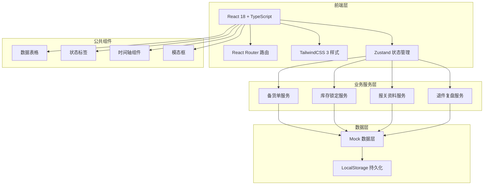
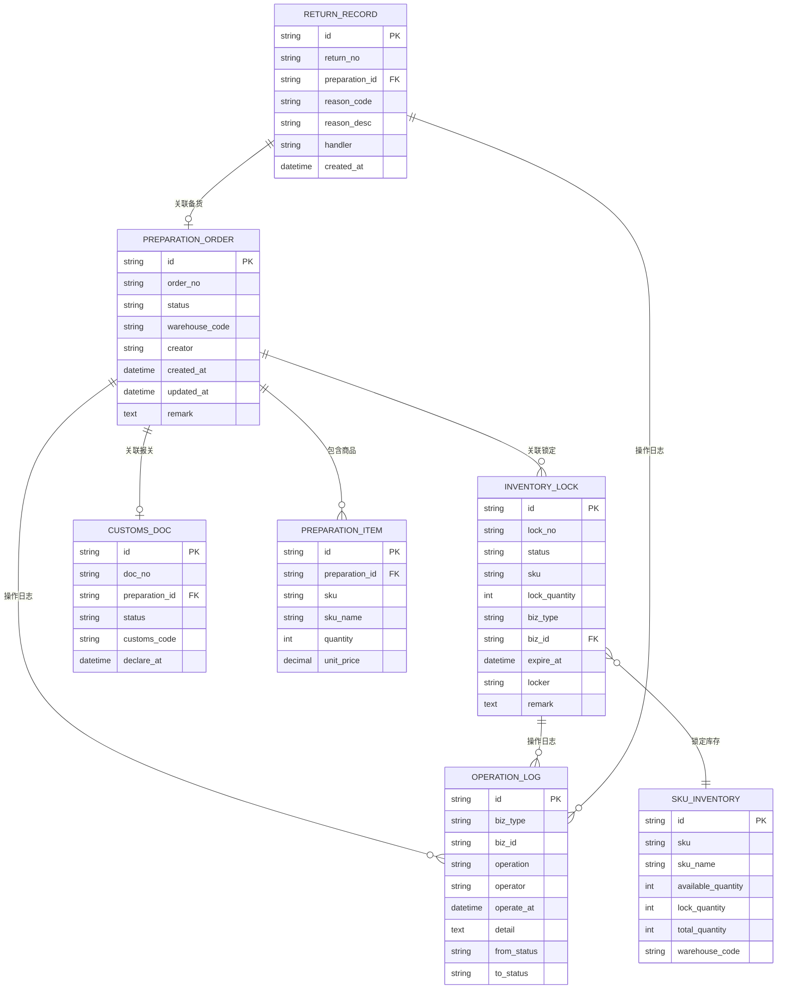

## 1. 架构设计



## 2. 技术描述

- **前端框架**：React 18 + TypeScript
- **构建工具**：Vite 5
- **样式方案**：TailwindCSS 3
- **状态管理**：Zustand（轻量、简单、适合内部系统）
- **路由方案**：React Router v6
- **图标库**：Lucide React
- **数据方案**：Mock 数据 + LocalStorage 持久化
- **代码规范**：ESLint + Prettier

## 3. 路由定义

| 路由路径 | 页面名称 | 说明 |
|---------|----------|------|
| /dashboard | 工作台首页 | 待办、风险预警、最近变更 |
| /stock-preparation | 备货单列表 | 海外仓备货单列表页 |
| /stock-preparation/:id | 备货单详情 | 备货单详情及处理 |
| /inventory-lock | 库存锁定列表 | 库存锁定单列表页 |
| /inventory-lock/:id | 库存锁定详情 | 锁定详情及历史回看 |
| /customs | 报关资料中心 | 报关单管理 |
| /returns | 退件复盘中心 | 退件登记与分析 |
| /api-docs | 接口文档中心 | API文档和权限说明 |

## 4. 数据模型

### 4.1 ER图



### 4.2 状态约束

#### 备货单状态流转
```
DRAFT(草稿) → PENDING_AUDIT(待审核) → AUDITING(关务审核中)
AUDITING → PENDING_SUPPLEMENT(待补件) → AUDITING
AUDITING → AUDIT_PASS(审核通过) → WAREHOUSE_CONFIRM(仓配确认)
WAREHOUSE_CONFIRM → INVENTORY_LOCKED(已锁库) → SHIPPED(已发运)
SHIPPED → RECEIVED(已入库) → COMPLETED(已完成)
* 任意状态可 → CANCELLED(已取消) [需权限校验]
```

#### 库存锁定状态流转
```
PENDING(待锁定) → LOCKED(已锁定)
LOCKED → RELEASED(已释放) [出库核销/手动释放]
LOCKED → EXPIRED(已过期) [定时任务自动释放]
```

### 4.3 角色权限矩阵

| 功能模块 | 操作 | 运营 | 关务 | 仓配 | 管理员 |
|---------|------|------|------|------|--------|
| 备货单 | 创建 | ✅ | ❌ | ❌ | ✅ |
| 备货单 | 编辑草稿 | ✅ | ❌ | ❌ | ✅ |
| 备货单 | 提交审核 | ✅ | ❌ | ❌ | ✅ |
| 备货单 | 关务审核 | ❌ | ✅ | ❌ | ✅ |
| 备货单 | 退回补件 | ❌ | ✅ | ❌ | ✅ |
| 备货单 | 仓配确认 | ❌ | ❌ | ✅ | ✅ |
| 备货单 | 查看 | ✅ | ✅ | ✅ | ✅ |
| 库存锁定 | 创建锁定 | ❌ | ❌ | ✅ | ✅ |
| 库存锁定 | 释放锁定 | ❌ | ❌ | ✅ | ✅ |
| 库存锁定 | 查看 | ✅ | ✅ | ✅ | ✅ |
| 报关资料 | 上传补件 | ✅ | ✅ | ❌ | ✅ |
| 报关资料 | 审核 | ❌ | ✅ | ❌ | ✅ |
| 退件复盘 | 登记 | ❌ | ❌ | ✅ | ✅ |
| 退件复盘 | 查看 | ✅ | ✅ | ✅ | ✅ |

## 5. 核心接口定义

### 5.1 备货单接口

```typescript
// 获取备货单列表
GET /api/preparation-orders
Query: {
  status?: string;
  warehouseCode?: string;
  startDate?: string;
  endDate?: string;
  keyword?: string;
  page: number;
  pageSize: number;
}
Response: {
  list: PreparationOrder[];
  total: number;
}

// 创建备货单
POST /api/preparation-orders
Body: {
  warehouseCode: string;
  items: Array<{sku: string; quantity: number}>;
  remark?: string;
}
Response: PreparationOrder

// 提交审核
POST /api/preparation-orders/:id/submit
Response: PreparationOrder

// 关务审核
POST /api/preparation-orders/:id/audit
Body: {
  pass: boolean;
  supplementItems?: string[];
  remark?: string;
}
Response: PreparationOrder

// 仓配确认
POST /api/preparation-orders/:id/warehouse-confirm
Body: {
  remark?: string;
}
Response: PreparationOrder
```

### 5.2 库存锁定接口

```typescript
// 创建库存锁定
POST /api/inventory-locks
Body: {
  sku: string;
  quantity: number;
  bizType: 'preparation' | 'order';
  bizId: string;
  expireAt?: string;
  remark?: string;
}
Response: InventoryLock

// 释放库存锁定
POST /api/inventory-locks/:id/release
Body: {
  reason: string;
}
Response: InventoryLock

// 获取锁定历史
GET /api/inventory-locks/:id/history
Response: OperationLog[]
```

### 5.3 权限校验机制

```typescript
// 权限校验中间件逻辑
function checkPermission(requiredRole: Role[]) {
  return (req: Request, res: Response, next: NextFunction) => {
    const userRole = req.headers['x-user-role'];
    if (!requiredRole.includes(userRole)) {
      return res.status(403).json({
        code: 'FORBIDDEN',
        message: '权限不足'
      });
    }
    next();
  };
}

// 状态变更前置校验
function validateStatusTransition(from: string, to: string, role: Role): boolean {
  const transitions: Record<string, Array<{to: string; roles: Role[]}>> = {
    DRAFT: [{ to: 'PENDING_AUDIT', roles: ['operator', 'admin'] }],
    PENDING_AUDIT: [{ to: 'AUDITING', roles: ['customs', 'admin'] }],
    AUDITING: [
      { to: 'PENDING_SUPPLEMENT', roles: ['customs', 'admin'] },
      { to: 'AUDIT_PASS', roles: ['customs', 'admin'] }
    ],
    // ...
  };
  return transitions[from]?.some(t => t.to === to && t.roles.includes(role));
}
```
