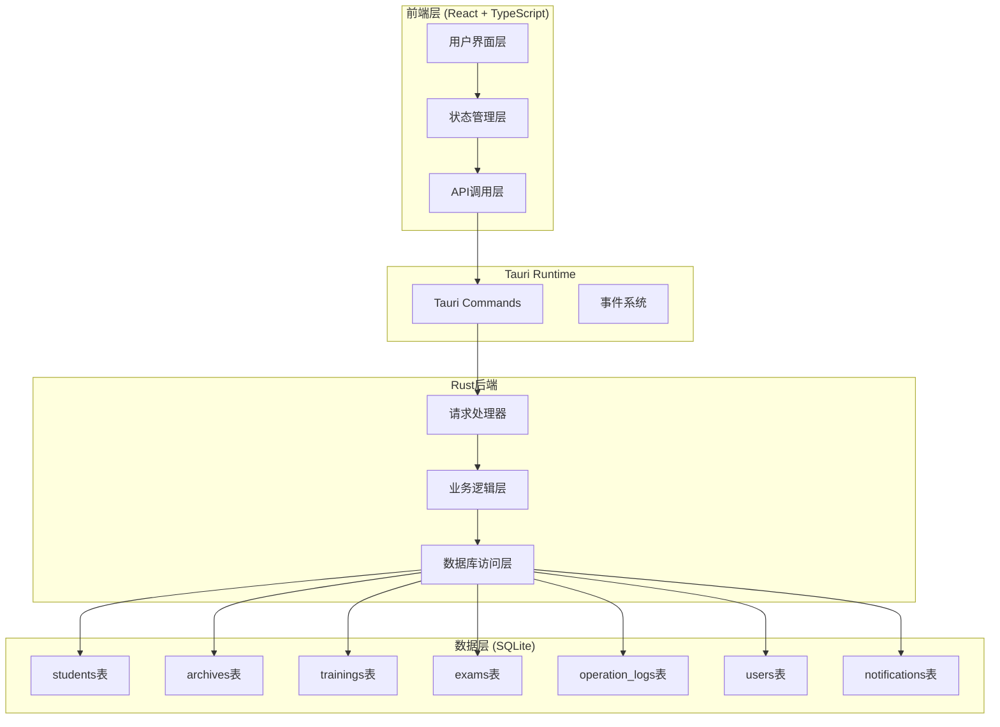
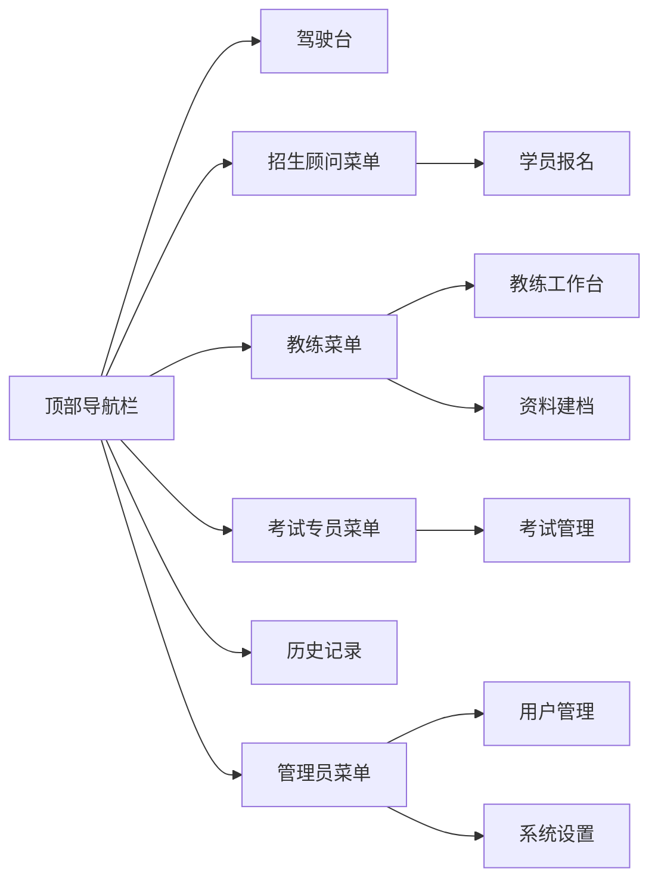

# 驾校运营管理系统 - 技术架构文档

## 1. 架构设计

### 1.1 整体架构



### 1.2 技术栈

| 层级 | 技术选型 | 版本要求 | 说明 |
|------|----------|----------|------|
| 桌面框架 | Tauri | 2.x | 跨平台桌面应用框架 |
| 前端框架 | React | 18.x | UI构建 |
| 语言 | TypeScript | 5.x | 类型安全 |
| 样式方案 | Tailwind CSS | 3.x | 原子化CSS |
| 状态管理 | Zustand | 4.x | 轻量状态管理 |
| 数据库 | SQLite | - | 本地持久化存储 |
| ORM | sqlx | 0.7.x | Rust异步数据库访问 |
| 序列化 | serde | 1.x | 数据序列化/反序列化 |
| 日期时间 | chrono | 0.4.x | 日期时间处理 |
| UUID | uuid | 1.x | 唯一标识生成 |

### 1.3 目录结构

```
driving-school/
├── src/                          # React前端源码
│   ├── components/               # UI组件
│   │   ├── common/              # 通用组件
│   │   │   ├── DataTable.tsx    # 密集表格组件
│   │   │   ├── StatusBadge.tsx  # 状态标签
│   │   │   ├── NotificationBell.tsx
│   │   │   └── ...
│   │   ├── enrollment/          # 学员报名模块
│   │   ├── archive/             # 资料建档模块
│   │   ├── coach/               # 教练工作台
│   │   ├── exam/                # 考试管理
│   │   ├── history/             # 操作历史
│   │   └── dashboard/           # 驾驶台
│   ├── pages/                   # 页面组件
│   │   ├── EnrollmentPage.tsx
│   │   ├── ArchivePage.tsx
│   │   ├── CoachPage.tsx
│   │   ├── ExamPage.tsx
│   │   ├── HistoryPage.tsx
│   │   └── DashboardPage.tsx
│   ├── hooks/                   # 自定义Hooks
│   │   ├── useStudents.ts
│   │   ├── useNotifications.ts
│   │   └── useOperationLogs.ts
│   ├── services/                # API服务层
│   │   ├── api.ts              # Tauri调用封装
│   │   └── studentService.ts
│   ├── stores/                  # Zustand状态库
│   │   ├── studentStore.ts
│   │   └── notificationStore.ts
│   ├── types/                   # TypeScript类型定义
│   │   └── index.ts
│   ├── utils/                   # 工具函数
│   │   └── formatters.ts
│   ├── App.tsx                  # 根组件
│   ├── main.tsx                 # 入口文件
│   └── index.css                # 全局样式
├── src-tauri/                   # Rust后端源码
│   ├── src/
│   │   ├── main.rs             # 入口文件
│   │   ├── db/                 # 数据库层
│   │   │   ├── mod.rs
│   │   │   ├── schema.rs       # 表结构定义
│   │   │   ├── init.rs         # 初始化数据
│   │   │   └── migrations.rs   # 迁移脚本
│   │   ├── models/             # 数据模型
│   │   │   ├── mod.rs
│   │   │   ├── student.rs
│   │   │   ├── archive.rs
│   │   │   ├── training.rs
│   │   │   ├── exam.rs
│   │   │   ├── operation_log.rs
│   │   │   ├── user.rs
│   │   │   └── notification.rs
│   │   ├── commands/           # Tauri命令处理
│   │   │   ├── mod.rs
│   │   │   ├── student_commands.rs
│   │   │   ├── archive_commands.rs
│   │   │   ├── training_commands.rs
│   │   │   ├── exam_commands.rs
│   │   │   └── log_commands.rs
│   │   └── services/           # 业务逻辑层
│   │       ├── mod.rs
│   │       └── notification_service.rs
│   ├── Cargo.toml              # Rust依赖
│   ├── tauri.conf.json         # Tauri配置
│   └── icons/                  # 应用图标
├── package.json
├── tsconfig.json
├── tailwind.config.js
├── vite.config.ts
└── README.md
```

## 2. 路由定义

### 2.1 前端路由

| 路由 | 页面组件 | 功能说明 | 访问角色 |
|------|----------|----------|----------|
| `/` | DashboardPage | 驾驶台-全局概览 | 全体 |
| `/enrollment` | EnrollmentPage | 学员报名管理 | 招生顾问、管理员 |
| `/archive` | ArchivePage | 资料建档管理 | 教练、档案员、管理员 |
| `/coach` | CoachPage | 教练工作台 | 教练、管理员 |
| `/exam` | ExamPage | 考试管理 | 考试专员、管理员 |
| `/history` | HistoryPage | 操作历史追溯 | 全体 |

### 2.2 导航结构



## 3. API定义

### 3.1 Tauri命令接口

#### 学员管理

```typescript
// 查询学员列表
interface GetStudentsRequest {
  status?: string[];
  consultantId?: string;
  startDate?: string;
  endDate?: string;
  keyword?: string;
  page?: number;
  pageSize?: number;
}

interface GetStudentsResponse {
  data: Student[];
  total: number;
  page: number;
  pageSize: number;
}

// 获取学员详情
interface GetStudentDetailRequest {
  studentId: string;
}

interface GetStudentDetailResponse {
  student: Student;
  archive: Archive;
  training?: Training;
  exams: Exam[];
  logs: OperationLog[];
}

// 创建学员
interface CreateStudentRequest {
  name: string;
  idCard: string;
  phone: string;
  address: string;
  carType: 'C1' | 'C2';
  enrollmentConsultantId: string;
}

interface CreateStudentResponse {
  studentId: string;
  studentNo: string;
}

// 更新学员信息
interface UpdateStudentRequest {
  studentId: string;
  name?: string;
  phone?: string;
  address?: string;
  carType?: 'C1' | 'C2';
  changeReason?: string;
}

interface UpdateStudentResponse {
  success: boolean;
  logs: OperationLog[];
}

// 变更学员状态
interface ChangeStudentStatusRequest {
  studentId: string;
  newStatus: string;
  reason?: string;
}

interface ChangeStudentStatusResponse {
  success: boolean;
  logs: OperationLog[];
  notifications: Notification[];
```

#### 档案管理

```typescript
// 获取档案列表
interface GetArchivesRequest {
  archiveStatus?: string[];
  studentKeyword?: string;
}

interface GetArchivesResponse {
  data: ArchiveWithStudent[];
  total: number;
}

// 获取待处理变更通知
interface GetPendingNotificationsRequest {
  role?: string;
  userId?: string;
}

interface GetPendingNotificationsResponse {
  notifications: Notification[];
  unreadCount: number;
}

// 确认变更通知
interface ConfirmNotificationRequest {
  notificationId: string;
  userId: string;
  confirmed: boolean;
}

// 更新档案状态
interface UpdateArchiveRequest {
  studentId: string;
  archiveStatus?: string;
  documentStatus?: string;
  missingDocuments?: string[];
  userId: string;
}

interface UpdateArchiveResponse {
  success: boolean;
  logs: OperationLog[];
```

#### 教练工作台

```typescript
// 获取分配学员
interface GetAssignedStudentsRequest {
  coachId: string;
}

interface GetAssignedStudentsResponse {
  students: StudentWithProgress[];
}

// 更新训练进度
interface UpdateTrainingProgressRequest {
  studentId: string;
  coachId: string;
  progress: string;
  theoryCompleted?: boolean;
  practiceHours?: number;
  notes?: string;
}

// 确认变更通知
interface ConfirmStudentChangeRequest {
  studentId: string;
  coachId: string;
  changeType: string;
  confirmed: boolean;
}
```

#### 考试管理

```typescript
// 获取考试列表
interface GetExamsRequest {
  studentId?: string;
  examStatus?: string[];
  examSubject?: string;
}

interface GetExamsResponse {
  data: ExamWithStudent[];
  total: number;
}

// 预约考试
interface ScheduleExamRequest {
  studentId: string;
  examSubject: string;
  examDate: string;
  examVenue: string;
  specialistId: string;
}

interface ScheduleExamResponse {
  success: boolean;
  logs: OperationLog[];
}

// 审核考试资格
interface ReviewExamEligibilityRequest {
  studentId: string;
  examSubject: string;
  approved: boolean;
  specialistId: string;
  reason?: string;
}

interface ReviewExamEligibilityResponse {
  success: boolean;
  logs: OperationLog[];
  notifications: Notification[];
}

// 录入考试成绩
interface RecordExamResultRequest {
  examId: string;
  examResult: string;
  absenceReason?: string;
  specialistId: string;
}
```

#### 操作历史

```typescript
// 查询操作日志
interface GetOperationLogsRequest {
  studentId?: string;
  operatorId?: string;
  operationType?: string[];
  startDate?: string;
  endDate?: string;
  page?: number;
  pageSize?: number;
}

interface GetOperationLogsResponse {
  data: OperationLogWithDetails[];
  total: number;
  page: number;
  pageSize: number;
}

// 获取学员完整操作链
interface GetStudentOperationChainRequest {
  studentId: string;
}

interface GetStudentOperationChainResponse {
  logs: OperationLogWithDetails[];
}
```

#### 驾驶台统计

```typescript
// 获取驾驶台数据
interface GetDashboardDataRequest {
  // 空参数，使用当前登录用户
}

interface GetDashboardDataResponse {
  totalStudents: number;
  statusCounts: Record<string, number>;
  stuckOrders: StuckOrder[];
  overdueCount: number;
  missingDocumentsCount: number;
  recentAlerts: Alert[];
  consultantWorkload: WorkloadItem[];
  coachWorkload: WorkloadItem[];
  specialistWorkload: WorkloadItem[];
}

interface StuckOrder {
  studentId: string;
  studentName: string;
  studentNo: string;
  currentStatus: string;
  stuckReason: string;
  stuckDays: number;
  consultantName: string;
}

interface WorkloadItem {
  userId: string;
  userName: string;
  pendingCount: number;
  overdueCount: number;
}
```

## 4. 数据模型

### 4.1 TypeScript类型定义

```typescript
// 学员主表
interface Student {
  id: string;
  studentNo: string;
  name: string;
  idCard: string;
  phone: string;
  address: string;
  carType: 'C1' | 'C2';
  enrollmentDate: string;
  status: StudentStatus;
  enrollmentConsultantId: string;
  coachId?: string;
  createdAt: string;
  updatedAt: string;
}

type StudentStatus =
  | 'DRAFT'
  | 'PENDING_REVIEW'
  | 'REVIEW_PASSED'
  | 'PENDING_EXAM'
  | 'EXAM_PASSED'
  | 'ARCHIVED'
  | 'COACH_ASSIGNED'
  | 'TRAINING'
  | 'PENDING_EXAM_BOOKING'
  | 'EXAM_PASSED_FINAL'
  | 'COMPLETED';

// 档案表
interface Archive {
  id: string;
  studentId: string;
  archiveStatus: 'PENDING' | 'COMPLETE' | 'LOCKED';
  documentStatus: 'PENDING' | 'COMPLETE';
  missingDocuments: string[];
  lastUpdateBy: string;
  lastUpdateAt: string;
  lockedAt?: string;
  lockedBy?: string;
}

// 教练分配表
interface Training {
  id: string;
  studentId: string;
  coachId: string;
  assignDate: string;
  progress: TrainingProgress;
  theoryCompleted: boolean;
  practiceHours: number;
  lastProgressUpdate: string;
}

type TrainingProgress =
  | 'NOT_STARTED'
  | 'THEORY'
  | 'PRACTICE_BASIC'
  | 'PRACTICE_INTERMEDIATE'
  | 'PRACTICE_ADVANCED'
  | 'READY_FOR_EXAM';

// 考试记录表
interface Exam {
  id: string;
  studentId: string;
  examSubject: ExamSubject;
  examDate: string;
  examStatus: ExamStatus;
  examResult?: ExamResult;
  examVenue: string;
  specialistId: string;
  absenceReason?: string;
  createdAt: string;
}

type ExamSubject = 'THEORY' | 'SUBJECT2' | 'SUBJECT3' | 'SUBJECT4';
type ExamStatus = 'PENDING' | 'SCHEDULED' | 'TAKEN' | 'ABSENT';
type ExamResult = 'PASSED' | 'FAILED';

// 操作日志表
interface OperationLog {
  id: string;
  studentId: string;
  operatorId: string;
  operatorRole: UserRole;
  operationType: OperationType;
  beforeValue?: Record<string, any>;
  afterValue?: Record<string, any>;
  changeReason?: string;
  operatedAt: string;
}

type OperationType =
  | 'CREATE'
  | 'UPDATE'
  | 'DELETE'
  | 'STATUS_CHANGE'
  | 'ARCHIVE_UPDATE'
  | 'TRAINING_UPDATE'
  | 'EXAM_SCHEDULE'
  | 'EXAM_RESULT';

// 用户表
interface User {
  id: string;
  username: string;
  name: string;
  role: UserRole;
  department: string;
  phone: string;
  status: 'ACTIVE' | 'INACTIVE';
}

type UserRole =
  | 'ADMIN'
  | 'CONSULTANT'
  | 'COACH'
  | 'SPECIALIST'
  | 'ARCHIVER';

// 通知表
interface Notification {
  id: string;
  studentId: string;
  recipientId: string;
  recipientRole: UserRole;
  notificationType: NotificationType;
  title: string;
  content: string;
  relatedOperationId: string;
  isRead: boolean;
  isConfirmed: boolean;
  confirmedAt?: string;
  createdAt: string;
}

type NotificationType =
  | 'STUDENT_UPDATE'
  | 'ARCHIVE_UPDATE'
  | 'EXAM_RESULT'
  | 'TRAINING_UPDATE'
  | 'STATUS_CHANGE';
```

## 5. 数据库表结构（DDL）

### 5.1 表创建语句

```sql
-- 用户表
CREATE TABLE IF NOT EXISTS users (
    id TEXT PRIMARY KEY,
    username TEXT UNIQUE NOT NULL,
    name TEXT NOT NULL,
    role TEXT NOT NULL CHECK (role IN ('ADMIN', 'CONSULTANT', 'COACH', 'SPECIALIST', 'ARCHIVER')),
    department TEXT,
    phone TEXT,
    status TEXT DEFAULT 'ACTIVE',
    created_at TEXT DEFAULT (datetime('now')),
    updated_at TEXT DEFAULT (datetime('now'))
);

-- 学员主表
CREATE TABLE IF NOT EXISTS students (
    id TEXT PRIMARY KEY,
    student_no TEXT UNIQUE NOT NULL,
    name TEXT NOT NULL,
    id_card TEXT NOT NULL,
    phone TEXT NOT NULL,
    address TEXT,
    car_type TEXT NOT NULL CHECK (car_type IN ('C1', 'C2')),
    enrollment_date TEXT NOT NULL,
    status TEXT NOT NULL DEFAULT 'DRAFT',
    enrollment_consultant_id TEXT NOT NULL,
    coach_id TEXT,
    created_at TEXT DEFAULT (datetime('now')),
    updated_at TEXT DEFAULT (datetime('now')),
    FOREIGN KEY (enrollment_consultant_id) REFERENCES users(id),
    FOREIGN KEY (coach_id) REFERENCES users(id)
);

-- 档案表
CREATE TABLE IF NOT EXISTS archives (
    id TEXT PRIMARY KEY,
    student_id TEXT UNIQUE NOT NULL,
    archive_status TEXT DEFAULT 'PENDING' CHECK (archive_status IN ('PENDING', 'COMPLETE', 'LOCKED')),
    document_status TEXT DEFAULT 'PENDING' CHECK (document_status IN ('PENDING', 'COMPLETE')),
    missing_documents TEXT DEFAULT '[]',
    last_update_by TEXT NOT NULL,
    last_update_at TEXT DEFAULT (datetime('now')),
    locked_at TEXT,
    locked_by TEXT,
    FOREIGN KEY (student_id) REFERENCES students(id),
    FOREIGN KEY (last_update_by) REFERENCES users(id)
);

-- 教练分配表
CREATE TABLE IF NOT EXISTS trainings (
    id TEXT PRIMARY KEY,
    student_id TEXT UNIQUE NOT NULL,
    coach_id TEXT NOT NULL,
    assign_date TEXT NOT NULL,
    progress TEXT DEFAULT 'NOT_STARTED',
    theory_completed INTEGER DEFAULT 0,
    practice_hours INTEGER DEFAULT 0,
    last_progress_update TEXT DEFAULT (datetime('now')),
    FOREIGN KEY (student_id) REFERENCES students(id),
    FOREIGN KEY (coach_id) REFERENCES users(id)
);

-- 考试记录表
CREATE TABLE IF NOT EXISTS exams (
    id TEXT PRIMARY KEY,
    student_id TEXT NOT NULL,
    exam_subject TEXT NOT NULL CHECK (exam_subject IN ('THEORY', 'SUBJECT2', 'SUBJECT3', 'SUBJECT4')),
    exam_date TEXT,
    exam_status TEXT DEFAULT 'PENDING' CHECK (exam_status IN ('PENDING', 'SCHEDULED', 'TAKEN', 'ABSENT')),
    exam_result TEXT CHECK (exam_result IN ('PASSED', 'FAILED')),
    exam_venue TEXT,
    specialist_id TEXT NOT NULL,
    absence_reason TEXT,
    created_at TEXT DEFAULT (datetime('now')),
    FOREIGN KEY (student_id) REFERENCES students(id),
    FOREIGN KEY (specialist_id) REFERENCES users(id)
);

-- 操作日志表
CREATE TABLE IF NOT EXISTS operation_logs (
    id TEXT PRIMARY KEY,
    student_id TEXT NOT NULL,
    operator_id TEXT NOT NULL,
    operator_role TEXT NOT NULL,
    operation_type TEXT NOT NULL,
    before_value TEXT,
    after_value TEXT,
    change_reason TEXT,
    operated_at TEXT DEFAULT (datetime('now')),
    FOREIGN KEY (student_id) REFERENCES students(id),
    FOREIGN KEY (operator_id) REFERENCES users(id)
);

-- 通知表
CREATE TABLE IF NOT EXISTS notifications (
    id TEXT PRIMARY KEY,
    student_id TEXT NOT NULL,
    recipient_id TEXT NOT NULL,
    recipient_role TEXT NOT NULL,
    notification_type TEXT NOT NULL,
    title TEXT NOT NULL,
    content TEXT NOT NULL,
    related_operation_id TEXT NOT NULL,
    is_read INTEGER DEFAULT 0,
    is_confirmed INTEGER DEFAULT 0,
    confirmed_at TEXT,
    created_at TEXT DEFAULT (datetime('now')),
    FOREIGN KEY (student_id) REFERENCES students(id),
    FOREIGN KEY (operator_id) REFERENCES users(id)
);

-- 索引
CREATE INDEX IF NOT EXISTS idx_students_status ON students(status);
CREATE INDEX IF NOT EXISTS idx_students_consultant ON students(enrollment_consultant_id);
CREATE INDEX IF NOT EXISTS idx_students_coach ON students(coach_id);
CREATE INDEX IF NOT EXISTS idx_students_enrollment_date ON students(enrollment_date);
CREATE INDEX IF NOT EXISTS idx_archives_student ON archives(student_id);
CREATE INDEX IF NOT EXISTS idx_archives_status ON archives(archive_status);
CREATE INDEX IF NOT EXISTS idx_trainings_student ON trainings(student_id);
CREATE INDEX IF NOT EXISTS idx_trainings_coach ON trainings(coach_id);
CREATE INDEX IF NOT EXISTS idx_exams_student ON exams(student_id);
CREATE INDEX IF NOT EXISTS idx_exams_status ON exams(exam_status);
CREATE INDEX IF NOT EXISTS idx_exams_specialist ON exams(specialist_id);
CREATE INDEX IF NOT EXISTS idx_logs_student ON operation_logs(student_id);
CREATE INDEX IF NOT EXISTS idx_logs_operator ON operation_logs(operator_id);
CREATE INDEX IF NOT EXISTS idx_logs_operated_at ON operation_logs(operated_at);
CREATE INDEX IF NOT EXISTS idx_notifications_recipient ON notifications(recipient_id);
CREATE INDEX IF NOT EXISTS idx_notifications_read ON notifications(is_read);
```

## 6. 核心业务逻辑

### 6.1 变更感知机制

```mermaid
sequenceDiagram
    participant 前端 as 前端应用
    participant Tauri as Tauri Commands
    participant Service as 通知服务
    participant DB as 数据库

    前端->>Tauri: updateStudent(studentId, updates)
    Tauri->>DB: 获取当前学员数据
    DB-->>Tauri: 当前数据

    Tauri->>Service: 生成变更日志
    Service->>Service: 对比变更前后差异

    alt 关键字段变更
        Service->>Service: 确定通知接收人
        Service->>DB: 创建通知记录
        通知接收人包括:
        - 档案员（体检、居住证变更）
        - 教练（学员信息变更）
        - 招生顾问（审核结果）
    end

    Tauri->>DB: 批量保存
    DB-->>Tauri: 保存结果

    Tauri-->>前端: 返回变更结果和通知列表
    前端->>前端: 更新UI + 显示通知
```

### 6.2 关键字段监控

| 字段类别 | 监控字段 | 通知接收人 | 通知类型 |
|----------|----------|------------|----------|
| 体检状态 | medical_status | 教练、档案员 | STUDENT_UPDATE |
| 居住证状态 | residence_permit_status | 教练、档案员 | STUDENT_UPDATE |
| 档案完善度 | document_status | 教练 | ARCHIVE_UPDATE |
| 训练进度 | training_progress | 招生顾问 | TRAINING_UPDATE |
| 考试结果 | exam_result | 教练、招生顾问 | EXAM_RESULT |

### 6.3 卡单判定规则

```rust
fn is_stuck_order(student: &Student, archive: &Archive) -> bool {
    let now = Utc::now();

    // 超时判定
    if let Some(updated_at) = parse_datetime(&student.updated_at) {
        let hours_elapsed = (now - updated_at).num_hours();

        match student.status.as_str() {
            "PENDING_REVIEW" => hours_elapsed > 24,      // 审核超时24小时
            "PENDING_EXAM" => hours_elapsed > 48,        // 体检后48小时未建档
            "ARCHIVED" => hours_elapsed > 72,            // 建档后72小时未分配教练
            "COACH_ASSIGNED" => hours_elapsed > 168,     // 分配教练后7天未开始训练
            _ => false
        }
    } else {
        false
    }
}
```

## 7. 初始化数据脚本

详见 `src-tauri/src/db/init.rs`，包含：

- 6名预置用户（2名顾问、2名教练、1名专员、1名管理员）
- 4名示例学员（含完整操作历史）
- 初始操作日志记录
- 变更通知示例

## 8. 环境要求

### 8.1 开发环境

- Node.js: >= 18.0.0
- Rust: >= 1.70.0
- Tauri CLI: 2.x
- pnpm: >= 8.0.0

### 8.2 构建依赖

- macOS: Xcode Command Line Tools
- Windows: Visual Studio Build Tools
- Linux: GCC, GTK3, libsoup

### 8.3 运行命令

```bash
# 安装依赖
pnpm install

# 开发模式
pnpm tauri dev

# 构建发布
pnpm tauri build
```
