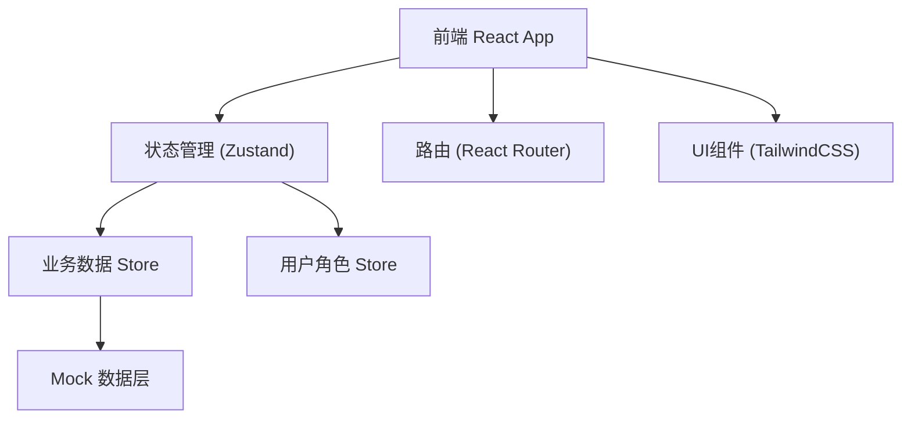
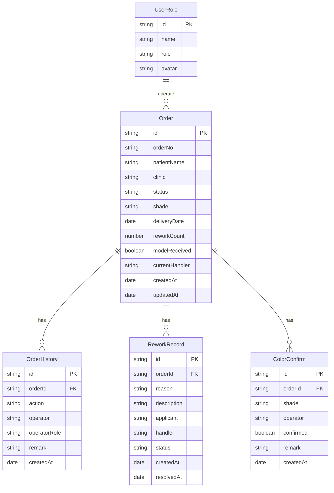

# 义齿加工厂管理系统 技术架构文档

## 1. 架构设计



## 2. 技术描述

- **前端框架**: React@18 + TypeScript
- **构建工具**: Vite@5
- **样式方案**: TailwindCSS@3
- **状态管理**: Zustand
- **路由管理**: React Router v6
- **图标库**: Lucide React
- **日期处理**: date-fns
- **后端**: 无后端，前端Mock数据模拟

## 3. 路由定义

| 路由 | 页面名称 | 说明 |
|------|----------|------|
| / | 订单列表页 | 主页面，展示所有订单及筛选功能 |
| /order/:id | 订单详情页 | 查看订单完整信息和历史记录 |
| /order/:id/color | 色号确认页 | 色号确认处理页面 |
| /order/:id/rework | 试戴返工页 | 返工申请和处理页面 |

## 4. 数据模型

### 4.1 ER图



### 4.2 核心类型定义

```typescript
// 订单状态类型
type OrderStatus = 
  | 'pending' 
  | 'model_received' 
  | 'color_confirmed' 
  | 'in_production' 
  | 'quality_check' 
  | 'rework' 
  | 'completed';

// 角色类型
type UserRoleType = 'customer_service' | 'designer' | 'inspector';

// 订单接口
interface Order {
  id: string;
  orderNo: string;
  patientName: string;
  clinic: string;
  status: OrderStatus;
  shade?: string;
  deliveryDate: string;
  reworkCount: number;
  modelReceived: boolean;
  currentHandler: string;
  createdAt: string;
  updatedAt: string;
}

// 操作历史接口
interface OrderHistory {
  id: string;
  orderId: string;
  action: string;
  operator: string;
  operatorRole: UserRoleType;
  remark?: string;
  createdAt: string;
}

// 返工记录接口
interface ReworkRecord {
  id: string;
  orderId: string;
  reason: string;
  description: string;
  applicant: string;
  handler: string;
  status: 'pending' | 'processing' | 'resolved';
  createdAt: string;
  resolvedAt?: string;
}

// 色号确认接口
interface ColorConfirm {
  id: string;
  orderId: string;
  shade: string;
  operator: string;
  confirmed: boolean;
  remark?: string;
  createdAt: string;
}
```

## 5. 状态管理结构

```typescript
// App Store
interface AppState {
  // 用户角色
  currentUser: User | null;
  setCurrentUser: (user: User) => void;
  
  // 订单数据
  orders: Order[];
  selectedOrder: Order | null;
  
  // 操作方法
  createOrder: (data: Partial<Order>) => void;
  confirmColor: (orderId: string, shade: string, remark?: string) => void;
  createRework: (orderId: string, data: ReworkData) => void;
  resolveRework: (reworkId: string, remark?: string) => void;
  addHistory: (orderId: string, action: string, remark?: string) => void;
}
```

## 6. 目录结构

```
src/
├── assets/          # 静态资源
├── components/      # 通用组件
│   ├── Layout/      # 布局组件
│   ├── Table/       # 表格组件
│   ├── Timeline/    # 时间线组件
│   └── Modal/       # 弹窗组件
├── pages/           # 页面组件
│   ├── OrderList/   # 订单列表
│   ├── OrderDetail/ # 订单详情
│   ├── ColorConfirm/# 色号确认
│   └── Rework/      # 返工处理
├── store/           # 状态管理
│   ├── useAuthStore.ts
│   └── useOrderStore.ts
├── types/           # 类型定义
│   └── index.ts
├── utils/           # 工具函数
│   ├── mock.ts      # Mock数据
│   └── date.ts
├── App.tsx
├── main.tsx
└── index.css
```
