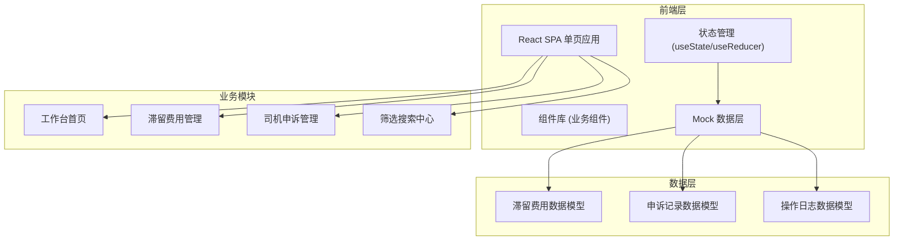
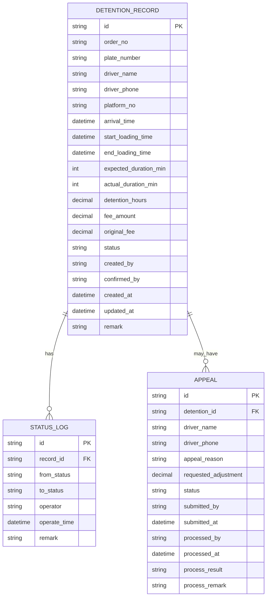

## 1. 架构设计



## 2. 技术描述

- **前端框架**：React@18 + TypeScript
- **构建工具**：Vite@5
- **样式方案**：TailwindCSS@3
- **路由管理**：React Router DOM@6
- **图标库**：Lucide React
- **状态管理**：React 内置 Hooks + Context
- **数据方案**：前端 Mock 数据，模拟完整业务数据

## 3. 路由定义

| Route | 页面 | 功能说明 |
|-------|------|----------|
| /dashboard | 工作台首页 | 数据概览、待办事项、快捷入口 |
| /detention | 滞留费用管理 | 滞留费用列表、详情、状态流转 |
| /appeal | 司机申诉管理 | 申诉列表、详情、处理操作 |
| /appeal/:id | 申诉详情页 | 单条申诉完整信息、历史回看 |

## 4. 数据模型

### 4.1 数据模型 ER 图



### 4.2 核心数据类型定义

```typescript
// 滞留费用状态
type DetentionStatus = 'pending' | 'confirmed' | 'appealed' | 'adjusted' | 'closed';

// 申诉状态
type AppealStatus = 'pending' | 'processing' | 'approved' | 'rejected' | 'closed';

// 滞留费用记录
interface DetentionRecord {
  id: string;
  orderNo: string;
  plateNumber: string;
  driverName: string;
  driverPhone: string;
  platformNo: string;
  arrivalTime: string;
  startLoadingTime: string;
  endLoadingTime: string;
  expectedDurationMin: number;
  actualDurationMin: number;
  detentionHours: number;
  feeAmount: number;
  originalFee: number;
  status: DetentionStatus;
  createdBy: string;
  confirmedBy?: string;
  createdAt: string;
  updatedAt: string;
  remark?: string;
  statusLogs: StatusLog[];
}

// 状态变更日志
interface StatusLog {
  id: string;
  recordId: string;
  fromStatus?: string;
  toStatus: string;
  operator: string;
  operateTime: string;
  remark?: string;
}

// 申诉记录
interface AppealRecord {
  id: string;
  detentionId: string;
  driverName: string;
  driverPhone: string;
  appealReason: string;
  requestedAdjustment: number;
  status: AppealStatus;
  submittedBy: string;
  submittedAt: string;
  processedBy?: string;
  processedAt?: string;
  processResult?: string;
  processRemark?: string;
  detention?: DetentionRecord;
}
```

## 5. 核心组件结构

```
src/
├── components/
│   ├── layout/
│   │   ├── Sidebar.tsx        # 左侧导航
│   │   ├── Header.tsx         # 顶部工具栏
│   │   └── Layout.tsx         # 布局容器
│   ├── common/
│   │   ├── StatusTag.tsx      # 状态标签
│   │   ├── DataTable.tsx      # 通用表格
│   │   ├── SearchBar.tsx      # 搜索筛选栏
│   │   ├── Modal.tsx          # 弹窗组件
│   │   └── Timeline.tsx       # 时间线组件
│   ├── detention/
│   │   ├── DetentionList.tsx  # 滞留费用列表
│   │   ├── DetentionDetail.tsx # 滞留费用详情抽屉
│   │   └── FeeAdjustModal.tsx # 费用调整弹窗
│   └── appeal/
│       ├── AppealList.tsx     # 申诉列表
│       ├── AppealDetail.tsx   # 申诉详情
│       └── AppealProcessModal.tsx # 申诉处理弹窗
├── pages/
│   ├── Dashboard.tsx          # 工作台首页
│   ├── Detention.tsx          # 滞留费用管理页
│   └── Appeal.tsx             # 申诉管理页
├── data/
│   └── mockData.ts            # Mock 数据
├── types/
│   └── index.ts               # 类型定义
└── utils/
    └── format.ts              # 工具函数
```

## 6. 状态流转规则

### 6.1 滞留费用状态流转

| 当前状态 | 可流转至 | 操作角色 | 触发操作 |
|---------|---------|---------|---------|
| pending (待确认) | confirmed (已确认) | 调度员 | 确认费用 |
| confirmed (已确认) | appealed (已申诉) | 系统 | 司机提交申诉 |
| confirmed (已确认) | adjusted (已调整) | 调度员/文员 | 费用调整 |
| appealed (已申诉) | adjusted (已调整) | 仓库文员 | 申诉通过，调整费用 |
| appealed (已申诉) | confirmed (已确认) | 仓库文员 | 申诉驳回，维持原费用 |
| adjusted (已调整) | closed (已关闭) | 系统 | 费用生效后自动关闭 |
| confirmed (已确认) | closed (已关闭) | 系统 | 超时未申诉自动关闭 |

### 6.2 申诉状态流转

| 当前状态 | 可流转至 | 操作角色 | 触发操作 |
|---------|---------|---------|---------|
| pending (待受理) | processing (处理中) | 仓库文员 | 受理申诉 |
| processing (处理中) | approved (申诉通过) | 仓库文员 | 裁决通过 |
| processing (处理中) | rejected (申诉驳回) | 仓库文员 | 裁决驳回 |
| approved (申诉通过) | closed (已关闭) | 系统 | 费用调整完成 |
| rejected (申诉驳回) | closed (已关闭) | 系统 | 通知司机后 |
