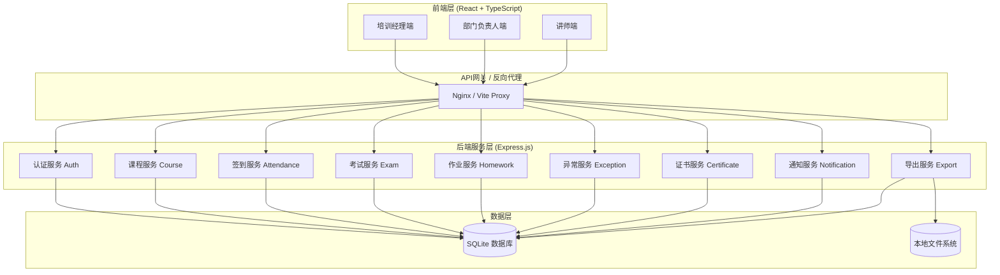
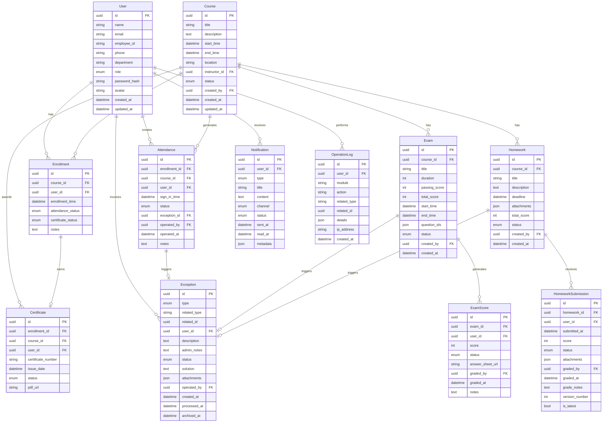

# 企业内训部-签到考试与作业回收系统 技术架构文档

## 1. 系统架构设计



## 2. 技术栈详情

### 2.1 前端技术栈

| 技术 | 版本 | 用途 |
|------|------|------|
| React | 18.x | UI框架 |
| TypeScript | 5.x | 类型安全 |
| Vite | 5.x | 构建工具 |
| Tailwind CSS | 3.x | 样式方案 |
| React Router | 6.x | 路由管理 |
| Axios | 1.x | HTTP客户端 |
| React Hook Form | 7.x | 表单管理 |
| Zod | 3.x | 数据验证 |
| Recharts | 2.x | 图表展示 |
| Lucide React | 最新 | 图标库 |
| Day.js | 1.x | 日期处理 |
| Headless UI | 2.x | 无头组件库 |
| Prisma Client | 5.x | ORM（前端演示用） |

### 2.2 后端技术栈

| 技术 | 版本 | 用途 |
|------|------|------|
| Node.js | 18.x | 运行环境 |
| Express.js | 4.x | Web框架 |
| Prisma | 5.x | ORM工具 |
| SQLite | - | 数据库 |
| jsonwebtoken | 9.x | JWT认证 |
| bcryptjs | 2.x | 密码加密 |
| multer | 1.x | 文件上传 |
| exceljs | 4.x | Excel导出 |
| cors | 2.x | 跨域处理 |

## 3. 项目结构

```
/trae-20260601-1
├── frontend/                    # 前端项目
│   ├── public/
│   │   └── vite.svg
│   ├── src/
│   │   ├── assets/             # 静态资源
│   │   │   └── styles/
│   │   │       └── index.css   # 全局样式
│   │   ├── components/         # 公共组件
│   │   │   ├── common/         # 通用组件
│   │   │   │   ├── Button/
│   │   │   │   ├── Card/
│   │   │   │   ├── Modal/
│   │   │   │   ├── Drawer/
│   │   │   │   ├── Table/
│   │   │   │   ├── Form/
│   │   │   │   ├── Timeline/
│   │   │   │   └── Badge/
│   │   │   └── layout/         # 布局组件
│   │   │       ├── Sidebar/
│   │   │       ├── Header/
│   │   │       └── PageContainer/
│   │   ├── pages/              # 页面组件
│   │   │   ├── dashboard/      # 工作台
│   │   │   ├── courses/        # 课程管理
│   │   │   ├── attendance/     # 签到管理
│   │   │   ├── exam/          # 考试管理
│   │   │   ├── homework/      # 作业管理
│   │   │   ├── exception/     # 异常处理
│   │   │   ├── certificate/    # 证书管理
│   │   │   └── notification/   # 消息通知
│   │   ├── hooks/              # 自定义Hooks
│   │   │   ├── useAuth.ts
│   │   │   ├── useAttendance.ts
│   │   │   ├── useHomework.ts
│   │   │   └── useExport.ts
│   │   ├── services/           # API服务
│   │   │   ├── api.ts          # Axios实例
│   │   │   ├── authService.ts
│   │   │   ├── courseService.ts
│   │   │   ├── attendanceService.ts
│   │   │   ├── examService.ts
│   │   │   ├── homeworkService.ts
│   │   │   ├── exceptionService.ts
│   │   │   └── exportService.ts
│   │   ├── store/              # 状态管理
│   │   │   ├── AuthContext.tsx
│   │   │   └── NotificationContext.tsx
│   │   ├── types/              # TypeScript类型
│   │   │   ├── api.d.ts
│   │   │   ├── course.d.ts
│   │   │   ├── attendance.d.ts
│   │   │   ├── homework.d.ts
│   │   │   └── user.d.ts
│   │   ├── utils/              # 工具函数
│   │   │   ├── format.ts
│   │   │   ├── validation.ts
│   │   │   └── storage.ts
│   │   ├── App.tsx             # 根组件
│   │   ├── main.tsx            # 入口文件
│   │   └── vite-env.d.ts
│   ├── index.html
│   ├── package.json
│   ├── tsconfig.json
│   ├── vite.config.ts
│   ├── tailwind.config.js
│   └── postcss.config.js
│
├── backend/                     # 后端项目
│   ├── prisma/
│   │   ├── schema.prisma        # 数据模型
│   │   └── seed.ts              # 种子数据
│   ├── src/
│   │   ├── config/
│   │   │   └── database.ts      # 数据库配置
│   │   ├── middleware/
│   │   │   ├── auth.ts          # 认证中间件
│   │   │   ├── errorHandler.ts  # 错误处理
│   │   │   ├── validator.ts     # 参数验证
│   │   │   └── upload.ts        # 文件上传
│   │   ├── routes/              # 路由定义
│   │   │   ├── auth.ts
│   │   │   ├── courses.ts
│   │   │   ├── attendance.ts
│   │   │   ├── exams.ts
│   │   │   ├── homework.ts
│   │   │   ├── exceptions.ts
│   │   │   ├── certificates.ts
│   │   │   ├── notifications.ts
│   │   │   └── export.ts
│   │   ├── services/            # 业务逻辑
│   │   │   ├── courseService.ts
│   │   │   ├── attendanceService.ts
│   │   │   ├── examService.ts
│   │   │   ├── homeworkService.ts
│   │   │   ├── exceptionService.ts
│   │   │   ├── certificateService.ts
│   │   │   └── notificationService.ts
│   │   ├── utils/               # 工具函数
│   │   │   ├── response.ts
│   │   │   ├── logger.ts
│   │   │   └── helpers.ts
│   │   └── app.ts               # 应用入口
│   ├── uploads/                # 上传文件目录
│   ├── package.json
│   └── tsconfig.json
│
├── package.json                 # 根目录package.json
├── README.md
└── .gitignore
```

## 4. 路由定义

### 4.1 前端路由

| 路径 | 组件 | 权限 | 描述 |
|------|------|------|------|
| `/` | DashboardPage | all | 首页工作台 |
| `/login` | LoginPage | guest | 登录页 |
| `/courses` | CourseListPage | all | 课程列表 |
| `/courses/:id` | CourseDetailPage | all | 课程详情 |
| `/courses/new` | CourseFormPage | trainer_manager | 新建课程 |
| `/courses/:id/edit` | CourseFormPage | trainer_manager | 编辑课程 |
| `/attendance` | AttendanceListPage | instructor | 签到任务列表 |
| `/attendance/:courseId` | AttendancePage | instructor | 签到处理页 |
| `/attendance/:courseId/detail` | AttendanceDetailPage | all | 签到详情页 |
| `/exams` | ExamListPage | all | 考试列表 |
| `/exams/:id` | ExamDetailPage | all | 考试详情页 |
| `/exams/:id/manage` | ExamManagePage | instructor | 考试处理页 |
| `/homework` | HomeworkListPage | all | 作业列表 |
| `/homework/:id` | HomeworkDetailPage | all | 作业详情页 |
| `/homework/:id/回收` | Homework回收Page | instructor | 作业回收页 |
| `/exceptions` | ExceptionCenterPage | trainer_manager | 异常处理中心 |
| `/certificates` | CertificateListPage | trainer_manager | 证书管理 |
| `/notifications` | NotificationListPage | all | 消息通知 |
| `/export` | ExportPage | trainer_manager | 数据导出 |

### 4.2 后端API路由

| 方法 | 路径 | 描述 | 认证 |
|------|------|------|------|
| POST | `/api/auth/login` | 用户登录 | 否 |
| POST | `/api/auth/logout` | 用户登出 | 是 |
| GET | `/api/auth/me` | 获取当前用户 | 是 |
| GET | `/api/courses` | 获取课程列表 | 是 |
| GET | `/api/courses/:id` | 获取课程详情 | 是 |
| POST | `/api/courses` | 创建课程 | 是 |
| PUT | `/api/courses/:id` | 更新课程 | 是 |
| DELETE | `/api/courses/:id` | 删除课程 | 是 |
| GET | `/api/attendance/:courseId` | 获取课程签到数据 | 是 |
| POST | `/api/attendance/sign-in` | 签到确认 | 是 |
| POST | `/api/attendance/batch-sign-in` | 批量签到 | 是 |
| PUT | `/api/attendance/:enrollmentId` | 更新签到状态 | 是 |
| GET | `/api/attendance/:courseId/timeline` | 获取签到时间线 | 是 |
| GET | `/api/exams` | 获取考试列表 | 是 |
| GET | `/api/exams/:id` | 获取考试详情 | 是 |
| POST | `/api/exams` | 创建考试 | 是 |
| PUT | `/api/exams/:id` | 更新考试 | 是 |
| POST | `/api/exams/:id/publish` | 发布考试 | 是 |
| POST | `/api/exams/:id/grade` | 批改考试 | 是 |
| POST | `/api/exams/:id/grades/batch` | 批量批改 | 是 |
| GET | `/api/homework` | 获取作业列表 | 是 |
| GET | `/api/homework/:id` | 获取作业详情 | 是 |
| POST | `/api/homework` | 创建作业 | 是 |
| PUT | `/api/homework/:id` | 更新作业 | 是 |
| POST | `/api/homework/:id/submit` | 提交作业 | 是 |
| GET | `/api/homework/:id/submissions` | 获取作业提交列表 | 是 |
| GET | `/api/homework/:id/submissions/:submissionId` | 获取作业提交详情 | 是 |
| POST | `/api/homework/:id/grade` | 批改作业 | 是 |
| GET | `/api/exceptions` | 获取异常列表 | 是 |
| GET | `/api/exceptions/:id` | 获取异常详情 | 是 |
| POST | `/api/exceptions` | 创建异常 | 是 |
| PUT | `/api/exceptions/:id` | 更新异常 | 是 |
| PUT | `/api/exceptions/:id/process` | 处理异常 | 是 |
| GET | `/api/certificates` | 获取证书列表 | 是 |
| POST | `/api/certificates/generate` | 生成证书 | 是 |
| GET | `/api/certificates/:id/download` | 下载证书 | 是 |
| GET | `/api/notifications` | 获取通知列表 | 是 |
| PUT | `/api/notifications/:id/read` | 标记已读 | 是 |
| POST | `/api/notifications/batch-read` | 批量标记已读 | 是 |
| POST | `/api/export/attendance` | 导出签到数据 | 是 |
| POST | `/api/export/homework` | 导出作业数据 | 是 |
| POST | `/api/export/exam` | 导出考试成绩 | 是 |
| POST | `/api/upload` | 上传文件 | 是 |
| GET | `/api/timeline/:type/:id` | 获取时间线 | 是 |

## 5. API接口定义

### 5.1 认证接口

```typescript
// POST /api/auth/login
interface LoginRequest {
  email: string;
  password: string;
}

interface LoginResponse {
  token: string;
  user: {
    id: string;
    name: string;
    email: string;
    role: 'trainer_manager' | 'department_head' | 'instructor';
    department?: string;
  };
}

// GET /api/auth/me
interface CurrentUserResponse {
  id: string;
  name: string;
  email: string;
  role: string;
  department?: string;
  avatar?: string;
}
```

### 5.2 签到接口

```typescript
// GET /api/attendance/:courseId
interface AttendanceResponse {
  courseId: string;
  courseName: string;
  scheduledTime: string;
  location: string;
  instructor: {
    id: string;
    name: string;
  };
  stats: {
    total: number;
    signed: number;
    late: number;
    leave: number;
    absent: number;
  };
  attendees: Array<{
    enrollmentId: string;
    userId: string;
    name: string;
    employeeId: string;
    department: string;
    avatar?: string;
    status: 'pending' | 'signed' | 'late' | 'leave' | 'absent';
    signInTime?: string;
    hasException: boolean;
    exceptionId?: string;
  }>;
  timeline: Array<{
    id: string;
    timestamp: string;
    operator: {
      id: string;
      name: string;
    };
    action: string;
    details: string;
    targetUser?: {
      id: string;
      name: string;
    };
  }>;
}

// POST /api/attendance/sign-in
interface SignInRequest {
  enrollmentId: string;
  courseId: string;
  status: 'signed' | 'late' | 'leave' | 'absent';
  signInTime?: string;
  notes?: string;
}

interface SignInResponse {
  success: boolean;
  attendance: {
    id: string;
    enrollmentId: string;
    status: string;
    signInTime: string;
  };
  timeline: {
    id: string;
    timestamp: string;
  };
}
```

### 5.3 作业回收接口

```typescript
// GET /api/homework/:id/submissions
interface HomeworkSubmissionsResponse {
  homeworkId: string;
  homeworkTitle: string;
  courseId: string;
  courseName: string;
  deadline: string;
  totalScore: number;
  stats: {
    total: number;
    submitted: number;
    late: number;
    pending: number;
    graded: number;
  };
  submissions: Array<{
    submissionId: string;
    userId: string;
    name: string;
    employeeId: string;
    department: string;
    avatar?: string;
    status: 'pending' | 'submitted' | 'late' | 'graded';
    submittedAt?: string;
    score?: number;
    isLatest: boolean;
    gradedAt?: string;
    gradedBy?: string;
  }>;
  timeline: Array<{
    id: string;
    timestamp: string;
    operator: {
      id: string;
      name: string;
    };
    action: string;
    details: string;
    targetUser?: {
      id: string;
      name: string;
    };
  }>;
}

// GET /api/homework/:id/submissions/:submissionId
interface SubmissionDetailResponse {
  submissionId: string;
  homeworkId: string;
  user: {
    id: string;
    name: string;
    employeeId: string;
    department: string;
  };
  status: string;
  submittedAt: string;
  version: number;
  attachments: Array<{
    id: string;
    name: string;
    url: string;
    size: number;
    type: string;
  }>;
  notes?: string;
  score?: number;
  gradeNotes?: string;
  gradedAt?: string;
  gradedBy?: string;
  history: Array<{
    version: number;
    submittedAt: string;
    attachments: Array<{
      name: string;
      url: string;
    }>;
  }>;
  timeline: Array<{
    id: string;
    timestamp: string;
    operator: {
      id: string;
      name: string;
    };
    action: string;
    details: string;
  }>;
}
```

### 5.4 异常处理接口

```typescript
// GET /api/exceptions
interface ExceptionListResponse {
  exceptions: Array<{
    id: string;
    type: 'attendance' | 'exam' | 'homework' | 'other';
    relatedType: string;
    relatedId: string;
    relatedName: string;
    user: {
      id: string;
      name: string;
      department: string;
    };
    description: string;
    status: 'pending' | 'processing' | 'processed' | 'archived';
    createdAt: string;
    processedAt?: string;
  }>;
  stats: {
    total: number;
    pending: number;
    processing: number;
    processed: number;
  };
  pagination: {
    page: number;
    limit: number;
    total: number;
  };
}

// POST /api/exceptions/:id/process
interface ProcessExceptionRequest {
  solution: string;
  adminNotes?: string;
  attachments?: string[];
}

interface ProcessExceptionResponse {
  success: boolean;
  exception: {
    id: string;
    status: 'processed';
    processedAt: string;
    solution: string;
  };
  timeline: {
    id: string;
    timestamp: string;
  };
}
```

### 5.5 导出接口

```typescript
// POST /api/export/attendance
interface ExportAttendanceRequest {
  courseId: string;
  format: 'xlsx' | 'csv';
  fields?: string[];
}

interface ExportAttendanceResponse {
  fileName: string;
  downloadUrl: string;
  expiresAt: string;
}

// POST /api/export/homework
interface ExportHomeworkRequest {
  homeworkId: string;
  format: 'xlsx' | 'csv';
  includeAttachments: boolean;
}

// POST /api/export/exam
interface ExportExamRequest {
  examId: string;
  format: 'xlsx' | 'csv' | 'pdf';
  includeAnswers: boolean;
}
```

### 5.6 文件上传接口

```typescript
// POST /api/upload
interface UploadResponse {
  fileId: string;
  fileName: string;
  fileUrl: string;
  fileSize: number;
  mimeType: string;
}
```

## 6. 数据模型

### 6.1 ER图



### 6.2 数据库表结构

#### users 表
```sql
CREATE TABLE users (
    id TEXT PRIMARY KEY,
    name TEXT NOT NULL,
    email TEXT UNIQUE NOT NULL,
    employee_id TEXT UNIQUE NOT NULL,
    phone TEXT,
    department TEXT NOT NULL,
    role TEXT NOT NULL CHECK (role IN ('trainer_manager', 'department_head', 'instructor', 'trainee')),
    password_hash TEXT NOT NULL,
    avatar TEXT,
    created_at DATETIME DEFAULT CURRENT_TIMESTAMP,
    updated_at DATETIME DEFAULT CURRENT_TIMESTAMP
);

CREATE INDEX idx_users_email ON users(email);
CREATE INDEX idx_users_employee_id ON users(employee_id);
CREATE INDEX idx_users_role ON users(role);
CREATE INDEX idx_users_department ON users(department);
```

#### courses 表
```sql
CREATE TABLE courses (
    id TEXT PRIMARY KEY,
    title TEXT NOT NULL,
    description TEXT,
    start_time DATETIME NOT NULL,
    end_time DATETIME NOT NULL,
    location TEXT,
    instructor_id TEXT REFERENCES users(id),
    status TEXT NOT NULL DEFAULT 'draft' CHECK (status IN ('draft', 'published', 'ongoing', 'completed', 'cancelled')),
    created_by TEXT REFERENCES users(id),
    created_at DATETIME DEFAULT CURRENT_TIMESTAMP,
    updated_at DATETIME DEFAULT CURRENT_TIMESTAMP
);

CREATE INDEX idx_courses_instructor ON courses(instructor_id);
CREATE INDEX idx_courses_status ON courses(status);
CREATE INDEX idx_courses_start_time ON courses(start_time);
```

#### enrollments 表
```sql
CREATE TABLE enrollments (
    id TEXT PRIMARY KEY,
    course_id TEXT REFERENCES courses(id) ON DELETE CASCADE,
    user_id TEXT REFERENCES users(id) ON DELETE CASCADE,
    enrollment_time DATETIME DEFAULT CURRENT_TIMESTAMP,
    attendance_status TEXT DEFAULT 'pending' CHECK (attendance_status IN ('pending', 'signed', 'late', 'leave', 'absent')),
    certificate_status TEXT DEFAULT 'none' CHECK (certificate_status IN ('none', 'pending', 'issued')),
    notes TEXT,
    UNIQUE(course_id, user_id)
);

CREATE INDEX idx_enrollments_course ON enrollments(course_id);
CREATE INDEX idx_enrollments_user ON enrollments(user_id);
```

#### attendances 表
```sql
CREATE TABLE attendances (
    id TEXT PRIMARY KEY,
    enrollment_id TEXT REFERENCES enrollments(id) ON DELETE CASCADE,
    course_id TEXT REFERENCES courses(id) ON DELETE CASCADE,
    user_id TEXT REFERENCES users(id) ON DELETE CASCADE,
    sign_in_time DATETIME,
    status TEXT NOT NULL CHECK (status IN ('signed', 'late', 'leave', 'absent')),
    exception_id TEXT REFERENCES exceptions(id),
    operated_by TEXT REFERENCES users(id),
    operated_at DATETIME DEFAULT CURRENT_TIMESTAMP,
    notes TEXT
);

CREATE INDEX idx_attendances_course ON attendances(course_id);
CREATE INDEX idx_attendances_user ON attendances(user_id);
CREATE INDEX idx_attendances_enrollment ON attendances(enrollment_id);
```

#### exceptions 表
```sql
CREATE TABLE exceptions (
    id TEXT PRIMARY KEY,
    type TEXT NOT NULL CHECK (type IN ('attendance', 'exam', 'homework', 'other')),
    related_type TEXT NOT NULL,
    related_id TEXT NOT NULL,
    user_id TEXT REFERENCES users(id) ON DELETE CASCADE,
    description TEXT NOT NULL,
    admin_notes TEXT,
    status TEXT DEFAULT 'pending' CHECK (status IN ('pending', 'processing', 'processed', 'archived')),
    solution TEXT,
    attachments TEXT,
    operated_by TEXT REFERENCES users(id),
    created_at DATETIME DEFAULT CURRENT_TIMESTAMP,
    processed_at DATETIME,
    archived_at DATETIME
);

CREATE INDEX idx_exceptions_type ON exceptions(type);
CREATE INDEX idx_exceptions_status ON exceptions(status);
CREATE INDEX idx_exceptions_user ON exceptions(user_id);
CREATE INDEX idx_exceptions_related ON exceptions(related_type, related_id);
```

#### exams 表
```sql
CREATE TABLE exams (
    id TEXT PRIMARY KEY,
    course_id TEXT REFERENCES courses(id) ON DELETE CASCADE,
    title TEXT NOT NULL,
    duration INTEGER NOT NULL,
    passing_score INTEGER NOT NULL,
    total_score INTEGER NOT NULL,
    start_time DATETIME NOT NULL,
    end_time DATETIME NOT NULL,
    question_ids TEXT,
    status TEXT DEFAULT 'draft' CHECK (status IN ('draft', 'published', 'ongoing', 'grading', 'published', 'archived')),
    created_by TEXT REFERENCES users(id),
    created_at DATETIME DEFAULT CURRENT_TIMESTAMP
);

CREATE INDEX idx_exams_course ON exams(course_id);
CREATE INDEX idx_exams_status ON exams(status);
```

#### exam_scores 表
```sql
CREATE TABLE exam_scores (
    id TEXT PRIMARY KEY,
    exam_id TEXT REFERENCES exams(id) ON DELETE CASCADE,
    user_id TEXT REFERENCES users(id) ON DELETE CASCADE,
    score INTEGER,
    status TEXT DEFAULT 'pending' CHECK (status IN ('pending', 'grading', 'graded', 'published')),
    answer_sheet_url TEXT,
    graded_by TEXT REFERENCES users(id),
    graded_at DATETIME,
    notes TEXT,
    UNIQUE(exam_id, user_id)
);

CREATE INDEX idx_exam_scores_exam ON exam_scores(exam_id);
CREATE INDEX idx_exam_scores_user ON exam_scores(user_id);
```

#### homeworks 表
```sql
CREATE TABLE homeworks (
    id TEXT PRIMARY KEY,
    course_id TEXT REFERENCES courses(id) ON DELETE CASCADE,
    title TEXT NOT NULL,
    description TEXT,
    deadline DATETIME NOT NULL,
    attachments TEXT,
    total_score INTEGER NOT NULL,
    status TEXT DEFAULT 'draft' CHECK (status IN ('draft', 'published', 'closed')),
    created_by TEXT REFERENCES users(id),
    created_at DATETIME DEFAULT CURRENT_TIMESTAMP
);

CREATE INDEX idx_homeworks_course ON homeworks(course_id);
CREATE INDEX idx_homeworks_status ON homeworks(status);
```

#### homework_submissions 表
```sql
CREATE TABLE homework_submissions (
    id TEXT PRIMARY KEY,
    homework_id TEXT REFERENCES homeworks(id) ON DELETE CASCADE,
    user_id TEXT REFERENCES users(id) ON DELETE CASCADE,
    submitted_at DATETIME DEFAULT CURRENT_TIMESTAMP,
    score INTEGER,
    status TEXT DEFAULT 'pending' CHECK (status IN ('pending', 'submitted', 'late', 'graded')),
    attachments TEXT,
    graded_by TEXT REFERENCES users(id),
    graded_at DATETIME,
    grade_notes TEXT,
    version_number INTEGER DEFAULT 1,
    is_latest BOOLEAN DEFAULT TRUE
);

CREATE INDEX idx_homework_submissions_homework ON homework_submissions(homework_id);
CREATE INDEX idx_homework_submissions_user ON homework_submissions(user_id);
CREATE INDEX idx_homework_submissions_latest ON homework_submissions(homework_id, is_latest);
```

#### certificates 表
```sql
CREATE TABLE certificates (
    id TEXT PRIMARY KEY,
    enrollment_id TEXT REFERENCES enrollments(id) ON DELETE CASCADE,
    course_id TEXT REFERENCES courses(id) ON DELETE CASCADE,
    user_id TEXT REFERENCES users(id) ON DELETE CASCADE,
    certificate_number TEXT UNIQUE NOT NULL,
    issue_date DATETIME DEFAULT CURRENT_TIMESTAMP,
    status TEXT DEFAULT 'generated' CHECK (status IN ('generated', 'issued', 'invalid')),
    pdf_url TEXT
);

CREATE INDEX idx_certificates_user ON certificates(user_id);
CREATE INDEX idx_certificates_course ON certificates(course_id);
```

#### notifications 表
```sql
CREATE TABLE notifications (
    id TEXT PRIMARY KEY,
    user_id TEXT REFERENCES users(id) ON DELETE CASCADE,
    type TEXT NOT NULL,
    title TEXT NOT NULL,
    content TEXT,
    channel TEXT DEFAULT 'in_app' CHECK (channel IN ('in_app', 'email', 'wechat', 'dingtalk')),
    status TEXT DEFAULT 'pending' CHECK (status IN ('pending', 'sent', 'read')),
    sent_at DATETIME,
    read_at DATETIME,
    metadata TEXT
);

CREATE INDEX idx_notifications_user ON notifications(user_id);
CREATE INDEX idx_notifications_status ON notifications(status);
```

#### operation_logs 表
```sql
CREATE TABLE operation_logs (
    id TEXT PRIMARY KEY,
    user_id TEXT REFERENCES users(id) ON DELETE SET NULL,
    module TEXT NOT NULL,
    action TEXT NOT NULL,
    related_type TEXT,
    related_id TEXT,
    details TEXT,
    ip_address TEXT,
    created_at DATETIME DEFAULT CURRENT_TIMESTAMP
);

CREATE INDEX idx_operation_logs_user ON operation_logs(user_id);
CREATE INDEX idx_operation_logs_module ON operation_logs(module);
CREATE INDEX idx_operation_logs_created ON operation_logs(created_at);
```

## 7. 种子数据设计

### 7.1 用户数据

```typescript
const seedUsers = [
  {
    id: 'user-001',
    name: '张培训',
    email: 'zhang@company.com',
    employee_id: 'EMP001',
    phone: '13800138000',
    department: '人力资源部',
    role: 'trainer_manager',
    password: 'password123'
  },
  {
    id: 'user-002',
    name: '李经理',
    email: 'li.manager@company.com',
    employee_id: 'EMP002',
    phone: '13800138001',
    department: '技术部',
    role: 'department_head'
  },
  {
    id: 'user-003',
    name: '王讲师',
    email: 'wang@company.com',
    employee_id: 'EMP003',
    phone: '13800138002',
    department: '技术部',
    role: 'instructor'
  },
  {
    id: 'user-004',
    name: '赵学员',
    email: 'zhao@company.com',
    employee_id: 'EMP004',
    phone: '13800138003',
    department: '技术部',
    role: 'trainee'
  },
  {
    id: 'user-005',
    name: '钱学员',
    email: 'qian@company.com',
    employee_id: 'EMP005',
    phone: '13800138004',
    department: '技术部',
    role: 'trainee'
  },
  {
    id: 'user-006',
    name: '孙学员',
    email: 'sun@company.com',
    employee_id: 'EMP006',
    phone: '13800138005',
    department: '市场部',
    role: 'trainee'
  }
];
```

### 7.2 课程数据

```typescript
const seedCourses = [
  {
    id: 'course-001',
    title: 'React高级开发实战',
    description: '深入学习React生态系统，包括Hooks、Redux、TypeScript集成等',
    start_time: '2024-01-15 09:00:00',
    end_time: '2024-01-15 17:00:00',
    location: 'A栋3楼培训室',
    instructor_id: 'user-003',
    status: 'completed',
    created_by: 'user-001'
  },
  {
    id: 'course-002',
    title: '产品经理能力提升',
    description: '从需求分析到产品落地的完整方法论',
    start_time: '2024-02-01 09:00:00',
    end_time: '2024-02-01 17:00:00',
    location: 'B栋5楼会议室',
    instructor_id: 'user-003',
    status: 'ongoing',
    created_by: 'user-001'
  }
];
```

### 7.3 签到数据示例

```typescript
const seedAttendances = [
  {
    id: 'attendance-001',
    enrollment_id: 'enrollment-001',
    course_id: 'course-001',
    user_id: 'user-004',
    sign_in_time: '2024-01-15 08:55:00',
    status: 'signed',
    operated_by: 'user-003',
    operated_at: '2024-01-15 09:00:00'
  },
  {
    id: 'attendance-002',
    enrollment_id: 'enrollment-002',
    course_id: 'course-001',
    user_id: 'user-005',
    sign_in_time: '2024-01-15 09:20:00',
    status: 'late',
    operated_by: 'user-003',
    operated_at: '2024-01-15 09:20:00',
    notes: '地铁延误'
  },
  {
    id: 'attendance-003',
    enrollment_id: 'enrollment-003',
    course_id: 'course-001',
    user_id: 'user-006',
    sign_in_time: null,
    status: 'absent',
    operated_by: 'user-003',
    operated_at: '2024-01-15 09:30:00'
  }
];
```

### 7.4 异常数据示例

```typescript
const seedExceptions = [
  {
    id: 'exception-001',
    type: 'attendance',
    related_type: 'course',
    related_id: 'course-001',
    user_id: 'user-005',
    description: '因地铁延误导致迟到20分钟，已提交地铁延误证明',
    admin_notes: '核实情况属实，地铁官方公告显示早高峰延误',
    status: 'processed',
    solution: '记录为迟到，不影响考勤',
    operated_by: 'user-001',
    created_at: '2024-01-15 09:30:00',
    processed_at: '2024-01-15 14:00:00'
  },
  {
    id: 'exception-002',
    type: 'attendance',
    related_type: 'course',
    related_id: 'course-001',
    user_id: 'user-006',
    description: '突发疾病，已就医',
    admin_notes: '',
    status: 'pending',
    operated_by: 'user-001',
    created_at: '2024-01-15 10:00:00'
  }
];
```

## 8. 本地运行指南

### 8.1 环境要求

- Node.js 18.x 或更高版本
- npm 9.x 或更高版本
- Git

### 8.2 快速启动

```bash
# 1. 克隆项目（如果需要）
# git clone <repo-url>

# 2. 安装根目录依赖
npm install

# 3. 安装前后端依赖并初始化数据库
npm run setup

# 4. 启动开发服务器
npm run dev
```

### 8.3 启动说明

- 前端访问地址：http://localhost:5173
- 后端API地址：http://localhost:3000
- 数据库文件位置：./backend/prisma/dev.db

### 8.4 测试账号

| 角色 | 邮箱 | 密码 |
|------|------|------|
| 培训经理 | zhang@company.com | password123 |
| 部门负责人 | li.manager@company.com | password123 |
| 讲师 | wang@company.com | password123 |
| 学员 | zhao@company.com | password123 |

### 8.5 可用功能演示

1. **签到处理：** 使用讲师账号登录，访问 /attendance/course-001 体验签到流程
2. **异常处理：** 使用培训经理账号登录，访问 /exceptions 查看和管理异常
3. **作业回收：** 体验作业提交、批改和历史版本回看
4. **数据导出：** 支持签到、作业、考试成绩的Excel导出
5. **消息通知：** 站内信功能，支持通知发送和已读状态

## 9. 项目约束与注意事项

### 9.1 功能轻重缓急

**已实现（核心功能）：**
- 多角色权限系统
- 课程管理（CRUD）
- 签到处理与详情时间线
- 异常处理中心（包含抽屉交互）
- 作业回收与历史回看
- 考试管理基础功能
- 数据导出（Excel格式）
- 消息通知（站内信）
- 文件上传下载

**简化实现（轻量功能）：**
- 消息通知渠道：仅实现站内信，邮件/企业微信/钉钉为预留接口
- 证书管理：简化版，支持生成和导出PDF
- 统计报表：基础图表和导出，复杂分析报表预留接口

### 9.2 技术约束

- 数据库使用SQLite，便于本地演示
- 文件存储使用本地文件系统，不依赖云服务
- 实时功能（签到监控）使用轮询，非WebSocket
- 认证使用简化的JWT，不使用Refresh Token
- 不使用消息队列，通知发送为同步操作

### 9.3 性能约束

- 单次查询返回数据量限制：100条
- 文件上传大小限制：10MB
- 并发用户支持：10-20人
- 页面加载时间目标：< 3秒

### 9.4 扩展性预留

- 模块化架构，支持后续添加新的业务模块
- 统一的时间线和日志系统，便于审计追踪
- 标准化的API接口，便于移动端或第三方系统集成
- 数据库结构预留扩展字段（metadata）
