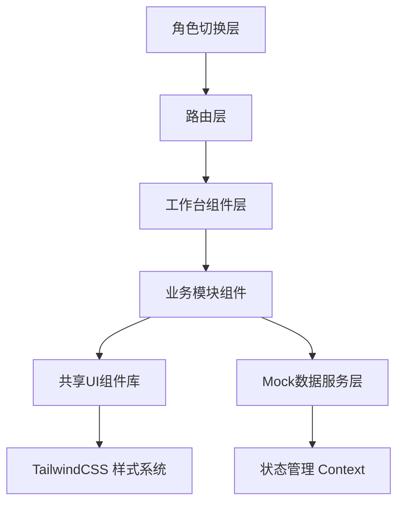

# 车辆年检站报告发放与车主回访系统 - 技术架构文档

## 1. 技术架构



## 2. 技术栈选型

### 2.1 前端技术栈

| 技术 | 版本 | 用途 |
|------|------|------|
| React | 18.x | UI框架，组件化开发 |
| React Router | 6.x | 客户端路由管理 |
| TailwindCSS | 3.x | 原子化CSS样式方案 |
| Lucide React | latest | 图标库 |
| Vite | 5.x | 开发和构建工具 |
| TypeScript | 5.x | 类型安全 |

### 2.2 项目初始化

```bash
# 使用 Vite 创建 React + TypeScript 项目
npm create vite@latest vehicle-inspection -- --template react-ts

# 安装依赖
npm install react-router-dom lucide-react clsx tailwind-merge

# 安装 TailwindCSS
npm install -D tailwindcss postcss autoprefixer
npx tailwindcss init -p
```

### 2.3 数据方案

**Mock Data First 策略**
- 使用 React Context 模拟全局状态管理
- 本地存储 localStorage 持久化模拟数据
- 预设7种状态的Mock数据（见PRD第5章）
- 提供数据重置功能用于测试

## 3. 路由定义

### 3.1 路由结构

```typescript
/                           # 首页（角色选择）
/dispatcher                 # 接车员入口
  /dispatcher/dashboard     # 仪表盘
  /dispatcher/register      # 车辆登记
  /dispatcher/tasks         # 任务列表
  /dispatcher/tasks/:id     # 任务详情
/inspector                  # 检测员入口
  /inspector/dashboard      # 仪表盘
  /inspector/tasks          # 检测任务列表
  /inspector/inspection/:id # 检测执行页
  /inspector/reports        # 我的报告
  /inspector/reports/edit/:id # 报告修改页
/auditor                    # 审核员入口
  /auditor/dashboard        # 仪表盘
  /auditor/reports          # 待审核报告列表
  /auditor/reports/:id      # 报告审核页
  /auditor/distribution     # 报告发放管理
  /auditor/distribution/:id # 发放详情
/admin                      # 管理员入口
  /admin/dashboard          # 全局仪表盘
  /admin/followup           # 回访管理
  /admin/followup/:id       # 回访执行页
  /admin/history            # 回访历史
  /admin/reports            # 统计报表
```

### 3.2 路由守卫

- 角色特定路由需通过角色上下文验证
- 未选择角色时重定向到首页
- 角色切换清除相关状态

## 4. 数据模型定义

### 4.1 核心数据实体

```typescript
// 车辆信息
interface Vehicle {
  id: string;
  plateNumber: string;          // 车牌号
  ownerName: string;             // 车主姓名
  ownerPhone: string;            // 车主电话
  ownerIdCard: string;           // 车主身份证
  brand: string;                // 品牌
  model: string;                // 型号
  vinCode: string;              // VIN码
  registerDate: string;          // 注册日期
  inspectionType: '初检' | '复检' | '变更';
  status: VehicleStatus;
  createdAt: string;
  updatedAt: string;
}

// 车辆状态枚举
type VehicleStatus = 
  | '待检测'
  | '检测中'
  | '待审核'
  | '待发放'
  | '发放中'
  | '已发放'
  | '已完成';

// 检测任务
interface InspectionTask {
  id: string;
  vehicleId: string;
  inspectorId: string;
  inspectorName: string;
  status: '待执行' | '进行中' | '已完成' | '已驳回';
  startTime?: string;
  endTime?: string;
  reportId?: string;
  createdAt: string;
}

// 检测报告
interface InspectionReport {
  id: string;
  vehicleId: string;
  taskId: string;
  inspectorName: string;
  auditorId?: string;
  auditorName?: string;
  status: '待审核' | '已通过' | '已驳回';
  rejectReason?: string;
  items: InspectionItem[];
  conclusion: '合格' | '不合格' | '需复检';
  photos: string[];
  remark?: string;
  submittedAt?: string;
  auditedAt?: string;
  distributedAt?: string;
  createdAt: string;
}

// 检测项目
interface InspectionItem {
  id: string;
  name: string;                  // 项目名称
  result: '合格' | '不合格' | '不适用';
  remark?: string;
  photo?: string;
}

// 报告发放
interface ReportDistribution {
  id: string;
  reportId: string;
  vehicleId: string;
  status: '待发放' | '发放中' | '已发放' | '发放异常';
  sentAt?: string;
  confirmedAt?: string;
  followupTaskId?: string;
  createdAt: string;
}

// 回访任务
interface FollowupTask {
  id: string;
  distributionId: string;
  reportId: string;
  vehicleId: string;
  ownerName: string;
  ownerPhone: string;
  status: '待回访' | '回访中' | '已完成' | '无法联系';
  deadline: string;
  attempts: number;
  result?: FollowupResult;
  followupRecords: FollowupRecord[];
  createdAt: string;
}

// 回访记录
interface FollowupRecord {
  id: string;
  taskId: string;
  type: '首次联系' | '催促' | '回访';
  contactResult: '成功' | '无人接听' | '号码错误' | '拒绝回访';
  reportReceived: boolean;
  serviceSatisfaction: '非常满意' | '满意' | '一般' | '不满意';
  processSatisfaction: '满意' | '基本满意' | '不满意';
  feedback?: string;
  operator: string;
  operatedAt: string;
}

// 回访结果
interface FollowupResult {
  reportReceived: boolean;
  serviceSatisfaction: string;
  processSatisfaction: string;
  feedback: string;
  conclusion: string;
  completedAt: string;
}
```

### 4.2 Mock 数据初始化

```typescript
// 预设数据 - 包含7种状态场景
const mockVehicles: Vehicle[] = [
  {
    id: 'V001',
    plateNumber: '京A·12345',
    ownerName: '李明',
    ownerPhone: '13800138001',
    brand: '宝马',
    model: 'BMW 525Li',
    status: '已完成',
    // ... 顺利记录
  },
  {
    id: 'V002',
    plateNumber: '京B·67890',
    ownerName: '王芳',
    status: '已发放',
    // ... 拖延记录（未回访）
  },
  // ... 其他6种状态
];

// 初始化状态
const initialState = {
  vehicles: mockVehicles,
  tasks: [...],
  reports: [...],
  distributions: [...],
  followups: [...],
  currentRole: null,
};
```

## 5. 组件架构

### 5.1 组件层级

```
src/
├── components/
│   ├── layout/              # 布局组件
│   │   ├── AppLayout.tsx    # 主布局（侧边栏+内容区）
│   │   ├── Sidebar.tsx     # 侧边栏导航
│   │   ├── TopBar.tsx      # 顶部栏
│   │   └── RoleSwitcher.tsx # 角色切换器
│   ├── common/              # 通用组件
│   │   ├── StatusBadge.tsx # 状态标签
│   │   ├── EmptyState.tsx  # 空状态
│   │   ├── DataTable.tsx    # 数据表格
│   │   ├── Card.tsx        # 卡片组件
│   │   ├── Button.tsx      # 按钮组件
│   │   ├── Modal.tsx       # 模态框
│   │   ├── Form.tsx        # 表单组件
│   │   └── StatsCard.tsx   # 统计卡片
│   ├── dispatcher/          # 接车员模块
│   │   ├── VehicleRegister.tsx
│   │   └── TaskAssignment.tsx
│   ├── inspector/           # 检测员模块
│   │   ├── InspectionTask.tsx
│   │   ├── InspectionForm.tsx
│   │   └── ReportEdit.tsx
│   ├── auditor/             # 审核员模块
│   │   ├── ReportAudit.tsx
│   │   ├── ReportDistribution.tsx
│   │   └── DistributionList.tsx
│   └── followup/            # 回访模块
│       ├── FollowupList.tsx
│       ├── FollowupForm.tsx
│       └── FollowupHistory.tsx
├── pages/
│   ├── Home.tsx             # 首页（角色选择）
│   ├── dispatcher/          # 接车员页面
│   ├── inspector/           # 检测员页面
│   ├── auditor/             # 审核员页面
│   └── followup/            # 回访页面
├── contexts/
│   ├── RoleContext.tsx      # 角色上下文
│   ├── DataContext.tsx      # 数据上下文
│   └── AppContext.tsx       # 应用上下文
├── services/
│   ├── mockService.ts       # Mock数据服务
│   └── dataService.ts       # 数据操作服务
├── hooks/
│   ├── useRole.ts
│   ├── useVehicles.ts
│   ├── useReports.ts
│   └── useFollowups.ts
├── types/
│   └── index.ts             # 类型定义
├── utils/
│   ├── helpers.ts           # 工具函数
│   └── constants.ts         # 常量定义
└── App.tsx
```

### 5.2 核心组件设计

#### 5.2.1 StatusBadge 状态标签组件

```typescript
interface StatusBadgeProps {
  status: string;
  size?: 'sm' | 'md' | 'lg';
  animate?: boolean;  // 异常状态闪烁动画
}

// 状态映射
const statusConfig = {
  '顺利/已完成': { bg: 'bg-green-500', text: 'text-white', pulse: false },
  '拖延/超时': { bg: 'bg-orange-100 border-2 border-orange-500', text: 'text-orange-700', pulse: true },
  '补录/待补': { bg: 'bg-blue-100 border-dashed border-2 border-blue-500', text: 'text-blue-700', pulse: false },
  '驳回/不合格': { bg: 'bg-red-500', text: 'text-white', pulse: false },
  '待复核/待审': { bg: 'bg-yellow-100', text: 'text-yellow-700', pulse: false },
  '无法联系': { bg: 'bg-gray-500', text: 'text-white', pulse: false },
};
```

#### 5.2.2 EmptyState 空状态组件

```typescript
interface EmptyStateProps {
  icon: ReactNode;           // SVG图标
  title: string;             // 标题
  description: string;       // 描述
  action?: {
    label: string;
    onClick: () => void;
  };
}

// 使用示例
<EmptyState
  icon={<CarIcon />}
  title="暂无待检测车辆"
  description="点击下方按钮快速登记车辆信息"
  action={{
    label: '登记车辆',
    onClick: () => navigate('/dispatcher/register')
  }}
/>
```

#### 5.2.3 AppLayout 主布局组件

```typescript
interface AppLayoutProps {
  children: ReactNode;
  role: Role;               // 当前角色
  sidebarItems: SidebarItem[];  // 侧边栏菜单
}

// 布局结构
<div className="flex h-screen bg-gray-100">
  <Sidebar role={role} items={sidebarItems} />
  <div className="flex-1 flex flex-col overflow-hidden">
    <TopBar role={role} />
    <main className="flex-1 overflow-y-auto p-6">
      {children}
    </main>
  </div>
</div>
```

## 6. 状态管理架构

### 6.1 Context 层级

```typescript
// RoleContext - 角色状态
const RoleContext = createContext<{
  currentRole: Role | null;
  setRole: (role: Role) => void;
  clearRole: () => void;
}>();

// DataContext - 业务数据状态
const DataContext = createContext<{
  vehicles: Vehicle[];
  tasks: InspectionTask[];
  reports: InspectionReport[];
  distributions: ReportDistribution[];
  followups: FollowupTask[];
  
  // 数据操作
  addVehicle: (vehicle: Vehicle) => void;
  updateVehicle: (id: string, updates: Partial<Vehicle>) => void;
  submitReport: (report: InspectionReport) => void;
  auditReport: (id: string, result: '通过' | '驳回', reason?: string) => void;
  distributeReport: (id: string) => void;
  createFollowup: (distributionId: string) => void;
  completeFollowup: (id: string, result: FollowupResult) => void;
  
  // 数据重置
  resetData: () => void;
}>();
```

### 6.2 状态更新流程

```typescript
// 报告发放触发回访
const distributeReport = (reportId: string) => {
  // 1. 更新报告状态
  updateReport(reportId, { status: '已通过', distributedAt: new Date() });
  
  // 2. 创建发放记录
  const distribution = createDistribution(reportId);
  
  // 3. 自动创建回访任务
  const followup = createFollowupTask(distribution.id);
  
  // 4. 触发通知（可选）
  notifyNewFollowup(followup);
};
```

## 7. 样式系统

### 7.1 TailwindCSS 配置

```javascript
// tailwind.config.js
module.exports = {
  content: [
    "./index.html",
    "./src/**/*.{js,ts,jsx,tsx}",
  ],
  theme: {
    extend: {
      colors: {
        // 角色主题色
        dispatcher: {
          DEFAULT: '#3B82F6',
          light: '#EFF6FF',
          dark: '#2563EB',
        },
        inspector: {
          DEFAULT: '#F59E0B',
          light: '#FFFBEB',
          dark: '#D97706',
        },
        auditor: {
          DEFAULT: '#10B981',
          light: '#ECFDF5',
          dark: '#059669',
        },
        admin: {
          DEFAULT: '#8B5CF6',
          light: '#F5F3FF',
          dark: '#7C3AED',
        },
      },
      animation: {
        'pulse-slow': 'pulse 2s cubic-bezier(0.4, 0, 0.6, 1) infinite',
        'fade-in': 'fadeIn 0.3s ease-out',
        'slide-up': 'slideUp 0.3s ease-out',
      },
      keyframes: {
        fadeIn: {
          '0%': { opacity: '0' },
          '100%': { opacity: '1' },
        },
        slideUp: {
          '0%': { transform: 'translateY(10px)', opacity: '0' },
          '100%': { transform: 'translateY(0)', opacity: '1' },
        },
      },
    },
  },
  plugins: [],
}
```

### 7.2 角色主题类名

```typescript
// 动态主题类名
const roleClasses = {
  dispatcher: {
    primary: 'bg-dispatcher text-white',
    secondary: 'bg-dispatcher-light text-dispatcher',
    border: 'border-dispatcher',
    hover: 'hover:bg-dispatcher-dark',
  },
  inspector: {
    primary: 'bg-inspector text-white',
    secondary: 'bg-inspector-light text-inspector',
    border: 'border-inspector',
    hover: 'hover:bg-inspector-dark',
  },
  auditor: {
    primary: 'bg-auditor text-white',
    secondary: 'bg-auditor-light text-auditor',
    border: 'border-auditor',
    hover: 'hover:bg-auditor-dark',
  },
  admin: {
    primary: 'bg-admin text-white',
    secondary: 'bg-admin-light text-admin',
    border: 'border-admin',
    hover: 'hover:bg-admin-dark',
  },
};

// 使用示例
<Button className={roleClasses[currentRole].primary}>
  主要操作
</Button>
```

## 8. 开发规范

### 8.1 组件开发规范

- 使用 TypeScript 严格模式
- 组件必须定义 Props 接口
- 使用 React.memo 优化性能
- 事件处理器使用 useCallback
- 数据获取使用 useEffect

### 8.2 样式开发规范

- 优先使用 TailwindCSS 原子类
- 复杂样式提取为组件
- 保持样式一致性
- 响应式设计优先移动端

### 8.3 数据操作规范

- 所有数据操作通过 DataContext
- 使用 Immer 或展开运算符更新状态
- 关键操作添加日志记录
- 操作后提供用户反馈

### 8.4 Mock 数据规范

- 每个状态至少一条完整记录
- 字段值真实合理
- 时间线逻辑正确
- 关联关系准确

## 9. 文件结构

```
vehicle-inspection/
├── index.html
├── package.json
├── vite.config.ts
├── tsconfig.json
├── tailwind.config.js
├── postcss.config.js
├── .gitignore
├── README.md
└── src/
    ├── main.tsx
    ├── App.tsx
    ├── index.css
    ├── components/
    │   ├── layout/
    │   ├── common/
    │   ├── dispatcher/
    │   ├── inspector/
    │   ├── auditor/
    │   └── followup/
    ├── pages/
    ├── contexts/
    ├── services/
    ├── hooks/
    ├── types/
    └── utils/
```

## 10. 开发优先级

### 第一阶段：基础框架
1. 项目初始化和配置
2. 路由系统搭建
3. 布局组件开发
4. 角色上下文实现

### 第二阶段：数据层
1. 类型定义
2. Mock 数据生成
3. DataContext 实现
4. 数据服务层

### 第三阶段：核心页面
1. 首页（角色选择）
2. 接车员模块
3. 检测员模块
4. 审核员模块
5. 回访模块

### 第四阶段：交互优化
1. 状态动画
2. 过渡效果
3. 错误处理
4. 空状态优化

### 第五阶段：数据完善
1. 补充 Mock 数据
2. 数据关联测试
3. 异常场景测试
4. 性能优化
