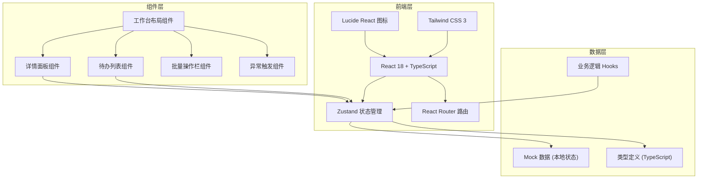

# 球馆运营系统 - 技术架构文档

## 1. 架构设计



## 2. 技术选型说明

| 层级 | 技术 | 版本 | 说明 |
|------|------|------|------|
| 前端框架 | React | 18.x | 函数式组件 + Hooks |
| 类型系统 | TypeScript | 5.x | 严格模式 |
| 构建工具 | Vite | 5.x | 极速开发体验 |
| 样式方案 | Tailwind CSS | 3.x | 原子化 CSS |
| 状态管理 | Zustand | 4.x | 轻量、高性能 |
| 路由 | react-router-dom | 6.x | 声明式路由 |
| 图标库 | lucide-react | 0.x | 现代化图标 |
| 后端 | 无 | - | 纯前端 Mock 数据 |

## 3. 路由定义

| 路由 | 页面 | 说明 |
|------|------|------|
| `/` | 运营工作台 | 主页面，包含所有功能 |

## 4. 数据模型

### 4.1 核心类型定义

```typescript
// 角色类型
type UserRole = 'reception' | 'coach' | 'manager';

// 记录状态
type RecordStatus = 
  | 'pending_coach_confirm'   // 待教练确认
  | 'pending_reception_handle' // 待前台处理
  | 'pending_manager_audit'    // 待店长仲裁
  | 'completed'                // 已完成
  | 'disputed';                // 有争议

// 退回原因
type RejectReason = 
  | 'time_conflict'      // 时间冲突
  | 'student_no_show'    // 学员未到
  | 'venue_issue'        // 场地问题
  | 'coach_unavailable'  // 教练无法到场
  | 'other';             // 其他

// 责任标记
type ResponsibilityFlag = 
  | 'none'           // 无
  | 'reception'      // 前台责任
  | 'coach'          // 教练责任
  | 'both'           // 双方都有
  | 'unclear';       // 责任不清

// 操作历史
interface ActionHistory {
  id: string;
  timestamp: number;
  operator: UserRole;
  operatorName: string;
  action: string;
  remark?: string;
}

// 排班与课时记录 (核心模型 - 单条记录贯穿全流程)
interface ScheduleRecord {
  id: string;
  // 排班信息
  studentName: string;
  studentPhone?: string;
  courseType: string;       // 课程类型
  coachId: string;
  coachName: string;
  venueId: string;
  venueName: string;
  scheduledDate: string;    // YYYY-MM-DD
  startTime: string;        // HH:mm
  endTime: string;          // HH:mm
  duration: number;         // 分钟
  
  // 状态流转
  status: RecordStatus;
  createdAt: number;
  updatedAt: number;
  isOverdue: boolean;       // 是否超时
  
  // 确认信息
  confirmedAt?: number;
  confirmedBy?: string;
  
  // 退回信息
  rejectedAt?: number;
  rejectedBy?: string;
  rejectReason?: RejectReason;
  rejectRemark?: string;
  
  // 补充备注
  receptionRemark?: string;  // 前台补充
  coachRemark?: string;      // 教练补充
  
  // 责任标记
  responsibility: ResponsibilityFlag;
  responsibilityRemark?: string;
  hasResponsibilityRisk: boolean;  // 是否有责任不清风险
  
  // 操作历史
  history: ActionHistory[];
}

// 教练信息
interface Coach {
  id: string;
  name: string;
  phone: string;
  specialty: string[];
}

// 场地信息
interface Venue {
  id: string;
  name: string;
  type: string;
  capacity: number;
}
```

### 4.2 状态管理结构 (Zustand)

```typescript
interface AppState {
  // 当前角色
  currentRole: UserRole;
  setCurrentRole: (role: UserRole) => void;
  
  // 数据
  records: ScheduleRecord[];
  coaches: Coach[];
  venues: Venue[];
  
  // UI 状态
  selectedRecordIds: string[];
  activeRecordId: string | null;
  showDetailPanel: boolean;
  
  // 筛选
  filterStatus: RecordStatus | 'all';
  
  // 操作
  setSelectedRecords: (ids: string[]) => void;
  setActiveRecord: (id: string | null) => void;
  setShowDetailPanel: (show: boolean) => void;
  setFilterStatus: (status: RecordStatus | 'all') => void;
  
  // 业务操作
  confirmRecord: (recordId: string, coachRemark?: string) => void;
  rejectRecord: (recordId: string, reason: RejectReason, remark: string) => void;
  addReceptionRemark: (recordId: string, remark: string) => void;
  escalateToManager: (recordId: string, remark: string) => void;
  resolveDispute: (recordId: string, responsibility: ResponsibilityFlag, remark: string) => void;
  batchConfirm: (recordIds: string[]) => void;
  batchMarkResponsibility: (recordIds: string[], flag: ResponsibilityFlag) => void;
  
  // 异常模拟
  simulateOverdue: (recordId: string) => void;
  simulateDispute: (recordId: string) => void;
  simulateDataInconsistency: (recordId: string) => void;
  
  // 辅助
  getTodoCount: () => number;
  getFilteredRecords: () => ScheduleRecord[];
}
```

## 5. 项目目录结构

```
src/
├── components/          # 组件
│   ├── layout/         # 布局组件
│   │   ├── TopBar.tsx
│   │   └── WorkspaceLayout.tsx
│   ├── records/        # 记录相关组件
│   │   ├── RecordCard.tsx
│   │   ├── RecordList.tsx
│   │   ├── RecordDetailPanel.tsx
│   │   └── StatusBadge.tsx
│   ├── actions/        # 操作组件
│   │   ├── BatchActionBar.tsx
│   │   ├── ConfirmDialog.tsx
│   │   └── RejectDialog.tsx
│   └── debug/          # 调试/异常触发
│       └── AnomalyTrigger.tsx
├── store/              # 状态管理
│   └── index.ts
├── types/              # 类型定义
│   └── index.ts
├── data/               # Mock 数据
│   └── mockData.ts
├── hooks/              # 自定义 Hooks
│   ├── useTodoStats.ts
│   └── usePressureIndicator.ts
├── utils/              # 工具函数
│   └── formatters.ts
├── App.tsx
├── main.tsx
└── index.css
```

## 6. 关键交互实现说明

### 6.1 连续处理机制
- 详情面板底部提供"保存并下一条"按钮
- 处理完当前记录后自动选中列表中下一条待办
- 键盘快捷键支持（Enter 确认，Esc 关闭）

### 6.2 压力感实现
- CSS `@keyframes` 实现数字跳动、边框脉动动画
- Zustand 订阅待办数量，超过阈值触发视觉强化
- 定时检查超时记录，动态更新 `isOverdue` 字段

### 6.3 责任不清标记
- 记录被退回超过 2 次自动标记 `hasResponsibilityRisk = true`
- 前台和教练备注同时存在且内容矛盾时触发风险标记
- 紫色角标 + 边框高亮双重提示

### 6.4 异常触发
- 开发者工具条提供三个异常按钮
- 点击直接修改对应记录的状态/标记
- 立即验证提醒、退回、高亮等流程是否生效
