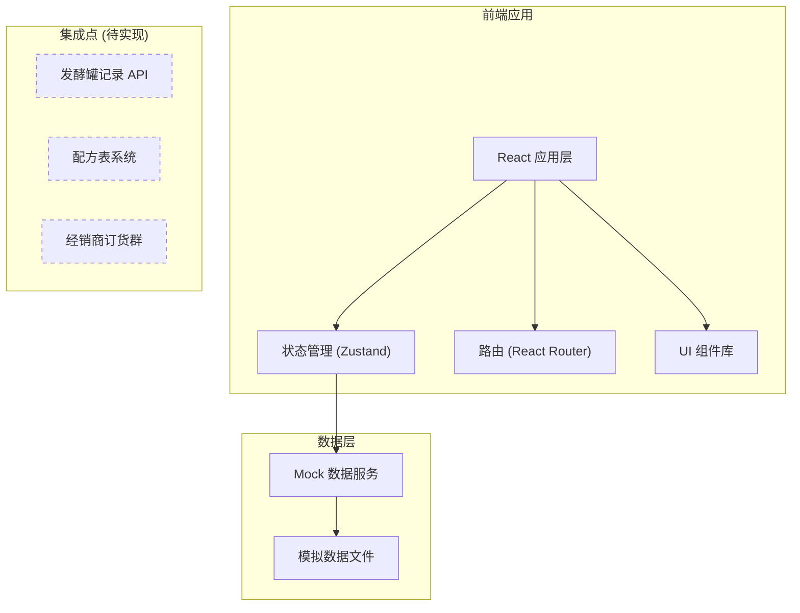
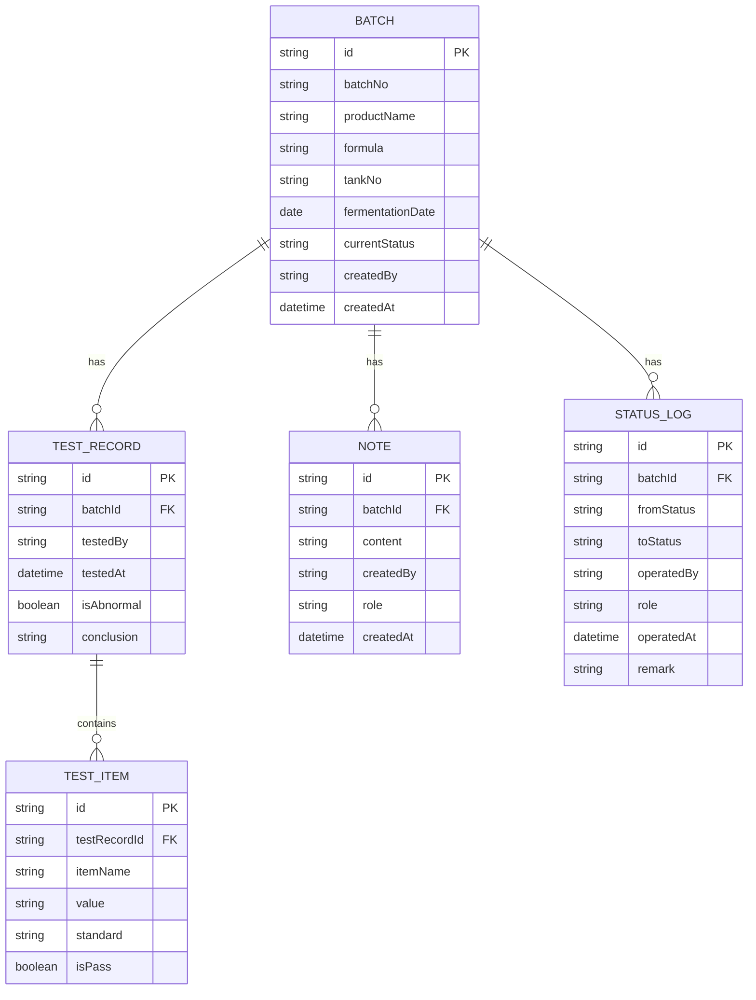

## 1. 架构设计



## 2. 技术栈说明

- **前端框架**：React@18 + TypeScript
- **构建工具**：Vite@5
- **样式方案**：TailwindCSS@3 + CSS 变量
- **状态管理**：Zustand (轻量级状态管理)
- **路由方案**：React Router@6
- **图标库**：Lucide React
- **动画方案**：Framer Motion
- **日期处理**：date-fns

## 3. 路由定义

| 路由 | 页面 | 权限 | 说明 |
|------|------|------|------|
| `/` | 角色选择页 | 公开 | 选择用户角色进入系统 |
| `/brewer` | 酿酒师工作台 | 酿酒师 | 发起检测、查看发酵记录 |
| `/packaging` | 包装主管工作台 | 包装主管 | 品控检测处理、批量操作 |
| `/sales` | 销售内勤工作台 | 销售内勤 | 放行判断、检测记录回看 |
| `/records` | 交班记录 | 所有角色 | 历史记录查询、责任追溯 |

## 4. 数据模型

### 4.1 数据关系图



### 4.2 模拟数据位置

所有模拟数据存储在 `/src/data/mock/` 目录下：
- `batches.ts` - 批次数据
- `testRecords.ts` - 检测记录
- `notes.ts` - 备注数据
- `statusLogs.ts` - 状态流转日志

## 5. 核心模块设计

### 5.1 状态流转模块

批次状态枚举：
- `PENDING_TEST` - 待检测
- `TESTING` - 检测中
- `TEST_PASSED` - 检测通过（待放行）
- `TEST_ABNORMAL` - 检测异常（待放行）
- `RELEASED` - 已放行
- `REJECTED` - 已拒签（退回重检）

### 5.2 角色权限模块

通过路由守卫和组件级权限控制实现：
- 角色信息存储在 localStorage
- 路由守卫检查当前角色是否有权限访问页面
- 操作按钮根据角色显示/隐藏

### 5.3 备注流转模块

- 备注与批次绑定，按时间倒序展示
- 每条备注显示创建人、角色、时间
- 不同角色的备注用不同颜色标记

## 6. 暂未实现的集成点

| 集成点 | 说明 | 优先级 | 对接方式 |
|--------|------|--------|----------|
| 发酵罐记录系统 | 自动获取发酵温度、压力等数据 | 高 | REST API |
| 配方管理系统 | 拉取产品配方标准参数 | 中 | REST API |
| 经销商订货群 | 同步放行信息到订货群 | 中 | Webhook |
| 条码打印系统 | 放行后自动生成产品条码 | 低 | SDK |
| 仓储管理系统 | 放行后通知WMS入库 | 低 | REST API |

## 7. 目录结构

```
src/
├── components/          # 通用组件
│   ├── layout/         # 布局组件
│   ├── ui/             # 基础UI组件
│   └── features/       # 业务组件
├── pages/              # 页面组件
├── store/              # 状态管理
├── data/mock/          # 模拟数据
├── types/              # TypeScript 类型定义
├── hooks/              # 自定义 Hooks
├── utils/              # 工具函数
├── styles/             # 全局样式
└── router/             # 路由配置
```
