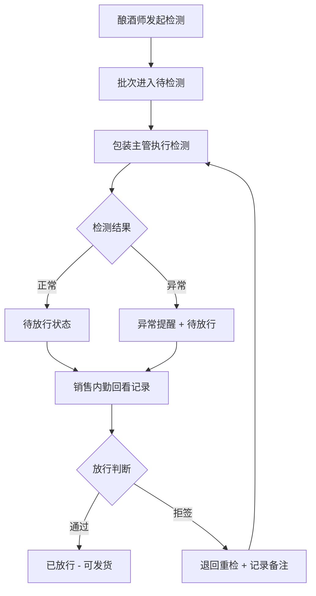

## 1. 产品概述
精酿酒厂品控检测与放行判断交班系统，解决品控检测与放行判断之间的责任不清问题，实现检测备注流转、角色差异化入口、状态清晰追踪。
- 目标用户：酿酒师、包装主管、销售内勤
- 核心价值：建立可追溯的品控流程，明确各环节责任，提升交班效率

## 2. 核心功能

### 2.1 用户角色
| 角色 | 登录方式 | 核心权限 |
|------|----------|----------|
| 酿酒师 | 角色选择登录 | 发起品控检测、填写发酵记录、查看异常提醒 |
| 包装主管 | 角色选择登录 | 执行品控检测、处理异常、批量操作 |
| 销售内勤 | 角色选择登录 | 放行判断、查看检测记录、对接经销商 |

### 2.2 功能模块
1. **角色选择页**：差异化入口、角色说明
2. **品控检测工作台**：批次列表、检测处理、异常标注、批量动作
3. **放行判断中心**：待放行批次、检测记录回看、放行/拒签操作
4. **交班记录**：历史流转记录、责任追溯、备注查看

### 2.3 页面详情
| 页面名称 | 模块名称 | 功能描述 |
|----------|----------|----------|
| 角色选择页 | 角色卡片区 | 三个角色卡片，点击进入对应工作台 |
| 角色选择页 | 系统状态栏 | 显示待处理数量、异常数量概览 |
| 品控检测工作台 | 批次筛选区 | 按状态、时间、批次号筛选 |
| 品控检测工作台 | 批次列表 | 显示批次信息、当前状态、操作按钮 |
| 品控检测工作台 | 检测处理面板 | 填写检测数据、添加备注、标注异常 |
| 品控检测工作台 | 批量操作栏 | 批量审核、批量导出、批量标记 |
| 放行判断中心 | 待放行列表 | 显示完成检测的批次，高亮异常项 |
| 放行判断中心 | 检测记录回看 | 查看完整检测流程、历史备注 |
| 放行判断中心 | 放行操作区 | 放行/拒签、添加放行备注 |
| 交班记录页 | 时间线视图 | 按时间展示所有操作记录 |
| 交班记录页 | 责任追溯 | 显示各环节操作人、时间、内容 |

## 3. 核心流程

### 3.1 品控检测与放行流程

### 3.2 备注流转机制
1. 酿酒师发起检测时填写基础备注
2. 包装主管检测时可查看并追加备注
3. 销售内勤放行时可查看全部历史备注
4. 所有备注与批次绑定，永久留存

## 4. 用户界面设计

### 4.1 设计风格
- **主色调**：深琥珀色 #8B4513（代表精酿啤酒的质感）
- **辅助色**：酒花绿 #2E8B57（正常状态）、警示橙 #FF6B35（异常状态）、确认蓝 #4A90D9
- **按钮风格**：圆角8px，微立体阴影，hover有轻微上浮效果
- **字体**：标题使用 Playfair Display（复古感），正文使用 Lato（现代易读）
- **布局风格**：卡片式布局，清晰的视觉层级，状态标签醒目
- **图标风格**：线性图标，配合状态色彩区分

### 4.2 页面设计概览
| 页面名称 | 模块名称 | UI 元素 |
|----------|----------|---------|
| 角色选择页 | 角色卡片 | 大卡片、角色图标、权限说明、进入按钮、悬浮动效 |
| 品控检测工作台 | 顶部导航 | 面包屑、角色标识、消息提醒、退出登录 |
| 品控检测工作台 | 统计卡片 | 四个统计卡片（待检测、检测中、异常、已完成） |
| 品控检测工作台 | 批次表格 | 斑马纹行、状态标签、操作列固定 |
| 品控检测工作台 | 侧边抽屉 | 检测表单、历史备注时间线、提交按钮 |
| 放行判断中心 | 异常警示条 | 顶部红色警示条，显示异常批次数量 |
| 放行判断中心 | 批次卡片 | 卡片式列表，异常卡片红色边框高亮 |
| 放行判断中心 | 回看面板 | 左右分栏，左侧检测记录时间线，右侧操作区 |
| 交班记录页 | 时间线 | 垂直时间线，不同操作类型用不同颜色标记 |

### 4.3 响应式设计
- Desktop-first 设计，主要适配 1440px 及以上
- 平板端：表格改为卡片列表，侧边抽屉改为底部弹窗
- 移动端：简化统计卡片，单列布局，优化触摸区域

### 4.4 动效设计
- 页面加载：统计数字滚动动画，卡片淡入错开出现
- 状态变更：状态标签颜色过渡动画，列表项位置平滑过渡
- 异常提醒：红色脉冲动画，数字跳动效果
- 抽屉展开：从右向左滑入，背景遮罩渐变
