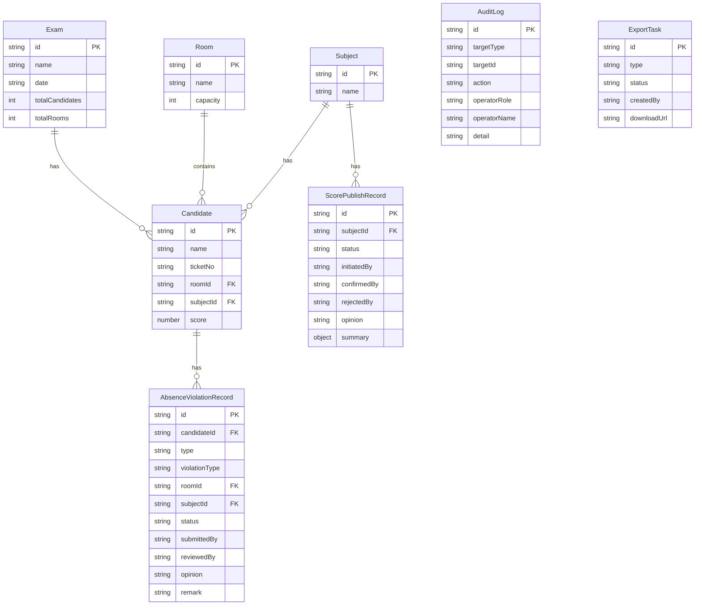

## 1. 架构设计

```mermaid
graph TB
    "浏览器" --> "React 前端"
    "React 前端" --> "Express API"
    "Express API" --> "Service 层"
    "Service 层" --> "内存数据存储"
    "Service 层" --> "审计日志"
```

前端 React + Tailwind 负责 UI 渲染与交互，后端 Express 提供 RESTful API，Service 层封装业务逻辑（审核流、状态机、审计留痕），数据存储使用内存 Map（模拟数据库，启动时种子数据初始化，支持重置）。

## 2. 技术说明

- 前端：React@18 + TailwindCSS@3 + Vite + zustand + react-router-dom
- 初始化工具：vite-init
- 后端：Express@4 + TypeScript (ESM)
- 数据库：内存存储（模拟），启动时种子数据初始化
- 图标：lucide-react

## 3. 路由定义

| 路由 | 用途 |
|------|------|
| / | 考务中心面板 |
| /absence-violation | 缺考违纪管理 |
| /score-publish | 成绩发布审批 |
| /query | 详情查询 |
| /export | 导出任务 |

## 4. API 定义

### 4.1 角色切换

```
POST /api/role
Body: { role: "invigilator" | "admin" | "tech" }
Response: { role, name, permissions }
```

### 4.2 考务概览

```
GET /api/dashboard
Response: { examName, examDate, totalCandidates, totalRooms, stages: [{ name, status, pendingCount }], recentLogs: AuditLog[] }
```

### 4.3 缺考违纪

```
GET /api/absence-violation?type=absence|violation&roomId=&subjectId=&status=
Response: { list: AbsenceViolationRecord[] }

POST /api/absence-violation
Body: { candidateId, type: "absence"|"violation", violationType?, roomId, subjectId, remark }
Response: AbsenceViolationRecord

PUT /api/absence-violation/:id/review
Body: { action: "approve"|"reject"|"supplement", opinion, supplementData? }
Response: AbsenceViolationRecord
```

### 4.4 成绩发布

```
GET /api/score-publish?status=
Response: { list: ScorePublishRecord[] }

POST /api/score-publish
Body: { subjectId, summary: { total, pass, fail, max, min, avg } }
Response: ScorePublishRecord

PUT /api/score-publish/:id/approve
Body: { opinion }
Response: ScorePublishRecord

PUT /api/score-publish/:id/reject
Body: { opinion }
Response: ScorePublishRecord

PUT /api/score-publish/:id/confirm
Body: { opinion }
Response: ScorePublishRecord

GET /api/score-publish/:id/review
Response: { record: ScorePublishRecord, auditLogs: AuditLog[] }
```

### 4.5 详情查询

```
GET /api/query?keyword=&roomId=&subjectId=
Response: { list: CandidateDetail[] }
```

### 4.6 导出任务

```
GET /api/export
Response: { list: ExportTask[] }

POST /api/export
Body: { type: "absence-violation"|"score", filters: { roomId?, subjectId?, status? } }
Response: ExportTask

GET /api/export/:id/download
Response: CSV file stream
```

### 4.7 审计日志

```
GET /api/audit-logs?targetType=&targetId=
Response: { list: AuditLog[] }
```

## 5. 服务端架构图

```mermaid
graph LR
    "Controller" --> "Service"
    "Service" --> "Repository"
    "Repository" --> "内存数据存储"
```

- Controller：路由处理、参数校验、响应格式化
- Service：业务逻辑、状态机、权限检查、审计记录
- Repository：数据 CRUD、ID 生成

## 6. 数据模型

### 6.1 数据模型定义



### 6.2 数据定义

使用 TypeScript 接口定义，数据存储在内存 Map 中。种子数据包含：
- 1 场考试
- 3 个考场
- 4 个科目
- 20 名考生
- 5 条缺考违纪记录（不同状态）
- 2 条成绩发布记录（不同状态）
- 预置审计日志

重置方式：调用 `POST /api/reset` 或重启服务。
