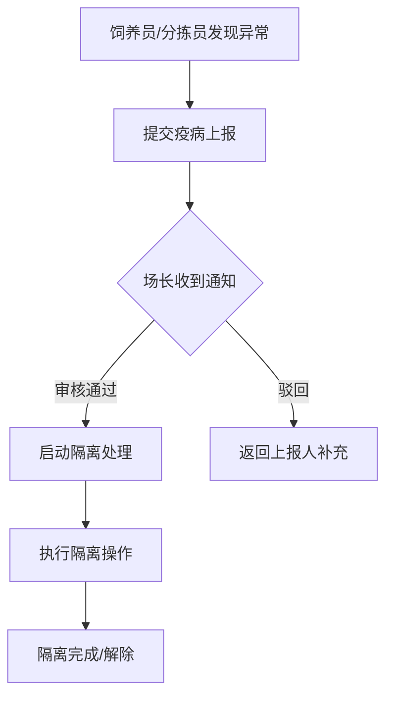

# 蛋鸡养殖场-疫病上报与隔离处理 系统PRD

## 1. 产品概述

针对蛋鸡养殖场疫病防控场景，解决疫病上报与隔离处理责任不清、流程脱节的问题。通过角色分离设计（饲养员、分拣员、场长）和状态驱动的工作流，确保疫病发现→上报→隔离处理链路完整闭环。

### 目标用户
- **饲养员**：日常巡查中发现异常，有权限提交疫病上报
- **分拣员**：蛋品分拣时发现问题，有权限提交疫病上报
- **场长**：审核疫病上报、启动隔离处理、查看统计分析

---

## 2. 核心功能

### 2.1 用户角色

| 角色 | 入口 | 核心权限 |
|------|------|---------|
| 饲养员 | 独立入口 | 疫病上报、查看我的上报记录 |
| 分拣员 | 独立入口 | 疫病上报、查看我的上报记录 |
| 场长 | 独立入口 | 审核疫病上报、启动隔离处理、查看全场统计、隔离处理回看 |

### 2.2 功能模块

1. **登录/角色选择页**：三个角色入口分开设计
2. **疫病上报页**（饲养员/分拣员）：
   - 新增疫病上报表单
   - 上报历史列表
   - 状态标签实时显示
3. **场长工作台**：
   - 待处理疫病上报列表
   - 疫病上报详情 + 隔离处理入口
   - 隔离处理回看
   - 全场统计概览

---

## 3. 核心流程

### 疫病上报→隔离处理自然接续
- 场长审核通过后，页面直接显示「启动隔离处理」按钮
- 不依赖额外消息提醒，状态驱动下一动作

---

## 4. 页面设计

### 4.1 设计风格
- **色调**：农业/自然风格，主色采用深绿色（#2D5A27），辅助色米色（#F5F0E6）
- **按钮**：圆角卡片式，状态驱动高亮
- **字体**：思源黑体/Noto Sans SC
- **布局**：左侧导航 + 右侧内容区

### 4.2 页面清单

| 页面 | 模块 | 功能 |
|------|------|------|
| 角色选择页 | 三个角色卡片 | 点击进入对应角色视图 |
| 疫病上报页 | 新增表单 + 历史列表 | 可提交的表单，状态标签可点击查看详情 |
| 场长工作台 | 统计概览 + 待处理列表 | 数据看板，列表项可点击 |
| 疫病详情页 | 上报信息 + 隔离处理入口 | 状态标签，隔离处理按钮 |
| 隔离处理页 | 隔离操作表单 | 可填写的隔离处理表单 |
| 隔离回看页 | 历史隔离记录列表 | 可点击查看历史处理详情 |

### 4.3 状态标签设计

| 状态 | 标签颜色 | 可触发动作 |
|------|---------|-----------|
| 待审核 | 黄色 | 场长审核 |
| 已驳回 | 灰色 | 查看驳回原因 |
| 已确认 | 蓝色 | 启动隔离处理 |
| 隔离中 | 橙色 | 查看隔离详情 |
| 已解除 | 绿色 | 归档 |

---

## 5. 技术方案

- **前端**：Vue 3 + Vite + 纯前端单页应用
- **路由**：Vue Router（角色视图通过路由隔离）
- **状态**：Pinia（管理疫病上报状态、用户角色状态）
- **样式**：CSS Variables + Scoped CSS
- **数据**：Mock数据（模拟后端API响应）

---

## 6. 简化点说明

### 6.1 权限简化
- 仅区分三个角色（饲养员/分拣员/场长）
- 不涉及细粒度权限控制
- 场长对所有疫病上报有处置权

### 6.2 附件简化
- 疫病上报表单仅支持文字描述
- 暂不实现图片/视频上传
- 历史记录保留文字内容

### 6.3 通知简化
- 不实现真实的短信/邮件通知
- 通过状态标签变更和界面内提示模拟通知效果
- 场长工作台显示「待处理」数量徽章

### 6.4 外部系统简化
- 不对接真实的养殖场管理系统
- 不对接畜牧兽医局上报系统
- 不实现与饲料/蛋品系统的数据联动
- 数据仅在原型内部流转
