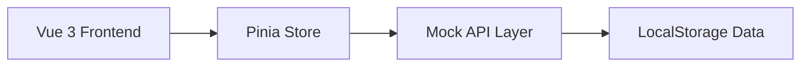
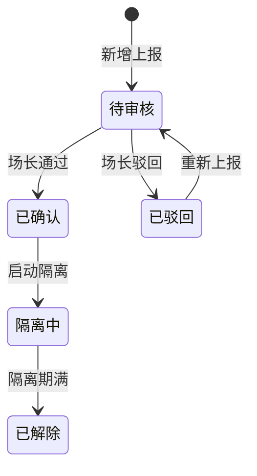

# 蛋鸡养殖场-疫病上报与隔离处理 技术架构文档

## 1. 架构设计



- **前端**：Vue 3 单页应用，通过路由隔离角色视图
- **状态管理**：Pinia 管理全局状态（当前角色、疫病上报列表、隔离记录）
- **数据层**：LocalStorage 持久化模拟后端，支持数据增删改查

---

## 2. 技术栈

| 类别 | 技术 | 说明 |
|------|------|------|
| 框架 | Vue 3 | Composition API |
| 构建 | Vite | 快速开发服务器 |
| 路由 | Vue Router 4 | 角色视图路由隔离 |
| 状态 | Pinia | 全局状态管理 |
| 样式 | CSS Variables + Scoped | 组件级样式 |

---

## 3. 路由定义

| 路由 | 用途 | 角色限制 |
|------|------|---------|
| `/` | 角色选择页 | 公开 |
| `/feeder` | 饲养员工作台 | 饲养员 |
| `/sorter` | 分拣员工作台 | 分拣员 |
| `/manager` | 场长工作台 | 场长 |
| `/manager/report/:id` | 疫病上报详情 | 场长 |
| `/manager/isolation/:id` | 隔离处理页 | 场长 |
| `/manager/isolation-review` | 隔离回看页 | 场长 |
| `/report/new` | 新增疫病上报 | 饲养员/分拣员 |
| `/report/history` | 我的上报历史 | 饲养员/分拣员 |

---

## 4. 数据模型

### 4.1 疫病上报 (DiseaseReport)

```typescript
interface DiseaseReport {
  id: string;                    // 唯一标识
  reportCode: string;            // 上报编号 EP-YYYYMMDD-XXXX
  reporterRole: 'feeder' | 'sorter';  // 上报人角色
  reporterName: string;           // 上报人姓名
  barnNumber: string;             // 鸡舍编号
  chickenCount: number;           // 鸡群数量
  symptomDescription: string;     // 症状描述
  symptomPhotos: string[];        // 症状图片（简化版为空）
  suspectedDisease: string;       // 疑似病症
  severity: 'low' | 'medium' | 'high' | 'critical';  // 严重程度
  status: 'pending' | 'rejected' | 'confirmed' | 'isolating' | 'resolved';  // 状态
  rejectReason?: string;         // 驳回原因
  createdAt: string;              // 上报时间
  processedBy?: string;          // 处理人
  processedAt?: string;          // 处理时间
  isolationId?: string;          // 关联隔离记录ID
}
```

### 4.2 隔离处理记录 (IsolationRecord)

```typescript
interface IsolationRecord {
  id: string;                     // 唯一标识
  isolationCode: string;         // 隔离编号 ISO-YYYYMMDD-XXXX
  reportId: string;              // 关联的上报ID
  reportCode: string;            // 关联的上报编号
  barnNumber: string;            // 鸡舍编号
  isolatedChickenCount: number;  // 隔离鸡群数量
  isolationStartDate: string;    // 隔离开始日期
  isolationEndDate?: string;     // 隔离结束日期
  isolationReason: string;       // 隔离原因
  handlingMeasures: string;      // 处理措施
  handler: string;               // 处理人
  status: 'active' | 'released'; // 隔离状态
  createdAt: string;
}
```

---

## 5. 状态流转



---

## 6. Mock API 设计

### 疫病上报相关

| 方法 | 路径 | 说明 |
|------|------|------|
| GET | /api/reports | 获取上报列表（根据角色过滤） |
| GET | /api/reports/:id | 获取上报详情 |
| POST | /api/reports | 新增上报 |
| PATCH | /api/reports/:id/status | 更新上报状态（审核/驳回） |

### 隔离处理相关

| 方法 | 路径 | 说明 |
|------|------|------|
| GET | /api/isolations | 获取隔离记录列表 |
| GET | /api/isolations/:id | 获取隔离详情 |
| POST | /api/isolations | 创建隔离记录 |
| PATCH | /api/isolations/:id/release | 解除隔离 |

---

## 7. 组件结构

```
src/
├── views/
│   ├── RoleSelect.vue           # 角色选择页
│   ├── feeder/
│   │   └── FeederWorkbench.vue  # 饲养员工作台
│   ├── sorter/
│   │   └── SorterWorkbench.vue  # 分拣员工作台
│   └── manager/
│       ├── ManagerWorkbench.vue # 场长工作台
│       ├── ReportDetail.vue      # 上报详情
│       ├── IsolationForm.vue     # 隔离处理表单
│       └── IsolationReview.vue   # 隔离回看
├── components/
│   ├── StatusBadge.vue          # 状态标签组件
│   ├── ReportCard.vue            # 上报卡片组件
│   ├── IsolationCard.vue         # 隔离记录卡片
│   └── StatsCard.vue             # 统计卡片组件
├── stores/
│   ├── reportStore.ts            # 疫病上报状态管理
│   └── isolationStore.ts          # 隔离处理状态管理
├── router/
│   └── index.ts                  # 路由配置
├── api/
│   └── mock.ts                   # Mock API 实现
└── types/
    └── index.ts                  # TypeScript 类型定义
```

---

## 8. 简化点实现

### 8.1 权限简化
- 使用 Pinia store 的 `currentRole` 状态管理当前角色
- 路由守卫检查角色权限，无权限重定向至角色选择页

### 8.2 附件简化
- 表单预留附件字段但前端不实现上传功能
- 数据模型保留字段但传空数组

### 8.3 通知简化
- 使用 Pinia 的 getter 计算待处理数量
- 场长工作台徽章显示 `pendingCount`

### 8.4 外部系统简化
- 所有数据存储在 LocalStorage
- 不实现任何外部 API 调用
