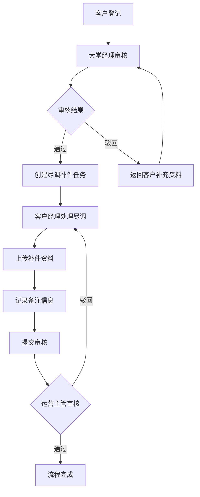
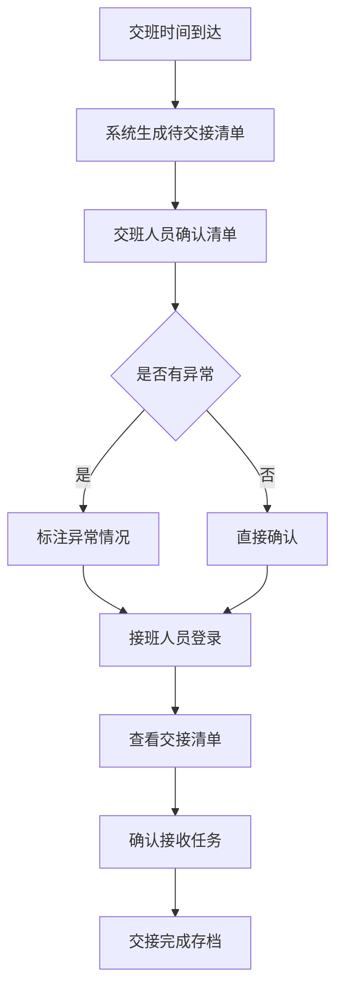

# 银行网点客户资料与尽调补件系统 PRD

## 1. 产品概述

银行网点客户资料与尽调补件系统是用于银行网点日常运营管理的数字化工具，旨在实现客户资料处理与尽调补件流程的无缝衔接，支持交班操作，确保信息在不同岗位间高效传递。

**核心价值：**
- 解决客户资料与尽调补件信息断层问题
- 支持跨班次工作交接
- 实现角色权限精细化管理
- 提升网点运营效率和服务质量

**目标用户：**
- 大堂经理：负责客户接待、排队叫号、初步资料审核
- 客户经理：负责客户资料完善、尽调补充材料收集
- 运营主管：负责流程监督、异常处理、跨流程协调

## 2. 核心功能

### 2.1 用户角色定义

| 角色 | 职责范围 | 核心权限 |
|------|----------|----------|
| 大堂经理 | 排队叫号、客户接待、初步资料审核 | 发起客户资料处理、查看当日排队队列、初步审核 |
| 客户经理 | 客户资料完善、尽调材料收集 | 完善客户资料、上传附件、提交尽调补件 |
| 运营主管 | 流程监督、异常协调、交班审批 | 全流程监督、跨流程备注查阅、交班确认 |
| 系统管理员 | 系统配置、用户管理 | 角色分配、权限配置、数据维护 |

### 2.2 核心功能模块

#### 2.2.1 排队叫号与客户管理
- **排队队列管理**：实时显示当前排队号码、客户姓名、业务类型、等待时间
- **叫号操作**：大堂经理可选择客户叫号、跳过、转至VIP窗口
- **客户登记**：记录客户基本信息、办理业务类型、紧急程度

#### 2.2.2 客户资料处理
- **资料状态跟踪**：待补充、补充中、已完善、审核通过、审核拒绝
- **资料类型管理**：身份证、营业执照、财务报表、授权委托书等
- **备注信息记录**：支持在处理过程中记录详细备注，供后续流程使用
- **附件上传**：支持身份证照片、证明文件等附件上传
- **资料审核**：大堂经理或运营主管审核客户提交的资料

#### 2.2.3 尽调补件管理
- **补件任务接收**：自动接收来自客户资料流程的补件任务
- **备注继承**：自动继承客户资料处理时的备注信息
- **补件进度跟踪**：待提交、补充中、已提交、已完成
- **历史记录查看**：可回看客户资料处理和尽调补件的完整历史

#### 2.2.4 交班功能
- **待办事项交接**：显示所有未完成的客户资料和尽调补件任务
- **交接班确认**：交接班双方确认交接内容
- **历史交接记录**：查询历史交接班记录
- **异常任务标注**：交接时需特别说明的异常情况

#### 2.2.5 通知与提醒
- **待办提醒**：客户资料待处理、尽调补件待提交等
- **超时提醒**：业务处理超时预警
- **交接提醒**：交班时间到达提醒

### 2.3 功能流程说明

#### 流程一：客户资料处理 → 尽调补件自然衔接
1. 大堂经理登记客户信息，创建客户资料处理任务
2. 客户经理完善客户资料，记录详细备注
3. 客户经理上传相关附件
4. 客户资料审核通过后，系统自动创建尽调补件任务
5. 尽调补件任务继承客户资料的备注信息
6. 客户经理继续处理尽调补件，完成后提交审核
7. 运营主管审核尽调补件，完成整个流程

#### 流程二：交班操作
1. 交班人员查看当前待办任务列表
2. 系统展示所有未完成的客户资料和尽调补件任务
3. 交班人员确认交接内容
4. 接班人员登录后查看已交接任务
5. 交接记录存档

## 3. 页面设计

### 3.1 页面列表

| 页面名称 | 访问角色 | 功能描述 |
|----------|----------|----------|
| 登录页 | 全部角色 | 用户登录、角色选择 |
| 大堂经理首页 | 大堂经理 | 排队队列、快捷操作、今日统计 |
| 客户经理首页 | 客户经理 | 待办任务、尽调补件入口、我的任务 |
| 运营主管首页 | 运营主管 | 全局概览、异常监控、交班管理 |
| 客户资料处理页 | 大堂经理、客户经理、运营主管 | 客户资料详情、附件上传、备注记录 |
| 尽调补件页 | 客户经理、运营主管 | 补件任务、备注继承、历史查看 |
| 交班管理页 | 全部角色 | 待办交接、交接确认、历史记录 |
| 附件管理页 | 全部角色 | 附件上传、预览、下载 |

### 3.2 页面详细说明

#### 3.2.1 登录页
- 用户名密码输入
- 角色选择下拉框（大堂经理、客户经理、运营主管）
- 记住登录状态选项
- 登录按钮

#### 3.2.2 大堂经理首页
- **排队队列面板**：显示当前排队号码，实时更新
- **快捷操作区**：叫号、分配窗口、标记VIP
- **今日统计**：今日接待客户数、待处理资料数、已完成数
- **待处理任务列表**：显示需要大堂经理处理的客户资料

#### 3.2.3 客户经理首页
- **待办任务面板**：显示待处理的客户资料和尽调补件任务
- **尽调补件入口**：显示需要尽调补件的任务数量
- **我的任务**：显示当前用户负责的所有任务
- **任务搜索**：按客户姓名、手机号、任务状态搜索

#### 3.2.4 运营主管首页
- **全局概览**：显示所有在处理中的任务数量
- **异常监控**：显示超时、审核拒绝等异常任务
- **交班管理入口**：快速进入交班管理页面
- **数据统计**：各类型任务完成率、平均处理时长

#### 3.2.5 客户资料处理页
- **客户基本信息区**：姓名、手机号、办理业务、紧急程度
- **资料类型列表**：显示所需资料类型及状态
- **附件上传区**：支持拖拽上传，显示上传进度
- **备注记录区**：记录处理过程中的详细备注
- **审核操作区**：提交审核、驳回、要求补充
- **历史记录区**：查看该客户的历史处理记录

#### 3.2.6 尽调补件页
- **任务基本信息**：客户姓名、业务类型、来源资料单号
- **继承备注区**：显示来自客户资料的备注信息（带标识）
- **补件资料上传**：上传尽调所需补充材料
- **补件备注区**：记录尽调补件过程中的备注
- **进度时间线**：显示任务各阶段时间节点
- **历史查看**：可回看客户资料和尽调补件完整流程

#### 3.2.7 交班管理页
- **交接班切换器**：选择交接班类型
- **待交接任务列表**：显示所有需要交接的任务
- **任务详情展开**：查看每个任务的详细信息
- **交接确认按钮**：确认交接完成
- **历史记录查询**：查询历史交接班记录

## 4. 核心业务流程

### 4.1 客户资料到尽调补件流程图

### 4.2 交班流程图

## 5. UI设计规范

### 5.1 设计风格
- **整体风格**：专业金融风格，简洁高效
- **配色方案**：
  - 主色调：深蓝色 #1E3A5F（体现银行专业性）
  - 辅助色：浅蓝色 #E8F4FD（背景色）
  - 强调色：橙色 #FF6B35（待办提醒）、绿色 #2ECC71（已完成）
  - 警示色：红色 #E74C3C（超时、紧急）
- **字体**：思源黑体（中文）、Roboto（英文）
- **布局**：卡片式布局，清晰的模块划分
- **图标**：线性图标，简洁明了

### 5.2 响应式设计
- 桌面端优先设计
- 支持平板设备访问
- 主要功能支持移动端查看

### 5.3 交互设计
- 操作按钮悬停效果：背景色加深
- 任务卡片点击展开详情
- 表单提交显示加载状态
- 操作成功/失败显示Toast提示
- 关键操作二次确认

## 6. 数据权限控制

### 6.1 角色数据权限
- 大堂经理：只能查看和操作自己发起的任务
- 客户经理：可以查看和操作分配给自己的任务
- 运营主管：可以查看所有任务，但不能直接操作

### 6.2 功能权限
- 附件上传：客户经理、运营主管
- 审核操作：大堂经理、运营主管
- 交班管理：所有角色
- 数据导出：运营主管

## 7. 简化说明

### 7.1 附件简化
- 附件上传采用前端占位符实现
- 不实现真实文件存储
- 附件信息记录到数据库，包括文件名、大小、类型
- 预览功能显示占位图

### 7.2 通知简化
- 通知功能采用前端模拟
- 不实现真实的短信、邮件推送
- 站内通知存储到数据库，前端轮询获取

### 7.3 外部系统简化
- 不对接真实的人行征信系统
- 不对接税务系统
- 不对接工商信息查询系统
- 所有外部数据采用模拟数据

### 7.4 权限简化
- 不实现完整的RBAC权限系统
- 简化为基于角色的简单权限控制
- 登录时指定角色，后续操作基于角色权限
