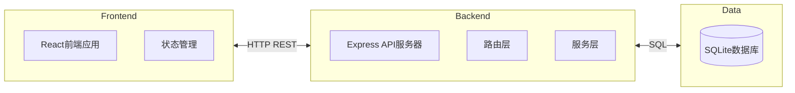
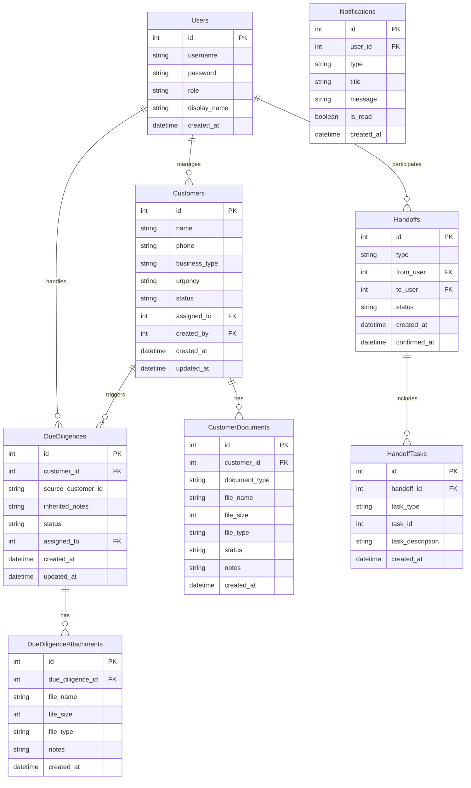

# 银行网点客户资料与尽调补件系统 技术架构文档

## 1. 系统架构设计



### 1.1 架构说明
- **前端**：React 18 + TypeScript + TailwindCSS + Vite
- **后端**：Node.js + Express + TypeScript
- **数据库**：SQLite（本地轻量级数据库）
- **通信**：HTTP REST API

## 2. 技术栈

### 2.1 前端技术
- **框架**：React 18.2
- **构建工具**：Vite
- **样式**：TailwindCSS
- **状态管理**：React Context
- **HTTP客户端**：Fetch API
- **类型检查**：TypeScript

### 2.2 后端技术
- **运行时**：Node.js
- **框架**：Express 4
- **数据库**：SQLite3
- **ORM**：better-sqlite3
- **类型检查**：TypeScript

### 2.3 开发工具
- **包管理**：npm
- **TypeScript**：ts-node用于开发环境

## 3. 数据库设计

### 3.1 ER图



### 3.2 数据表定义

#### 用户表 (users)
```sql
CREATE TABLE users (
    id INTEGER PRIMARY KEY AUTOINCREMENT,
    username VARCHAR(50) UNIQUE NOT NULL,
    password VARCHAR(255) NOT NULL,
    role VARCHAR(20) NOT NULL CHECK(role IN ('lobby_manager', 'account_manager', 'operation_manager')),
    display_name VARCHAR(100) NOT NULL,
    created_at DATETIME DEFAULT CURRENT_TIMESTAMP
);
```

#### 客户表 (customers)
```sql
CREATE TABLE customers (
    id INTEGER PRIMARY KEY AUTOINCREMENT,
    name VARCHAR(100) NOT NULL,
    phone VARCHAR(20),
    business_type VARCHAR(50) NOT NULL,
    urgency VARCHAR(20) DEFAULT 'normal' CHECK(urgency IN ('normal', 'urgent', 'vip')),
    status VARCHAR(30) DEFAULT 'pending' CHECK(status IN ('pending', 'processing', 'completed', 'rejected')),
    assigned_to INTEGER REFERENCES users(id),
    created_by INTEGER REFERENCES users(id),
    created_at DATETIME DEFAULT CURRENT_TIMESTAMP,
    updated_at DATETIME DEFAULT CURRENT_TIMESTAMP
);
```

#### 客户资料表 (customer_documents)
```sql
CREATE TABLE customer_documents (
    id INTEGER PRIMARY KEY AUTOINCREMENT,
    customer_id INTEGER NOT NULL REFERENCES customers(id),
    document_type VARCHAR(50) NOT NULL,
    file_name VARCHAR(255),
    file_size INTEGER,
    file_type VARCHAR(50),
    status VARCHAR(20) DEFAULT 'pending' CHECK(status IN ('pending', 'uploaded', 'approved', 'rejected')),
    notes TEXT,
    created_at DATETIME DEFAULT CURRENT_TIMESTAMP
);
```

#### 尽调补件表 (due_diligences)
```sql
CREATE TABLE due_diligences (
    id INTEGER PRIMARY KEY AUTOINCREMENT,
    customer_id INTEGER NOT NULL REFERENCES customers(id),
    source_customer_id INTEGER,
    inherited_notes TEXT,
    status VARCHAR(20) DEFAULT 'pending' CHECK(status IN ('pending', 'processing', 'submitted', 'completed', 'rejected')),
    assigned_to INTEGER REFERENCES users(id),
    created_at DATETIME DEFAULT CURRENT_TIMESTAMP,
    updated_at DATETIME DEFAULT CURRENT_TIMESTAMP
);
```

#### 尽调附件表 (due_diligence_attachments)
```sql
CREATE TABLE due_diligence_attachments (
    id INTEGER PRIMARY KEY AUTOINCREMENT,
    due_diligence_id INTEGER NOT NULL REFERENCES due_diligences(id),
    file_name VARCHAR(255) NOT NULL,
    file_size INTEGER,
    file_type VARCHAR(50),
    notes TEXT,
    created_at DATETIME DEFAULT CURRENT_TIMESTAMP
);
```

#### 交班表 (handoffs)
```sql
CREATE TABLE handoffs (
    id INTEGER PRIMARY KEY AUTOINCREMENT,
    type VARCHAR(20) DEFAULT 'shift' CHECK(type IN ('shift', 'task')),
    from_user INTEGER NOT NULL REFERENCES users(id),
    to_user INTEGER NOT NULL REFERENCES users(id),
    status VARCHAR(20) DEFAULT 'pending' CHECK(status IN ('pending', 'confirmed', 'cancelled')),
    created_at DATETIME DEFAULT CURRENT_TIMESTAMP,
    confirmed_at DATETIME
);
```

#### 交班任务表 (handoff_tasks)
```sql
CREATE TABLE handoff_tasks (
    id INTEGER PRIMARY KEY AUTOINCREMENT,
    handoff_id INTEGER NOT NULL REFERENCES handoffs(id),
    task_type VARCHAR(30) NOT NULL,
    task_id INTEGER NOT NULL,
    task_description TEXT,
    created_at DATETIME DEFAULT CURRENT_TIMESTAMP
);
```

#### 通知表 (notifications)
```sql
CREATE TABLE notifications (
    id INTEGER PRIMARY KEY AUTOINCREMENT,
    user_id INTEGER NOT NULL REFERENCES users(id),
    type VARCHAR(30) NOT NULL,
    title VARCHAR(100) NOT NULL,
    message TEXT,
    is_read BOOLEAN DEFAULT FALSE,
    created_at DATETIME DEFAULT CURRENT_TIMESTAMP
);
```

## 4. API路由设计

### 4.1 用户相关接口

| 方法 | 路由 | 描述 | 权限 |
|------|------|------|------|
| POST | /api/users/login | 用户登录 | 公开 |
| GET | /api/users/me | 获取当前用户信息 | 已登录 |
| GET | /api/users | 获取所有用户列表 | 已登录 |
| POST | /api/users/logout | 用户登出 | 已登录 |

### 4.2 客户相关接口

| 方法 | 路由 | 描述 | 权限 |
|------|------|------|------|
| GET | /api/customers | 获取客户列表 | 已登录 |
| POST | /api/customers | 创建新客户 | 大堂经理、运营主管 |
| GET | /api/customers/:id | 获取客户详情 | 已登录 |
| PUT | /api/customers/:id | 更新客户信息 | 已登录 |
| DELETE | /api/customers/:id | 删除客户 | 运营主管 |

### 4.3 客户资料相关接口

| 方法 | 路由 | 描述 | 权限 |
|------|------|------|------|
| GET | /api/customers/:customerId/documents | 获取客户资料列表 | 已登录 |
| POST | /api/customers/:customerId/documents | 添加客户资料 | 已登录 |
| PUT | /api/documents/:id | 更新资料信息 | 已登录 |
| DELETE | /api/documents/:id | 删除资料 | 已登录 |

### 4.4 尽调补件相关接口

| 方法 | 路由 | 描述 | 权限 |
|------|------|------|------|
| GET | /api/due-diligences | 获取尽调补件列表 | 已登录 |
| POST | /api/due-diligences | 创建尽调补件 | 已登录 |
| GET | /api/due-diligences/:id | 获取尽调补件详情 | 已登录 |
| PUT | /api/due-diligences/:id | 更新尽调补件 | 已登录 |
| POST | /api/due-diligences/:id/attachments | 添加尽调附件 | 已登录 |
| GET | /api/due-diligences/:id/history | 获取处理历史 | 已登录 |

### 4.5 交班相关接口

| 方法 | 路由 | 描述 | 权限 |
|------|------|------|------|
| GET | /api/handoffs | 获取交班列表 | 已登录 |
| POST | /api/handoffs | 创建交班 | 已登录 |
| GET | /api/handoffs/:id | 获取交班详情 | 已登录 |
| PUT | /api/handoffs/:id/confirm | 确认交班 | 已登录 |
| GET | /api/handoffs/pending | 获取待交接任务 | 已登录 |

### 4.6 通知相关接口

| 方法 | 路由 | 描述 | 权限 |
|------|------|------|------|
| GET | /api/notifications | 获取通知列表 | 已登录 |
| PUT | /api/notifications/:id/read | 标记已读 | 已登录 |
| PUT | /api/notifications/read-all | 全部已读 | 已登录 |

## 5. API数据结构

### 5.1 用户登录请求/响应

**请求：**
```typescript
interface LoginRequest {
    username: string;
    password: string;
    role: 'lobby_manager' | 'account_manager' | 'operation_manager';
}
```

**响应：**
```typescript
interface LoginResponse {
    success: boolean;
    data: {
        user: {
            id: number;
            username: string;
            display_name: string;
            role: string;
        };
        token: string;
    };
}
```

### 5.2 客户数据

```typescript
interface Customer {
    id: number;
    name: string;
    phone: string;
    business_type: string;
    urgency: 'normal' | 'urgent' | 'vip';
    status: 'pending' | 'processing' | 'completed' | 'rejected';
    assigned_to: number;
    assigned_to_name?: string;
    created_by: number;
    created_by_name?: string;
    created_at: string;
    updated_at: string;
    documents?: CustomerDocument[];
    due_diligence?: DueDiligence;
}
```

### 5.3 尽调补件数据

```typescript
interface DueDiligence {
    id: number;
    customer_id: number;
    customer_name?: string;
    source_customer_id: number;
    inherited_notes: string;
    status: 'pending' | 'processing' | 'submitted' | 'completed' | 'rejected';
    assigned_to: number;
    assigned_to_name?: string;
    created_at: string;
    updated_at: string;
    attachments?: DueDiligenceAttachment[];
}
```

### 5.4 交班数据

```typescript
interface Handoff {
    id: number;
    type: 'shift' | 'task';
    from_user: number;
    from_user_name?: string;
    to_user: number;
    to_user_name?: string;
    status: 'pending' | 'confirmed' | 'cancelled';
    created_at: string;
    confirmed_at?: string;
    tasks?: HandoffTask[];
}

interface HandoffTask {
    id: number;
    handoff_id: number;
    task_type: 'customer' | 'due_diligence';
    task_id: number;
    task_description: string;
}
```

## 6. 目录结构

```
/Users/zhangliu/Documents/private/model-test/trae-20260601-5/
├── frontend/                    # 前端项目
│   ├── src/
│   │   ├── api/                 # API调用层
│   │   │   └── index.ts
│   │   ├── components/          # React组件
│   │   │   ├── LoginPage.tsx
│   │   │   ├── Header.tsx
│   │   │   ├── LobbyManagerPage.tsx
│   │   │   ├── AccountManagerPage.tsx
│   │   │   ├── OperationManagerPage.tsx
│   │   │   ├── CustomerModal.tsx
│   │   │   ├── CustomerDocumentModal.tsx
│   │   │   ├── CreateCustomerModal.tsx
│   │   │   └── CustomerCard.tsx
│   │   ├── context/             # 状态管理
│   │   │   └── AppContext.tsx
│   │   ├── types/               # TypeScript类型定义
│   │   │   └── index.ts
│   │   ├── index.css            # 全局样式
│   │   └── main.tsx             # 入口文件
│   ├── index.html
│   ├── package.json
│   ├── tailwind.config.js
│   ├── postcss.config.js
│   ├── tsconfig.json
│   └── vite.config.ts
├── backend/                     # 后端项目
│   ├── src/
│   │   ├── routes/              # 路由层
│   │   │   ├── users.ts
│   │   │   ├── customers.ts
│   │   │   ├── documents.ts
│   │   │   ├── dueDiligence.ts
│   │   │   ├── notifications.ts
│   │   │   └── handoffs.ts
│   │   ├── database.ts          # 数据库初始化
│   │   └── server.ts            # 服务器入口
│   ├── package.json
│   └── tsconfig.json
└── package.json                 # 根目录package.json
```

## 7. 环境变量

### 7.1 前端环境变量
```
VITE_API_BASE_URL=http://localhost:3001/api
```

### 7.2 后端环境变量
```
PORT=3001
DATABASE_PATH=./data/bank_system.db
CORS_ORIGIN=http://localhost:5173
```

## 8. 初始化数据

### 8.1 测试用户
| 用户名 | 密码 | 角色 | 显示名称 |
|--------|------|------|----------|
| lobby_mgr | password123 | lobby_manager | 张大堂 |
| account_mgr | password123 | account_manager | 李经理 |
| operation_mgr | password123 | operation_manager | 王主管 |

### 8.2 测试客户数据
系统将初始化10条测试客户数据，涵盖不同状态和业务类型。

## 9. 部署说明

### 9.1 开发环境启动
1. 安装依赖：`npm install`（根目录）
2. 启动后端：`cd backend && npm run dev`
3. 启动前端：`cd frontend && npm run dev`
4. 访问应用：`http://localhost:5173`

### 9.2 生产环境构建
1. 构建前端：`cd frontend && npm run build`
2. 启动后端：`cd backend && npm start`

## 10. 性能优化

### 10.1 前端优化
- 使用React.lazy进行代码分割
- 使用useMemo和useCallback优化渲染
- 图片懒加载

### 10.2 后端优化
- SQLite数据库索引优化
- 分页查询
- 缓存热点数据

## 11. 安全考虑

### 11.1 认证
- 基于Token的简单认证
- Token存储在localStorage
- 请求头携带Token

### 11.2 授权
- 基于角色的权限控制（RBAC）
- 路由守卫检查权限
- API层权限验证
