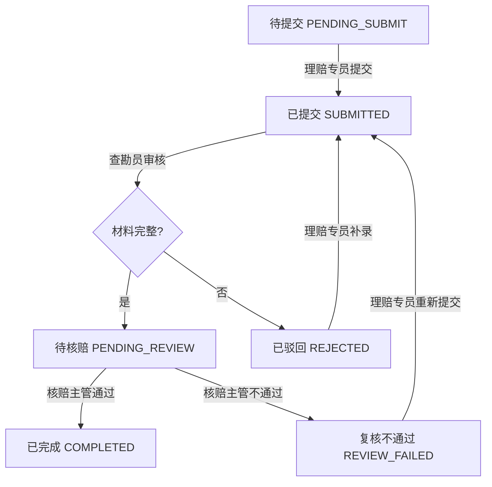

# 保险理赔中心-修复后的演示路径说明

## ⚠️ 重要修复说明

本次更新修复了以下流程问题：

1. **查勘员确认材料后不再直接结案**，而是改为"待核赔"状态，等待核赔主管审批
2. **核赔通过和复核不通过权限收紧**，只有核赔主管才能执行
3. **操作日志角色和状态变化修正**，确保记录准确
4. **前端数据加载修复**，首页、列表和详情页能正确显示真实数据

---

## 系统访问

**访问地址**：http://localhost:3000

**当前状态**：系统已启动，演示数据已更新

## 修复后的状态流转

### 完整流程图



### 新增状态：待核赔（PENDING_REVIEW）

- **定义**：查勘员已确认所有材料，等待核赔主管审批
- **可见角色**：核赔主管
- **可用操作**：核赔通过 / 复核不通过

---

## 演示数据概览

| 报案编号 | 被保险人 | 状态 | 说明 |
|---------|---------|------|------|
| CASE20240001 | 张三 | PENDING_REVIEW | 待核赔（查勘员已确认，等待审批） |
| CASE20240002 | 李四 | COMPLETED | 已完成（核赔主管已通过） |
| CASE20240003 | 王五 | REJECTED | 已驳回（材料不全被驳回） |
| CASE20240004 | 赵六 | REVIEW_FAILED | 复核不通过（核赔主管发现问题） |
| CASE20240005 | 孙七 | PENDING_SUBMIT | 待提交（新报案） |

---

## 演示路径一：正常推进流程（修复版）

### 流程说明
张三的案件已由查勘员李四审核完成，现在处于"待核赔"状态，等待核赔主管王五审批。

### 演示步骤

#### 1. 查看待核赔案件

**角色**：核赔主管

**操作步骤**：
1. 在首页右上角切换角色为"核赔主管"
2. 观察首页统计数据：
   - 待处理：2个（已驳回 + 复核不通过）
   - **待核赔：1个**（新增统计项）
   - 已完成：1个
3. 点击"待核赔"统计卡片，或进入"报案列表"页面筛选

**预期结果**：
- 首页正确显示"待核赔"状态统计
- 列表页显示状态为"待核赔"的案件

#### 2. 核赔主管审批通过

**角色**：核赔主管

**操作步骤**：
1. 点击案件编号 CASE20240001 进入详情页面
2. 检查材料清单状态（全部为"已确认"）
3. 检查操作历史：
   - 理赔专员提交报案（PENDING_SUBMIT → SUBMITTED）
   - 查勘员确认现场照片
   - 查勘员确认保单复印件
   - 查勘员确认身份证明
   - **查勘员提交核赔（SUBMITTED → PENDING_REVIEW）** ← 新增日志
4. 点击"核赔通过"按钮

**预期结果**：
- 案件状态从"待核赔"变为"已完成"
- 操作历史新增记录：
  - 核赔主管审批通过（PENDING_REVIEW → COMPLETED）
  - 操作角色：核赔主管
  - 状态变更路径正确记录

**权限验证**：
- 只有核赔主管能看到"核赔通过"和"复核不通过"按钮
- 理赔专员和查勘员无法看到这些按钮

---

## 演示路径二：异常处理流程（驳回）

### 案例背景
报案编号：CASE20240003
被保险人：王五
事故类型：水灾
当前状态：已驳回

### 流程说明
查勘员李四在审核材料时发现保单复印件缺失，驳回报案。

### 演示步骤

#### 1. 查看驳回记录

**角色**：理赔专员

**操作步骤**：
1. 切换角色为"理赔专员"
2. 在"待处理任务"中找到 CASE20240003
3. 点击进入报案详情页面

**预期结果**：
- 报案状态显示"已驳回"（红色标签）
- 材料清单显示：
  - 事故现场照片：已上传
  - **保单复印件：未上传**（驳回原因）
  - 身份证明：已上传
- 操作历史显示驳回记录：
  - 2024-06-03 15:00：理赔专员提交报案
  - 2024-06-03 16:00：查勘员驳回
    - **驳回原因**："材料不全：缺少保单复印件，请补充完整后再提交"
    - 状态变更：SUBMITTED → REJECTED
    - 操作角色：查勘员（正确）

#### 2. 补录材料并重新提交

**角色**：理赔专员

**操作步骤**：
1. 点击"管理材料"进入材料清单页面
2. 找到"保单复印件"项
3. 点击"上传附件"按钮（模拟上传）
4. 返回报案详情页面
5. 点击"提交报案"按钮

**预期结果**：
- 系统记录新的操作日志
- 状态从 REJECTED 变为 SUBMITTED
- 案件重新进入查勘员审核环节

---

## 演示路径三：异常处理流程（复核不通过）

### 案例背景
报案编号：CASE20240004
被保险人：赵六
事故类型：盗窃
当前状态：复核不通过

### 流程说明
核赔主管王五在复核时发现事故经过描述不够详细，损失清单未提供，驳回重办。

### 演示步骤

#### 1. 查看复核不通过记录

**角色**：理赔专员

**操作步骤**：
1. 在"待处理任务"中找到 CASE20240004
2. 点击进入报案详情页面

**预期结果**：
- 报案状态显示"复核不通过"（橙色标签）
- 材料清单显示所有材料都已确认
- 操作历史显示完整的流程记录：
  - 理赔专员提交报案
  - 查勘员确认所有材料
  - **查勘员提交核赔（SUBMITTED → PENDING_REVIEW）** ← 正确的状态变更
  - **核赔主管复核不通过（PENDING_REVIEW → REVIEW_FAILED）** ← 正确的状态变更
    - **不通过原因**："复核不通过：事故经过描述不够详细，损失清单未提供，请补充后重新提交"
    - 操作角色：核赔主管（正确）

#### 2. 补录信息并重新提交

**角色**：理赔专员

**操作步骤**：
1. 根据不通过原因，补充事故经过描述和损失清单
2. 点击"提交报案"按钮重新提交

**预期结果**：
- 系统记录新的操作日志
- 状态从 REVIEW_FAILED 变为 SUBMITTED
- 案件重新进入审核流程

---

## 演示路径四：新报案流程（完整演示）

### 案例背景
报案编号：CASE20240005
被保险人：孙七
事故类型：车辆剐蹭
当前状态：待提交

### 完整流程演示

#### 步骤1：理赔专员创建报案

**角色**：理赔专员

**操作步骤**：
1. 切换角色为"理赔专员"
2. 点击"新建报案"
3. 填写表单：
   - 保单号：POL2024007890
   - 被保险人：孙七
   - 事故经过：2024年6月5日上午11点，在成都市武侯区发生车辆剐蹭事故。
4. 点击"创建报案"按钮

**预期结果**：
- 系统自动创建报案记录（状态：PENDING_SUBMIT）
- 自动创建 3 个初始材料清单项

#### 步骤2：理赔专员上传材料

**操作步骤**：
1. 点击"管理材料"进入材料清单页面
2. 对每个材料点击"上传附件"按钮
3. 返回报案详情页面

**预期结果**：
- 所有材料状态变为"已上传"

#### 步骤3：理赔专员提交报案

**操作步骤**：
1. 点击"提交报案"按钮

**预期结果**：
- 状态从 PENDING_SUBMIT 变为 SUBMITTED
- 操作历史记录：理赔专员提交报案

#### 步骤4：查勘员审核材料

**角色**：查勘员

**操作步骤**：
1. 切换角色为"查勘员"
2. 在报案列表中找到 CASE20240005
3. 点击进入报案详情页面
4. 点击"管理材料"进入材料清单页面
5. 对每个材料点击"确认"按钮
6. 返回报案详情页面
7. 点击"**提交核赔**"按钮（不再是"确认材料"）

**预期结果**：
- 状态从 SUBMITTED 变为 **PENDING_REVIEW**
- 操作历史记录：
  - 查勘员确认现场照片
  - 查勘员确认保单复印件
  - 查勘员确认身份证明
  - **查勘员提交核赔（SUBMITTED → PENDING_REVIEW）** ← 新增记录

#### 步骤5：核赔主管审批

**角色**：核赔主管

**操作步骤**：
1. 切换角色为"核赔主管"
2. 在报案列表中看到 CASE20240005 状态为"待核赔"
3. 点击进入报案详情页面
4. 选择以下操作之一：

**选项A：核赔通过**
- 点击"核赔通过"按钮

**预期结果**：
- 状态从 PENDING_REVIEW 变为 COMPLETED
- 操作历史记录：
  - 核赔主管审批通过（PENDING_REVIEW → COMPLETED）

**选项B：复核不通过**
- 点击"复核不通过"按钮
- 填写不通过原因（必填）
- 点击"确认不通过"

**预期结果**：
- 状态从 PENDING_REVIEW 变为 REVIEW_FAILED
- 操作历史记录：
  - 核赔主管复核不通过（PENDING_REVIEW → REVIEW_FAILED）
  - 不通过原因结构化记录

---

## 权限控制验证

### 角色权限矩阵

| 操作 | 理赔专员 | 查勘员 | 核赔主管 |
|------|:--------:|:------:|:--------:|
| 创建报案 | ✓ | ✗ | ✗ |
| 提交报案 | ✓ | ✗ | ✗ |
| 上传材料 | ✓ | ✗ | ✗ |
| 审核材料 | ✗ | ✓ | ✗ |
| **提交核赔** | ✗ | ✓ | ✗ |
| 驳回报案 | ✗ | ✓ | ✗ |
| **核赔通过** | ✗ | ✗ | ✓ |
| **复核不通过** | ✗ | ✗ | ✓ |
| 查看历史 | ✓ | ✓ | ✓ |

### 权限验证清单

- [ ] 理赔专员不能看到"提交核赔"、"核赔通过"、"复核不通过"按钮
- [ ] 查勘员不能看到"核赔通过"、"复核不通过"按钮
- [ ] 只有核赔主管能看到"核赔通过"和"复核不通过"按钮
- [ ] 核赔主管可以看到"提交核赔"按钮吗？（不应该看到）

---

## 操作日志验证

### 日志记录准确性检查

每次状态变更都应该正确记录：

1. **提交报案**
   - 操作人：理赔专员
   - 操作类型：SUBMIT
   - 状态变更：PENDING_SUBMIT → SUBMITTED

2. **提交核赔**
   - 操作人：查勘员
   - 操作类型：SUBMIT
   - 状态变更：SUBMITTED → PENDING_REVIEW
   - 备注：查勘员确认材料清单完成，提交核赔

3. **核赔通过**
   - 操作人：核赔主管
   - 操作类型：CONFIRM
   - 状态变更：PENDING_REVIEW → COMPLETED
   - 备注：核赔主管审批通过

4. **复核不通过**
   - 操作人：核赔主管
   - 操作类型：REJECT
   - 状态变更：PENDING_REVIEW → REVIEW_FAILED
   - 备注：不通过原因（必填）

5. **驳回**
   - 操作人：查勘员
   - 操作类型：REJECT
   - 状态变更：SUBMITTED → REJECTED
   - 备注：驳回原因（必填）

---

## 技术实现修复

### API 修改

1. **提交核赔 API** (`/api/cases/[id]/complete`)
   - 权限控制：只允许查勘员调用
   - 状态变更：SUBMITTED → PENDING_REVIEW
   - 操作日志：角色为 SURVEYOR

2. **核赔通过 API** (`/api/cases/[id]/approve`)
   - 新增 API endpoint
   - 权限控制：只允许核赔主管调用
   - 状态变更：PENDING_REVIEW → COMPLETED
   - 操作日志：角色为 UNDERWRITER

3. **复核不通过 API** (`/api/cases/[id]/review-fail`)
   - 权限控制：只允许核赔主管调用
   - 状态变更：PENDING_REVIEW → REVIEW_FAILED
   - 操作日志：角色为 UNDERWRITER

### 前端修改

1. **报案详情页面**
   - 新增 `PENDING_REVIEW` 状态判断
   - 查勘员看到"提交核赔"按钮
   - 核赔主管看到"核赔通过"和"复核不通过"按钮
   - 按钮文案修改："确认材料" → "提交核赔"

2. **首页统计**
   - 将"审核中"改为"待核赔"
   - 添加 PENDING_REVIEW 状态统计

3. **状态标签组件**
   - 添加 PENDING_REVIEW 状态显示

---

## 对比修复前后

### 修复前的问题

```
查勘员确认材料 → COMPLETED（直接结案）
      ↓
  错误：跳过了核赔主管审批环节
```

### 修复后的正确流程

```
查勘员确认材料 → PENDING_REVIEW（待核赔）
      ↓
核赔主管审批 → COMPLETED（结案）
      ↓
    或
      ↓
核赔主管不通过 → REVIEW_FAILED（退回重办）
```

---

## 下一步优化建议

### 功能完善

1. **流程通知**
   - 查勘员提交核赔后，自动通知核赔主管
   - 核赔不通过后，自动通知理赔专员

2. **流程回退**
   - 允许核赔主管将案件退回查勘员重新审核
   - 而非直接驳回到理赔专员

3. **时间限制**
   - 添加每个环节的处理时限
   - 超时自动提醒

### 数据完善

1. **附件管理**
   - 支持真实文件上传
   - 附件预览功能
   - 附件下载功能

2. **数据统计**
   - 各环节平均处理时长
   - 驳回率统计
   - 核赔通过率统计

3. **数据导出**
   - 导出报案详情为 PDF
   - 导出操作历史为 Excel

---

## 常见问题排查

### Q1: 查勘员提交核赔后，案件状态没变化？

**检查项**：
1. 确认所有材料都已确认为"已确认"状态
2. 确认案件当前状态为"已提交"
3. 查看浏览器控制台是否有错误信息
4. 检查数据库中案件状态是否更新

### Q2: 核赔主管看不到"核赔通过"按钮？

**检查项**：
1. 确认已切换角色为"核赔主管"
2. 确认案件状态为"待核赔"
3. 如果是"已提交"状态，查勘员还未提交核赔

### Q3: 操作历史没有记录？

**检查项**：
1. 查看数据库 OperationLog 表
2. 检查 API 调用是否成功
3. 检查 createOperationLog 函数是否正确调用

---

## 联系与反馈

如有问题，请检查：
1. 浏览器控制台错误信息
2. 服务器日志输出
3. 数据库数据完整性

所有修复均已完成，系统已重新启动，请刷新浏览器访问 http://localhost:3000